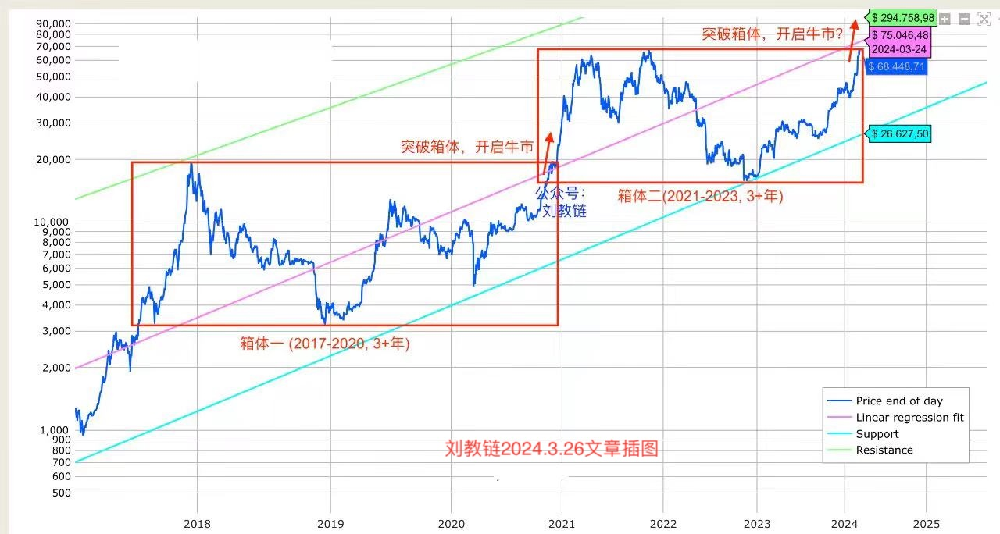
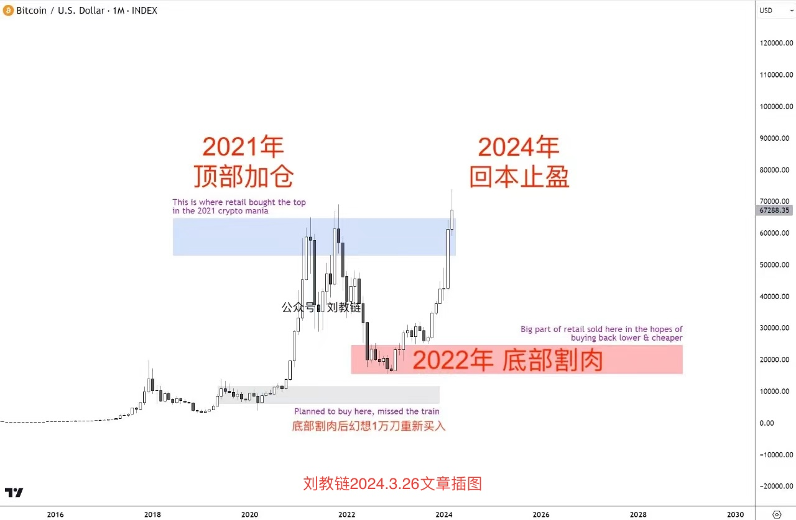

# 重上十万刀

隔夜BTC骤然发力，一举冲破30日均线98.3k的阻力，破土而出，如雨后春笋，蹭蹭向上，一夜长高4%，重上十万刀，目前已逼近102k。

就像竹子的生长。地下茎要在土里花费几年时间蔓延根系、蓄势待发。一朝竹笋破土而出，就会以极快速度长高。某些品种每天可以长高几十厘米，甚至在几周内达到接近最终高度。

这就是厚积薄发的威力。

潜龙勿用数载，一朝龙跃于渊。

这是竹的品质，是君子的品质，也是BTC的品质。

十个月前，教链在2024.3.26文章《比特币再破7万刀》中画了下面这个图：

后来，加上2024年，这个箱体又延长了一年。从2021，到2024，四年，正堪比竹子在地下蔓延蓄势的年头。

于是2024年，也就成了分歧博弈的一年。教链犹记，从年初到年末，那些看空的声音——2024年初提前开启了牛市，2024年内也就将转入熊市；2024年内必将回到25000刀；2024年将是BTC过去15年的历史大顶，未来15年将一路下跌直至归零，从哪里来，回哪里去；…… 如此种种，言犹在耳；余音绕梁，绵绵不绝。

为什么会在十万刀的门前出现如此大的分歧？为什么在这个新起点前，看空的声音如此强烈呢？因为，因为，他们都是韭菜呀！教链在2024.3.26文章《比特币再破7万刀》中画的另一幅图就很好地解释了这个现象：

韭菜思维是什么？教链早在2021.6.30文章《小杂感》里就总结过了。韭菜有三宝：顶部加仓，底部割肉，回本止盈。

2024年，就是韭菜思维里的回本止盈年。

一上十万就做空，一上十万就做空，屡试不爽。直到，BTC一骑绝尘，把你彻底甩下车，远远甩在身后，再也追不上。

贪小便宜吃大亏。

可以说，在一个动动手指就能轻松赚钱的市场里，只要不吃大亏，或早或晚总能积累到令人满意的财富。

而很多人无法拿到结果，主要的问题还在于总是吃大亏、上大当、进大坑、栽大跟头。

为什么会吃大亏、上大当、进大坑、栽大跟头呢？归根结底，就是因为贪小便宜。

常贪小便宜，就会从行为习惯，到思维认知，全方位地塑造你这个人，把你塑造成一个具备吃大亏体质的人。

一旦具备了吃大亏体质，那么吃大亏，就不过是早晚的事。

然后就会陷入到挖空心思求财而不得、辛苦淘金却时常幻灭的死循环中无法自拔。

苦海无边，回头是岸。

众生皆苦，无法回头。

在2024.12.29教链年终私董会上，教链讲了一个形象的比喻。说持有BTC，就好比是坐在时速350公里的高铁上。你安安稳稳地坐着不动，就已经比旁边走路、骑车、开车的人快很多很多了。但偏就有很多人，掂量不清自己几斤几两，贪心不足还嫌速度不够快，非得要扒开车窗，沿着疾驰高铁的外表面向前爬，仅仅是为了跑赢坐在高铁里面的人。

后果很明显。绝大多数爬出高铁的人，都被大风吹下去了生死未卜，或者是一头撞到隧道口的山体粉身碎骨。

很显然，你以为自己是内裤外穿的超人，脱离高铁的“束缚”就能飞得更快，殊不知自己就是个肉身凡胎，禁不住某些人不知出于何种用心的“规劝”去试试身手，于是试试就“逝世”。

教链说，十万刀是新的起点。

有人问，十万刀了，还能投吗？

这个问题是错误的问题。

投资决策要考虑的，总归是自身的实力，投资的目标，以及持仓的情况。

有的人在十万刀前下车了。那可能是因为他的目标达成了，或者仓位对他而言太多了。

有的人在十万刀后还积极上车。那可能是因为他还有源源不断地钱加仓，他的目标还很远大，他的仓位还很不够，等等。

对前一个人，十万刀已经足够贵、足够好了。对后一个人，十万刀还很便宜，足够便宜。

其实思考十万刀这个绝对数值是贵还是便宜本就是一种错误的思维方式。

BTC其实就是尺子。BTC如果是“米”，那么还可以用“分米”或者“厘米”。

如果1米是十万刀，那么1分米就只是1万刀，1厘米就只是1000刀。

米制的2025，分米制的2017，厘米制的2013。

宇宙是分形的。大自然是分形的。

日常我们用米，坐高铁、坐飞机时我们就要用千米。

那么1千米现在就是1亿刀。

你说1亿刀就是很贵吗？1亿刀究竟是贵还是便宜呢？

这就像是问，1千米很长吗？1千米究竟是长还是短呢？

这个问题是和1 BTC十万刀是贵还是便宜其实是等价的问题。

换个坐标系就能一眼看出问题是错误的问题。

1千米无所谓长短。丈量星系之间的距离太短。丈量原子之间的缝隙则太长。

相对论。

长度量是相对的。

价值量也是相对的。

当BTC站在十万刀的新起点上，分BTC（0.1BTC）站在了1万刀的新起点上，厘BTC（0.01BTC）站在了1000刀的新起点上，…… 聪站在了0.001刀的新起点上。

说白了，不是十万刀太贵，而是自己兜里的钱太少。

但是，太阳有太阳的光辉，月亮也有月亮的皎洁。

不需要对自己的囊中羞涩妄自菲薄。

选择合适的比例尺，从一点一滴开始积累。

九层之台，起于累土。合抱之木，生于毫末，千里之行，始于足下。

越等待，越急躁。越攀比，越焦虑。越专注，越幸福。

站在对自己合适的新起点上，向着自己的目标努力，人人都可以有幸福的未来。
