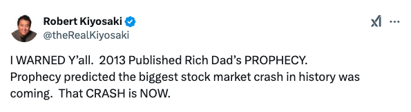
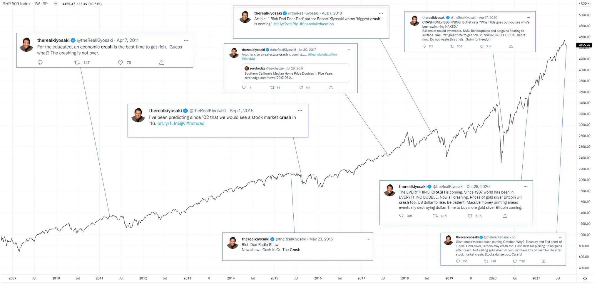
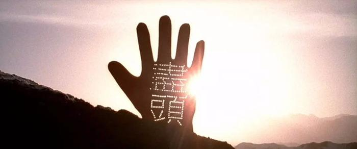
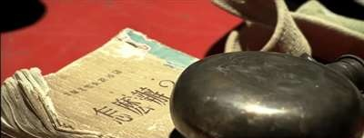

# “狼来了”，天亮了

隔夜BTC在10万刀上方遭遇空头的大举反扑。前天怎么冲上前去，昨夜就怎么败下阵来。以至于今晨仍在延续跌势，回落至97k一线。于是多头苦心经营多日，于前日对这30日线发起总攻，强势突破，就不幸又化为了假突破。

《富爸爸穷爸爸》的作者罗伯特·清崎发帖说，2013年他就预测了，史上最大的美股崩盘即将到来。「而现在，崩盘已经开始了。」他如是说道。

他继续说：「我是怎么知道这次巨大的崩盘会到来？我知道是因为在2008年，以美联储主席本·伯南克为首的领导者们，给自己和银行家们发放了数十亿美元的奖金，而数以百万计的普通百姓却失去了他们的家园、工作和储蓄。」

「到2025年，汽车市场、房地产市场、餐饮业、零售业甚至葡萄酒销售都将面临崩盘。更糟糕的是，世界正处于战争的边缘。」

「许多昂贵的资产，如房屋、黄金、白银和比特币，将会降价出售。我将用贬值的美元购买更多的真实资产。」

「崩盘是致富、增长智慧并在人生中取得领先的绝佳时机。」

一楼网友迅速翻出那张有些包浆的、罗伯特·清崎先生自2011年以来多次唱衰美股的神图。

不断传来的“崩溃”之声，和节节攀升的标普500指数，交相辉映，格外亮眼。

三楼网友则说道，「罗伯特，我非常喜欢你的书！但现在我几乎可以确定，自2016年以来，你每年都会发布同样的警告。第一次看到时，我确实有些慌张。第十次？老实说，这就有点令人失望了。以你书中的水准来看，我只是希望你能创作出更有价值的内容。」

“狼来了”喊多了，男孩也不相信了。

也许，不断有人唱空的牛市，恰恰是上行期尚未到头的牛市。

等到有一天，最嘴硬、最头铁的唱空者都转而唱多了，才是真正“狼来了”的时刻，牛市的尽头。

那一天，你骑着骆驼，来到了选择之路：一边是尽头，一边是非尽头。

这里，是叙事的终点，却是历史的起点。

在每一个历史的选择点，在市场的每一个分歧时刻，每一个身处其中的人，都将做出自己的历史选择。

是跟随信仰，继续坚定不移地走下去……

还是涅槃重生，太阳照常升起？

小韭菜，别害怕，砸盘在上面停下啦。他一笑天就亮了。

[The Sun Also Rises (Music)]
