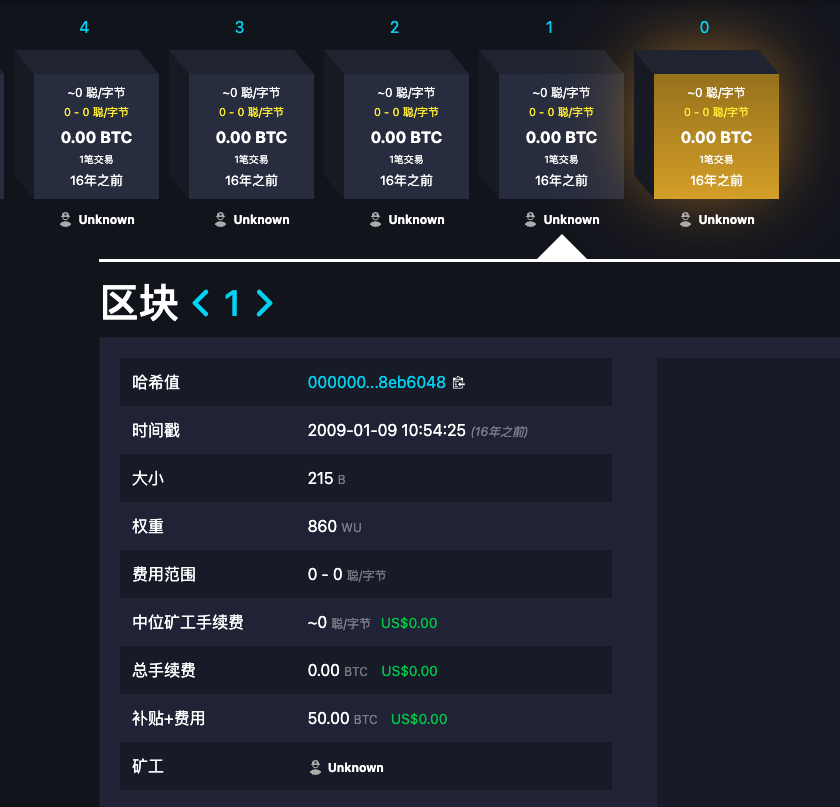
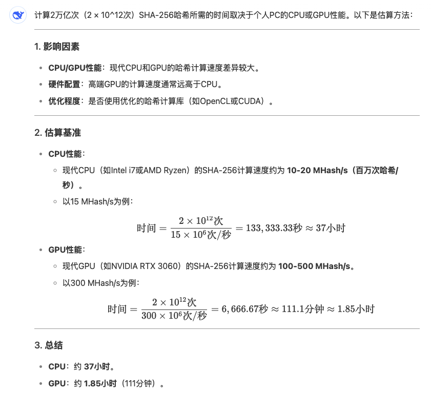
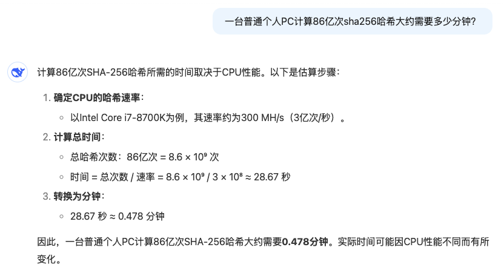
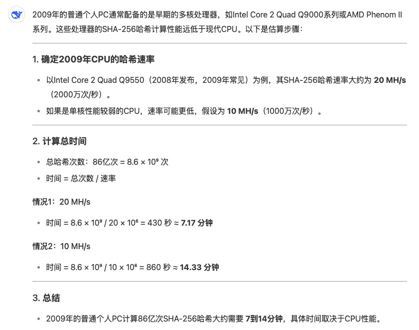

# 一号区块

隔夜BTC刺向92k未及后复又拉升回95k上方。今天是2025年1月9号。16年前的今天，比特币历史上也许是首个被真正通过挖矿挖出的区块，1号区块，产生了。

通常更为众人所知的比特币所谓创世区块（Genesis Block），也就是0号区块，即中本聪在其币基交易（coinbase transaction）中铭刻上那句著名的《泰晤士报》头版头条标题「2009 年 1 月 3 日，财政大臣即将对银行实施第二轮紧急财政援助」的区块，历史的起点，比特币世界时间线和现实世界时间线之间的锚，则很有可能是中本聪在2009年1月3号至9号之间，手工制作的。

正如教链在其完稿于2020年末的《比特币史话》第一章第3话中所写的，「从 1 月 3 号的创世区块起，后面隔了 5 天没有任何区块被创建，直到 9 号第 2 个区块才被创建出来。随后，才真正开始了持续的出块，直到今天。」

「这有可能是中本聪在 3 号启动比特币，试运行了几天之后，在 9 号把试运行期间产生的区块全部删掉，接着创世区块重新开始出块。也有可能是中本聪在 9 号之前才拿到 3 号那天的《泰晤士报》，他觉得这张报纸的头条标题比较符合他想传达的意思，于是就用这个标题和 3 号当天的一个时间作为参数，制作了创世区块。」

「无论如何，我们可以确信的是，创世区块的制作时间，以及比特币启动的时间，绝不会早于中本聪挑选的那期《泰晤士报》的发行日期，即 2009 年 1 月 3 号。」

「中本聪这样做，至少有两个方面的深意。第一个方面，就是借报纸的出版日期作一个时间的证明。第二个方面，就是借报纸标题的主题，讽时事以言志。」

「区块链是时间的历史。这历史，需要一个起点。这个起点，需要一个可信的时间戳（Timestamp）。……」

制作创世区块的计算量，并不比挖出1号区块更低。

让我们来比较一下它们的区块哈希的哈希值。

创世区块：000000000019d6689c085ae165831e934ff763ae46a2a6c172b3f1b60a8ce26f

一号区块：00000000839a8e6886ab5951d76f411475428afc90947ee320161bbf18eb6048

可以看出，十分有趣的是，中本聪制作创世区块的难度，比随机开挖而挖出1号区块所用的难度，还要更高——前导零的个数多了两个。

一号区块的区块哈希值开头有8个0。8个16进制的0就是四八32个二进制的0。所以，很容易就从数学直观上知道，挖出一号区块的概率就是2的32次方分之一，也就是大约100亿分之2.3。

而创世区块的哈希值则有10个前导零。10个16进制0就是40个二进制0。因此，制作创世区块就需要尝试更多次数。这个数字是2的40次方，刚好是1万多亿次，10995亿次。

教链甚至怀疑中本聪是先通过粗估设定了1万亿次这个门槛，然后反过来要求创世区块的制作难度是10个前导零的。

不过，中本聪的这个设定难度显然是太高了。

我们知道，比特币的设计区块出块间隔应控制在大约10分钟。而如果我们问一下AI，「一台普通个人PC计算2万亿次sha256哈希大约需要多少分钟？」便能得到这样的答案：

从AI帮我们估算的数值可知，用CPU计算，约需要37个小时；就算用显卡GPU加速，也要1.85个小时。两者都大大超过了10分钟。

所以，中本聪花了5天时间才搞好，也可以理解。

他可能是在由难到易地做试验。

当然，他当年所用的电脑配置，我们也不得而知。

一个小问题：为何教链问的是2万亿次哈希计算？这个问题当作思考题留给各位读者吧。作为一个BTC的投资者、爱好者，你应该搞明白这些小细节。

而当中本聪尝试到8个前导零的难度时，他便发现了适合稳定出块的难度设定。每43亿次尝试能够找到一个解。

教链问了一下AI，「一台普通个人PC计算86亿次sha256哈希大约需要多少分钟？」

不到1分钟。这显然不太对。我们需要考虑到过去16年硬件算力的突飞猛进。重新提问一下，「一台2009年的普通个人PC计算86亿次sha256哈希大约需要多少分钟？」

AI给出的答案是7-14分钟，刚好落在比特币设定的区块间隔10分钟左右的这个范围。这就验证了教链上面提出的假设，即中本聪通过调整参数，找到了适合于稳定在10分钟左右出块的难度设定。

好玩吧？这就是用科学研究的“假设-检验”方法来对历史真相进行挖掘。

由此，我们便可以大致勾勒出比特币创世之初的那一个星期，中本聪是如何忙碌工作，启动比特币系统，并将其送入稳定出块的正确轨道上的了：

2009年1月3号之前，中本聪已经完成启动所需代码，并做好了各方面的测试和检查。

2009年1月3号或稍晚，中本聪看到了当期的《泰晤士报》。他终于等到了期盼已久的具有双重隐喻的现实世界时间锚。

于是他快马加鞭，开始用这个时间锚信息，制作创世区块。

他从一个较高的设定难度开始，进行挖矿实验。

如果一次实验就需要耗费2天时间的话，5天也就够做两次实验的。

或许中本聪同时动用了多台电脑来并行实验各种参数。
他需要精细地调低计算难度，尽快找到那个能够让当时的普通电脑每10分钟挖出一个区块的合适参数。

终于，在1月9号，他找到了这个合适的难度参数。

当然，也有可能中本聪远在1月3号前就开始了实验。在1月3号刚巧看到了《泰晤士报》上中意的新闻标题。而后在1月9号前完成实验，找到了合适的参数。

他洗了洗脸，擦干双手，用一台选出的计算机，按照合适的难度参数，挖出了一号区块。

并继续稳定地挖下去……

比特币的历史，从这一刻起，正式拉开了帷幕。
