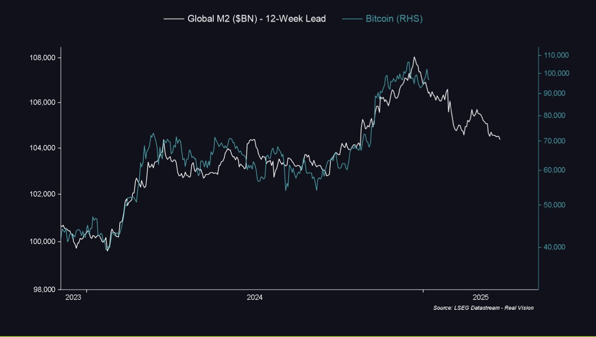
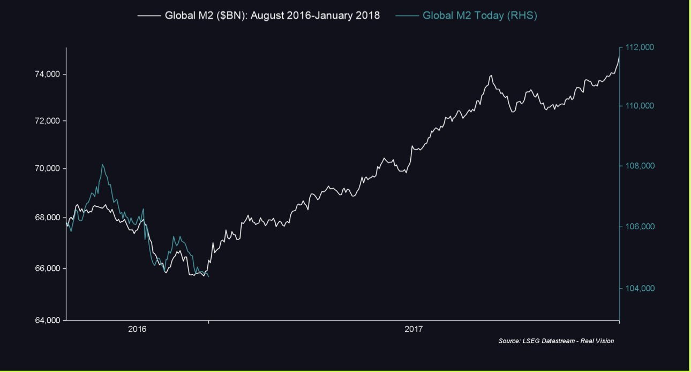
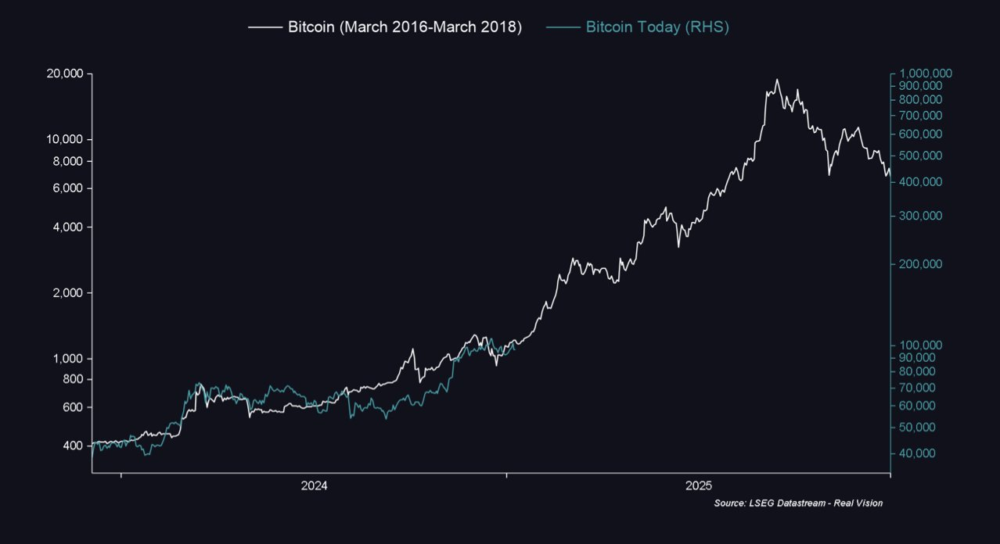
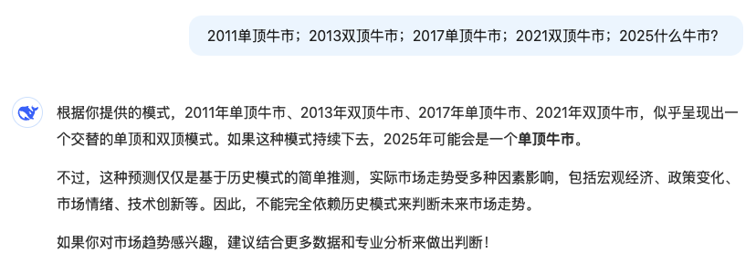

# 刻舟求剑

隔夜BTC下插91.2k拉回94k，身后甩出下影线。在2025.1.8教链内参《流动性领先指标大回撤》中，教链介绍了一个近两年的BTC价格领先指标——全球流动性指数。从2023年初本轮周期复苏以来，该指标就以接近12-13周的时间领先于BTC的波动。

实际上，这个指标就是全球M2波动。从实盘数据来看，它很好的吻合了2024年初和年末的暴涨，以及中段的横盘震荡。

如果接下去两三个月该指标继续有效，那么短期来看，10万刀这个坎，怕是不容易过的。

不过，另一幅图也许会让人们重燃希望。那就是2016-2017年的全球M2波动，和当前的走势似乎有些吻合。

如果历史重演的话，那么当前这波始于2024年8、9月份的流动性枯竭，或即将迎来触底反弹——而且是，在未来相当长一段时期的、持续的反弹。

回头看，当初9月份美联储议息会议，鲍威尔力排众议，首次降息即超常规大降50bp，是不是他们已经掌握了流动性枯竭预警信号了呢？

美联储的行动滞后于市场信号。而美联储的滞后行动，又会在更加滞后之后反作用于市场。

如果这样解释，那么对于美联储近期又开始表态不想继续大幅降息，或许又反向说明了流动性枯竭状况已经缓解，甚至即将迎来大反弹。

加息都无法抑制的暴涨才是真正的过热。降息也不能阻挡的滑落才是真正的暴跌。

这就是否定之否定。

刻舟求剑的话，把2024年的BTC走势和2016年对齐，然后我们就会看到，目前的阶段，和2016年末、2017年初何其相似？

哲人说，历史只会押韵，却从不重复。

教链听到很多声音，普遍预期2025年一季度就会见顶，或者，2025年是个双顶。

这听起来像是2021年症候。

也许是因为，他们只见过、经历过或者只记得2021年牛市的样子了。

他们没见过，2017年一年时间从1000刀到20000刀20倍的牛市模样。

或者他们忘记了。

金鱼的记忆只有七秒，韭菜的记忆只有一轮周期。

毕竟，也许，99%的韭菜，活不到下一轮牛熊。

大浪淘沙。饮恨离场。

因而，市场的集体记忆，往往只有一轮牛熊周期的长度。

鼠目寸光。

2011单顶牛市；2013双顶牛市；2017单顶牛市；2021双顶牛市；2025什么牛市？

人脑的分析和归因能力太容易被给出事实的方式所巧妙诱导。事实还是一样的事实。巧妙的叙事方法却可以诱导你得出截然不同的结论。

AI也不例外。

警惕风险。保持乐观！

还有，不要刻舟求剑。
