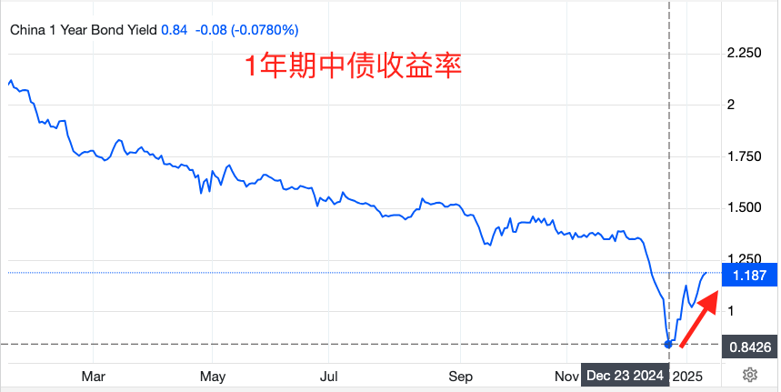
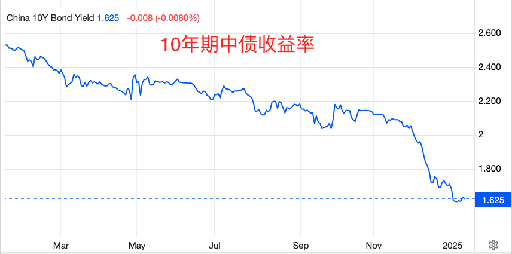
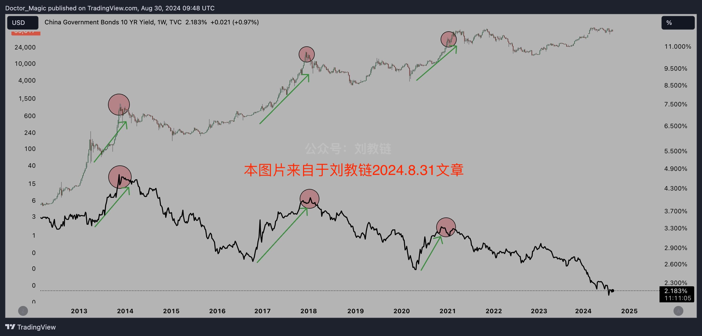
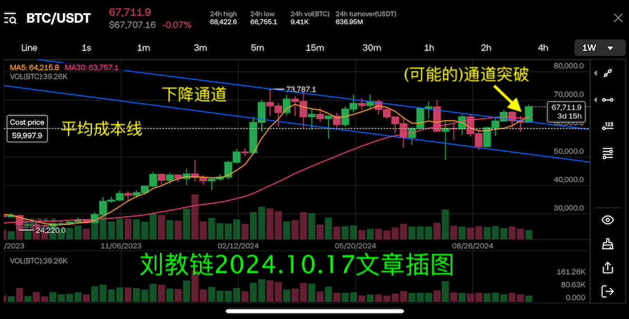
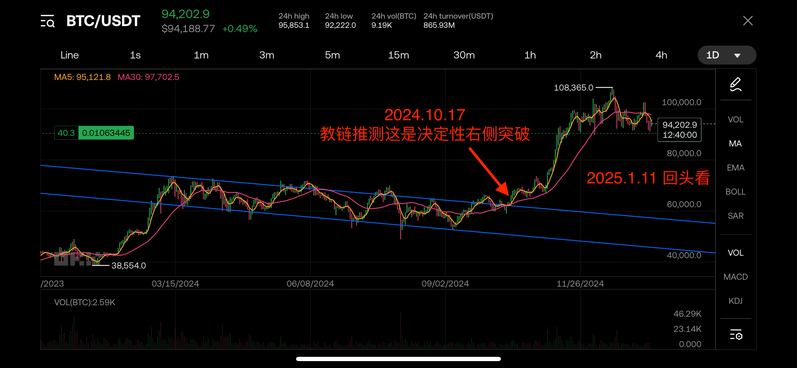

# 央妈暂停购债

隔夜BTC反弹未果，多头未能守住95k，至晨仍于94k一线待机。30日线已经被折弯，上升趋势已被打断。

昨天，央妈公告，决定阶段性暂停在公开市场买入国债。

而一年期中债收益率早在2024年12月圣诞节前夕就已经开始触底反弹了。

而今十年期中债收益率也已呈现出筑底之势。

教链讲过，债券收益率与其价格成反比。

收益率筑底，或者触底反弹，说明债券价格在下跌。

为什么下跌，很好理解。少了一个大买家，根据市场供需关系，价格自然会回落到一个新的平衡价格上。

不久以前，教链2024.8.31文章《中国长期债券收益率与BTC的奇妙相关》中，介绍过十年期中债和BTC牛市在过去三轮BTC牛市周期中的同频共振。

BTC什么时候走出决定性右侧突破的？大概是2024年10月份。回看一下教链2024.10.17文章《大突破：BTC反幂律增长的另一种猜想》里的推测：「10月14号开启的这根本周K线，很有机会成为今年初以来所构筑的下降通道的、向上的决定性突破。拉远一些，视野放大，会看得更清楚。…… 目前，我们也许正处于本轮快牛周期启动的前夜。只差临门一脚。」

如今回头看，就看得很清楚。彼时的确是决定性的右侧突破。图中夹逼通道的两根蓝色直线，还是教链起初画的那两根，没有变过。以此作为参照物也能清晰看出右侧突破的形态。

从BTC右侧突破前最后一次触底反弹，大致在2024年9月份，到一年期中债收益率触底反弹的12月份，相差了大概3个月。

金融问题总是带给我们很多迷思。或者，至少是带给教链很多思之甚奇之处。

主流的金融命题，真的就是那么天经地义的吗？教链认为，并不见得。

就比如说国债收益率走低表明经济陷入通缩风险。可是收益率走低明明是市场追捧国债，这不是表明市场对国家信用的认可吗？

为什么要那样说呢，是因为一种普遍的观念，认为资本在市场上没有更好的投资机会时，才会去追捧国债。

但是整个国家的经济发展，不就是其中的市场主体共同创造的吗？

那么如果国债收益率走高，就是经济活跃的体现了。

这种二元论的观念，实在是把国家和市场对立起来看问题了。这种对立的二元论对中国特色经济体是不适合的，因为中国是国有经济为主体、民营经济为补充的国民互补的模式。

由此，中债收益率所指示的，或许仅代表一部分经济主体的活跃度。

中债收益率反弹和BTC牛市的相关性何时会消失？也许待到国家开始参与其中之后，关联模式就会发生变化了。

至少在此之前，如果预期该相关模式依然存在，那么持有BTC，就不应看空2025年中国经济的复苏。因为很有可能，没有后者，也就没有了2025年的BTC牛市。
