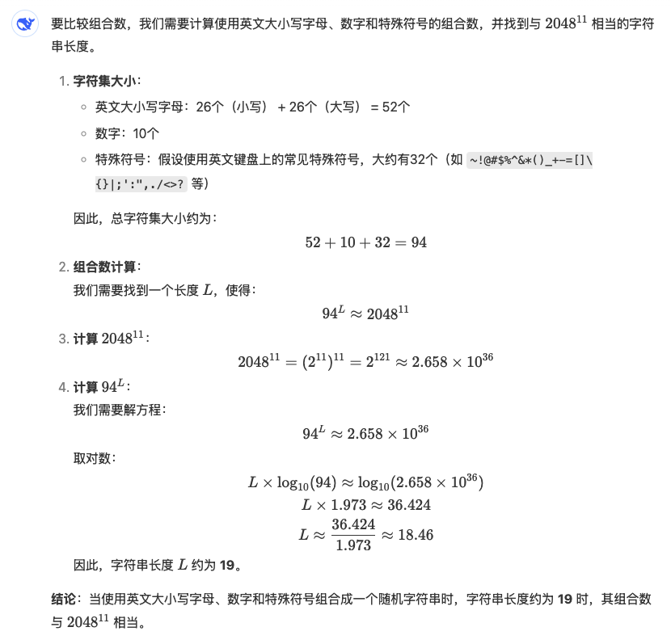

# 脑钱包

今天BTC凶猛下行，不仅抹去前两日反弹的涨幅，更是摆出一副再次测试92k支撑位的架势。这个水平，2024年11/27测试过，12/6测试过，12/30测试过，转进2025，1/10刚刚测试过。多头久攻不上，空头久攻不下。来呀，造作啊，反正有，大把时光～

这两天好像是轻感风寒，今天脑袋沉的很。小白课上，有同学问脑钱包。教链讲授的冷钱包制作法，乃是生成即冷冻，够冷，够简单，砍掉了一切不必要的中间环节和第三方依赖，从而最小化了泄密风险和因第三方倒闭而无法恢复的风险。但最近加州山火，引发思考，如果抄写私钥的本子被大火烧成灰烬，这BTC不就永远锁死、自此丢失了么？

保管BTC就是保管私钥。而这保管私钥的一切方案，无非就是要规避两类风险：第一类是私钥泄密，币被别人偷了去。第二类则是私钥丢失，自己也失去了对币的支配权。

这脑钱包就是一种降低第二类风险发生概率的办法。当然，它自然会增加第一类风险发生的概率，特别是如果你对这里面的问题想当然的话。

什么是脑钱包？顾名思义，脑钱包就是把私钥存放在自己的脑子里，也就是说，自己用大脑记住私钥。

私钥抄在纸上，叫纸钱包（冷钱包的一种）。私钥存在外接设备上，叫硬件钱包。私钥放在手机App里，叫软件钱包（热钱包的一种）。私钥记在脑子里，那自然就叫作脑钱包。

但是，私钥是一个巨大的随机数，它可不是那么容易背下来的。

实际上人们使用的脑钱包，背下来的是一个自己容易记住但是别人很难猜到的密码（也叫作口令），然后用公开算法——sha256哈希算法，对口令作计算得到私钥。即：

私钥 = sha256(口令)

大家都知道，BTC的私钥其实就是一个256位二进制数字。恰好，sha256的输出就是一个256位二进制数字。

那么口令又是什么呢？随便什么都可以。比如你是小张，你家的狗叫旺财，那么你就可以如下编制一个口令：

先用拼音写下这句话：

xiao zhang jia de gou jiao wang cai

再用一个包含数字和特殊字符组成的连字符穿插，比如：

xiao1^zhang2^jia3^de4^gou5^jiao6^wang7^cai8^

然后再把奇数序号的拼音第二个字母大写，变成这样：

xIao1^zhang2^jIa3^de4^gOu5^jiao6^wAng7^cai8^

最后再加上序列号（#1，这样编制一个口令模版就可以做出多个脑钱包，只要增加序列号即可）：

xIao1^zhang2^jIa3^de4^gOu5^jiao6^wAng7^cai8^#1

这个完成的口令长度是46个字符，且包含了大小写字母、数字以及特殊符号。

它的sha256哈希值是：

97cf2b9748fb61c3421b9917af89177397eae1ad2aa2b59428ba3c879a1aba63

（教链注：需要注意的是，如果你用linux命令sha256sum来计算，需要小心去掉口令尾部的换行符，给echo加个-n参数，即 echo -n 口令 | sha256sum ）

以此作为BTC的私钥，对应的BTC地址就是：

1BE3bqSgCLNdhyFCedB7NWwTXqd79mZTcj

这里最大的危险就是你的口令不够秘密，或者模式过于简单，被别人轻易猜出，那么就完了。

主流的意见是，小白不要轻易尝试脑钱包，因为人脑是一个很糟糕的随机数生成器。

教链的看法是，脑钱包之所以相比于强随机的私钥更容易被记忆，就在于它不够随机，也就是有一定的规律。关键在于，随机不够，秘密来凑。

要尽量使用只有自己知道的秘密信息，以及秘密的隐藏模式，来拼凑口令。绝不要对外披露你的秘密信息和隐藏模式。不要模仿任何网上公开教学的模式，比如教链上面举例的模式。一个模式一旦公开，就不再是隐藏模式了。

如果黑客不知道你的秘密信息和隐模式，那么他就只能采用穷举法来暴力破解。

对付暴力破解的诀窍，除了上面展示的，使用较大字符集，比如务必包含大小写字母、数字以及特殊符号（共约94个字符）之外，最重要、最关键的是口令的长度！

口令长度越长，暴力破解的难度越高。

多长合适呢？至少19个字符以上。

怎么算出来这个长度的呢？我们可以对标一下比特币助记词标准BIP-39，它从一个拥有2048个单词的词典里随机选取11个单词加一个校验词形成一个有12个单词的助记词（最短标准）。而只要使用包含大小写字母、数字以及特殊符号共约94个字符的字符集构建口令，那么可以算出，长度超过19个字符就可以拥有和12个单词的助记词相当的强度。

当然，也不要搞出太长、太复杂的口令，到头来贼是防住了，自己却也记不起来了。

有了脑钱包，就可以用自己的大脑记忆和纸笔互相做一个备份了。即便是记在本子上的口令或私钥被毁，凭借大脑记忆还是可以恢复出来私钥，从而拿回自己的BTC。
