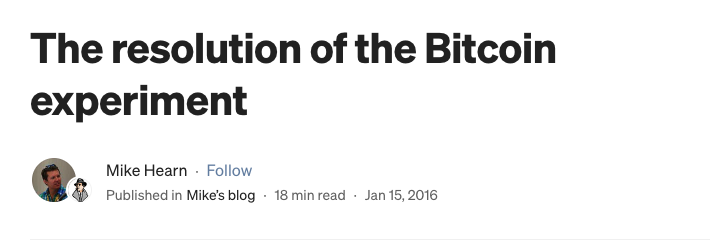
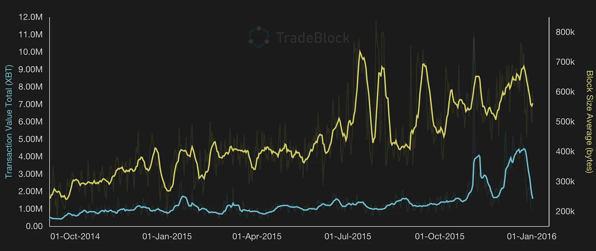
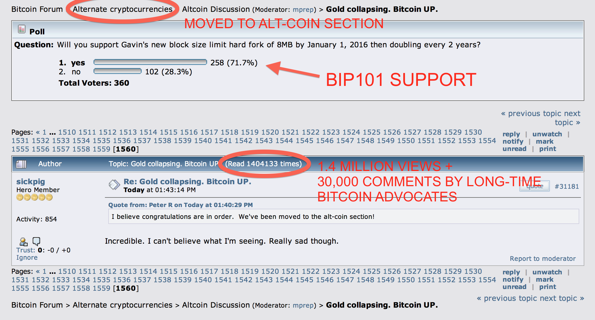
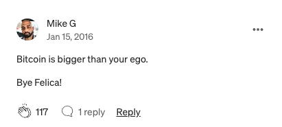
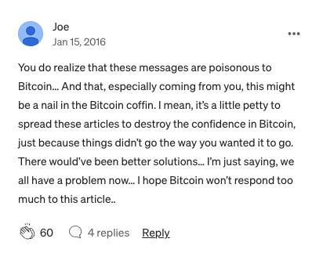

# 清仓

隔夜BTC延续反弹，重新从30日均线96.7k上方弹出了头。在10万刀门前的分歧时刻，不少业内老炮也纷纷减持甚至清仓，给后市走向增添了许多扑朔迷离的色彩。

9年前的2016年，也是1月15号，著名比特币核心贡献者、前谷歌开发工程师Mike Hearn宣布退出比特币开发，并清仓自己持有的全部BTC。他甚至写了一篇特别长特别长的博客帖子，宣布比特币已经失败了。他文章的标题就叫作《比特币实验的终结》。

看过教链所著《比特币史话》的朋友可能还有印象，这位Mike Hearn（麦克·赫恩）可谓是与中本聪的衣钵传人Gavin Andresen（加文·安德森）同一时期的超级老炮了。在《比特币史话》第二章第7话中，教链介绍过，Mike Hearn据信是最后一个与中本聪通信的人。

「他在 2011 年 4 月 18 日给中本聪去信咨询有关比特币的技术问题，得到了中本聪的回复。在交流中，赫恩问中本聪，是计划在某个时间点重新回归比特币社区，还是准备永远离开。中本聪在 23 日的回信说：“我已经开始着手做其他事情了。（关于比特币的事）加文和大家可以掌控得很好。”」

后来，Mike Hearn离开了工作8年之久的谷歌，全职投入到比特币的代码开发中去。这一干就是5年，直到2016年初宣布彻底退出。

在他清仓的时候，BTC的价格大约是430美刀。今天，9.7万美刀。翻了225倍。

人总是要为自己的认知埋单。哪怕是亲手写过比特币核心代码的老炮，也不例外。

他写了很多，大倒苦水。帖子太长，无法仔细介绍。教链总结了一下，令他悲观失望以及大加吐槽的点主要有这么三个：

第一，比特币扩容问题。他和加文支持BIP 101提案的硬分叉扩容方案，但是遭到其他几位核心committer的抵制。

他放了张图。图中显示，区块链已经用满了（接近1MB上限），但传输的价值量却只能达到400万枚BTC左右。

这里他的确是有些论证错误。BTC交易尺寸并不会随着交易携带的BTC数量大幅增加而大幅增加。之所以只传输了这么多BTC，并不是网络无法传输更多，而是用户没有需求去传输更多。另外，随着BTC价格越来越高，同等数量的BTC传输将可以携带更高的现实世界价值量进行转移。比如BTC 100美刀时，转移100枚BTC只能转移1万美刀价值；但是当BTC 10万美刀时，转移100枚BTC就可以转移1000万美刀价值。也就是说，BTC越贵，比特币网络作为价值转移工具的使用价值就越大。

第二，加文失去领导权的问题。他极力赞扬加文从中本聪手里继承了比特币核心最初代码之后，做了很多工作，是一位非常敬业和负责任的领导者。他转而吐槽加文一下子吸纳了好几位committer进来共同维护代码，而并未对他们进行过像公司招聘那样的严格面试，确保每个人对项目愿景认识一致。

教链觉得他在这里表现出了政治幼稚。领导权不是你把住commit权限进行个人独裁就能实现的。特别是对于纯粹志愿贡献，不可能进行强制的开源软件。本质上，领导权力的来源是他人的服从。如果别人都反对，你就是一个人垄断commit权限又如何？别人可以分分钟fork一份代码，把你撇开。

正如《比特币史话》第二十章第99话中写的，「中本聪在 2009 年 12 月 10 日回复有关比特币的讨论时说的那样，“开源意味着任何人都可以独立评审代码。如果（比特币）是闭源的，那么没有人可以验证它的安全性。我觉得对于本质如此的程序，开源是必须的。”」

第三，社区论坛管理员theymos的“言论审查”。当他们鼓捣出BIP 101扩容实现Bitcoin XT之后，要在比特币论坛以及reddit的Bitcoin版面上传播时，遭到了论坛管理员theymos的迎头痛击——删帖，屏蔽话题，等等。

甚至，有关Bitcoin XT的讨论被管理员给移到了“山寨币”讨论区。这可能让他感到了被羞辱。

他把theymos在reddit上的一句话拿出来鞭挞。这句话是这么说的：「比特币的一个伟大之处在于它没有民主」（One of the great things about Bitcoin is its lack of democracy）。

看到这句话就想吐槽的人，大概率应该是不懂民主。

他断章取义了。theymos的原话是这样说的：

「Bitcoin is not a democracy. Not of miners, and not of nodes. Switching to XT is not a vote for BIP 101 -- it is abandoning Bitcoin for a separate network/currency. It is good that you have the freedom to do this. One of the great things about Bitcoin is its lack of democracy: even if 99% of people use Bitcoin, you are free to implement BIP 101 in a separate currency without the Bitcoin users being able to democratically coerce you into using the real Bitcoin network/currency again. But I am not obligated to allow these separate offshoots of Bitcoin to exist on r/Bitcoin, and I'm not going to.」

「比特币不是一种民主制度。既不是矿工的民主，也不是节点的民主。转向XT并不是对BIP 101的投票——而是放弃比特币，转向一个独立的网络/货币。你有自由这样做是好事。比特币的一个伟大之处在于它没有民主：即使99%的人使用比特币，你也可以自由地在一种独立的货币中实施BIP 101，而比特币用户无法通过民主手段强迫你重新使用真正的比特币网络/货币。但我没有义务允许这些比特币的分支存在于r/Bitcoin版面上，我也不会允许。」

很显然，theymos的意思很明白：比特币没有民主，所以即便是大多数人不认可你，你仍然有自己的自由，而不会受到任何强制。

民主，是人民实施主宰，也就是统治，是多数人对少数人实施专政和压迫。多数人走个投票程序立个法，触犯法律的少数人就要被开除出人民的行列，成为专政对象。

“比特币不是一种民主制度”的意思就是说，在这里，没有人可以搞个投票表决什么的，就强迫少数不同意的人去做他们不愿意做的事情。

消除了这种强制，就消除了多数人暴政，也就给予了所有人更大的自由——选择的自由、用脚投票的自由，任何人，你我他，都可以像Mike Hearn一样，不认可BTC了就可以自行选择清仓离开，来去自由。

Mike Hearn还在帖子里吐槽了BTC的其他一些方面。篇幅所限，不再一一罗列。

总之，教链读后感就是，全篇太多情绪化的东西，而严谨的逻辑和技术论证则没有。这其实就让他的帖子失去了力量。

网友的眼睛是雪亮的。在9年前就有网友毫不留情地指出他的问题正在与把自己的不得志解释为BTC的失败：「比特币比你的ego（自我）要更大。」

也有网友直言，他作为一个如此资深的元老级人物，发表这种论调是非常不负责任的行为。「仅仅因为事情没有按照你希望的方式发展，就传播这些文章来破坏人们对比特币的信心，这种做法有点小家子气了。」

当然，相比于Mike Hearn不为很多人所知的吐槽和退圈，名气更大的中本聪正统衣钵传人Gavin Andresen亲口承认澳本聪就是真正的中本聪，才是真的打开了潘多拉魔盒，把魔鬼给放了出来，在此后数年，对整个比特币社区造成了难以估量的破坏。

掩卷抚昔，真是令人不胜唏嘘。也是了解这些曲折的历史，才越能体会BTC走到今天而没有中道崩殂，有多么殊为不易。这一路上，相比于那些台前知名的人物，幕后的甚至无名的维护者们，真的是以虽千万人吾往矣的决心，捍卫了比特币的方向，哪怕是被曲解、攻击、诋毁依然不屈不挠地坚持着初心和理想。他们才是BTC真正的守护神。

就像theymos说的，「如果90%的/r/Bitcoin版面用户认为（本论坛的）这些规定无法容忍，那么我希望这90%的用户离开。」
