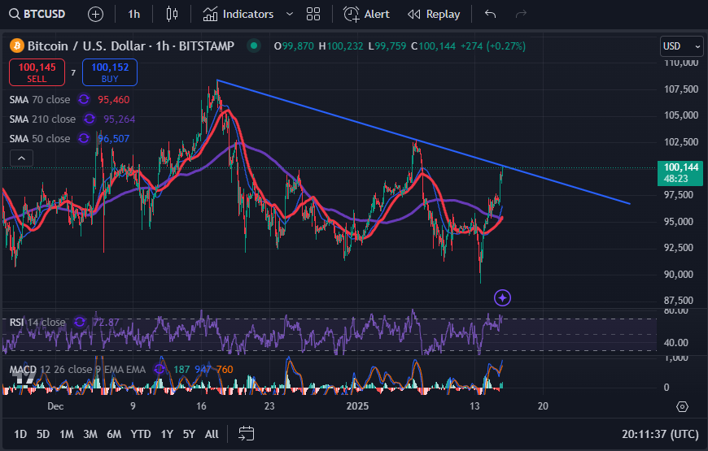

# 锌火花

隔夜今晨，BTC再次冲击10万刀。不过，很显然，这里是一个明显的阻力区。多头再次遭到了空头猛烈的压制。无它，空头必须死守，否则一旦阻力线被突破，空头的马其顿防线就要土崩瓦解、一泻千里了。

BTC就像一只活跃异常的精虫，在中本聪的大脑中孕育，经中本聪的双手编码而降生。最初几年在东方之睾中发育，构建了强大的算力网络。2021年高潮时刻，巨大的压强迫其喷涌而出，东风西渐，进入母体。

就像2016年顶级科研期刊《自然》刊登的一篇论文[1]所揭示的那样：当精子成功进入卵子并与其结合形成受精卵的时候，卵子就会在几秒到几分钟之内迅速、大量释放多达数万亿个锌原子。仿佛是在用一场盛大的烟花秀，庆祝这一次伟大的结合。科学家给这一奇妙的现象起了个漂亮的名字叫做——锌火花（zinc spark）。

如今，自由女神成功受孕。2024年年初，通过了多只现货BTC ETF。年底，宣称要将BTC纳入国家战略储备。

精子时代结束了。胚胎时代开始了。

你不能只看到10万刀来回放烟花的璀璨，也不能只看到旧时代的凋零，而要看到新生命的诞生。

从一种生命形态，转变为全新的另一种生命形态。这就是相变。

生命不断轮回，凤凰不断涅槃。根本就在于，每一次新生，都会迎来一次新的指数级增长的机会。

有人说什么二零三几年看到几百万甚至几亿美刀的话。教链觉得，任何的价格高度，都比不上生命力所能带给我们的震撼。

法币价格是个幻觉。从未有BTC上涨这回事，那只不过是美元的跌落。

过去16年，美元跌落的速度越来越慢，因为美联储在慢慢收紧2008年突然洞开的门户，以支撑美元的信用。

直到现在，它还在试图利用利率操纵的手段，来迷惑世人，让大家觉得它还能撑。

可是，美国债台高筑，容不得美联储再这样撑下去。

美债最大的持有人、债权人就是美联储。

经济基础决定上层建筑。当还钱的成本比造枪还要高的时候，债权人就不可能压得住债务人。

大胆想象一下，美国政府没收美联储，大笔一挥勾销它手上的5万亿刀美债，35万亿刀的债务负担也能立刻减轻一些。

有人可能会觉得，不敢想，不敢想。但是加拿大和格陵兰岛都敢想，美联储有啥不敢想的呢？

又说，这样搞恐怕美元要崩溃。不然呢？你以为为啥2023-2031可能会出现BTC指数级再增长？

美联储拼命顶住通胀洪水决堤的缺口。但是它的做法却是和拼命摁住高压锅出气阀门来控制蒸汽外溢一样笨拙——所有过去和今天加上去的利息，都是明天更多的水、更大的压力。阻止过高压锅出气的朋友都知道，这么搞，高压锅很快就要爆炸了。

就像一口突然爆炸的高压锅猛地向外喷发出无数水蒸气液滴那样，自由女神猛地向外喷洒出数以万亿刀计的绿票子，仿佛是成功受精的卵细胞突然爆发出锌火花一般：

刹那绽放。

---
参考文献：
- [1] https://www.nature.com/articles/srep24737
