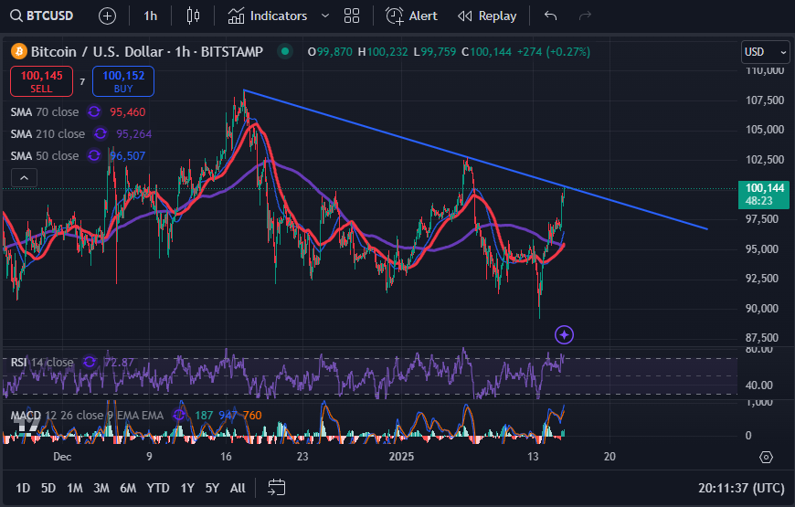
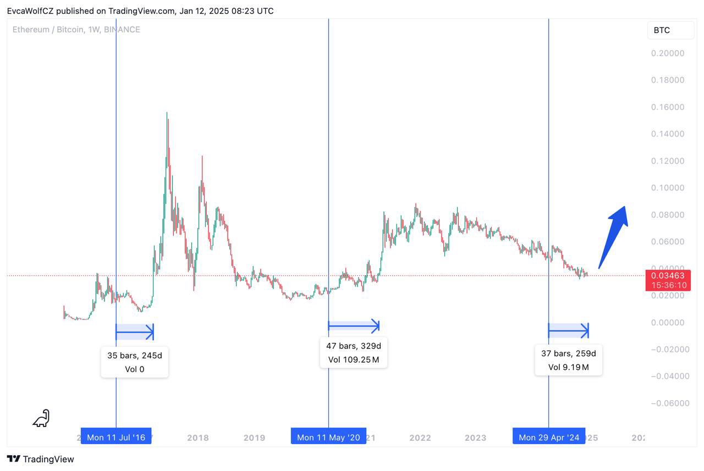
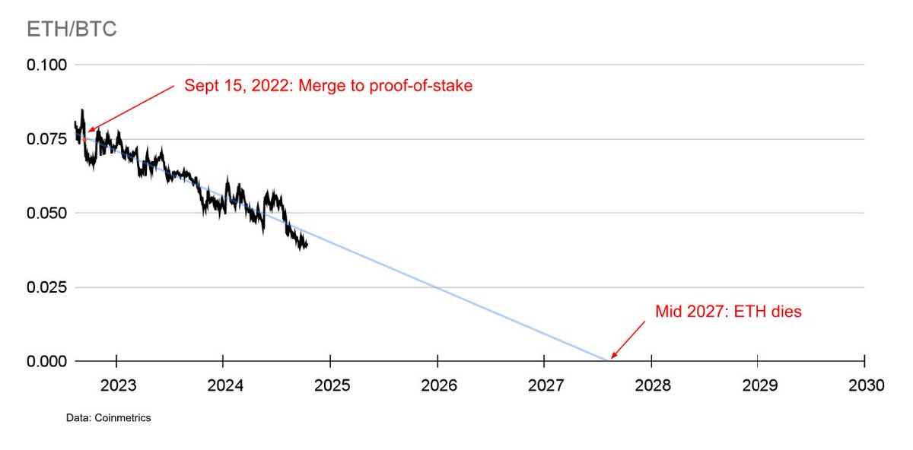
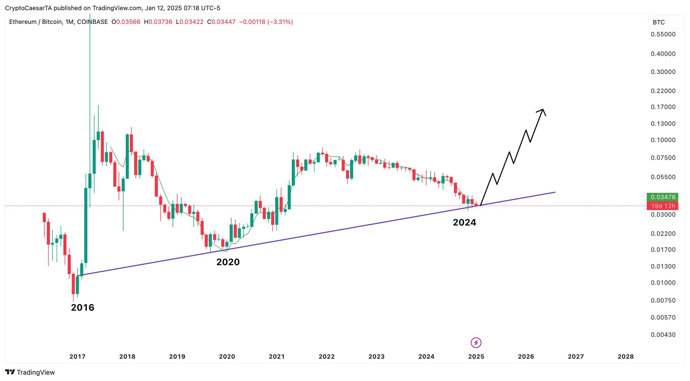
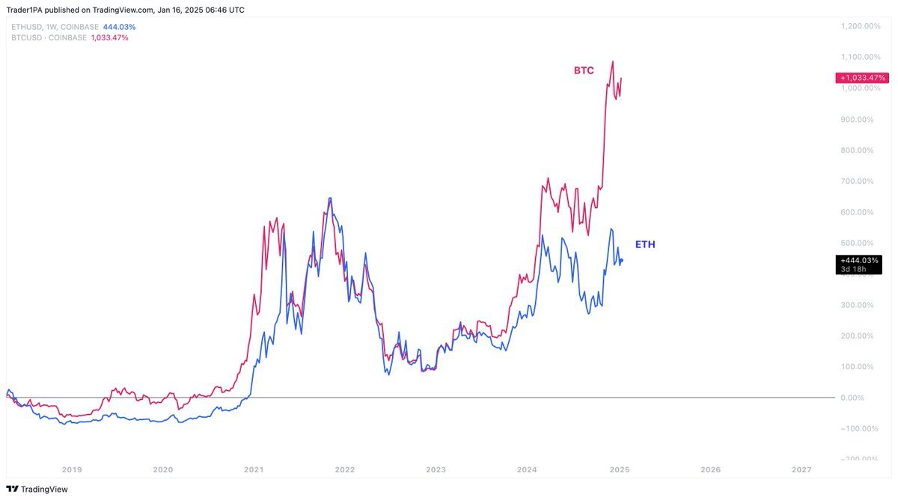
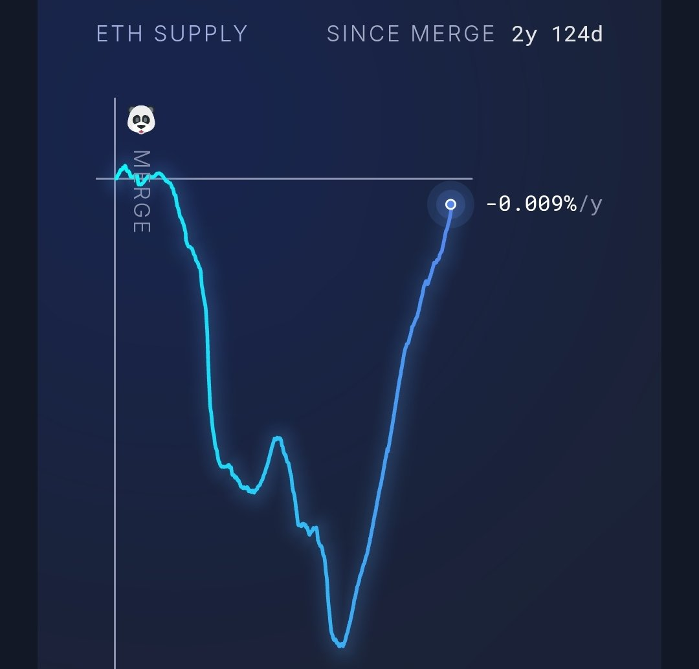
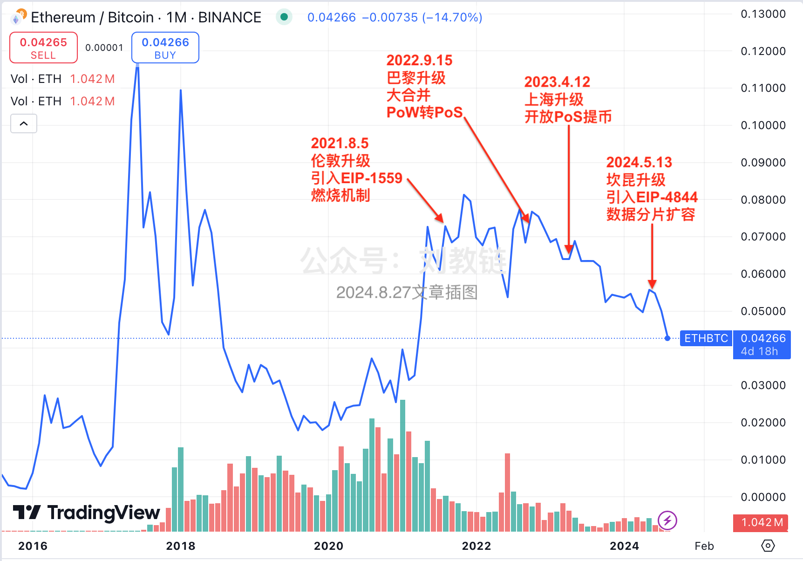

# 这次的突破静悄悄

今天BTC延续涨势，骤然加速冲破阻力位，再破10万刀，并一鼓作气抵达102k附近。

上图就是昨天文章《锌火花》中的阻力线示意图。此次突破若进展为实质性突破，将可能走出一段彻底摆脱空头控制的趋势。

奇怪的是，再破10万刀，讨论BTC的声音反而越发安静了。

各平台、社群里反而是一片对ETH的吐槽声。

有网友吐槽说：

第一次BTC达到10万美元时，ETH是4000美元。
第二次BTC达到10万美元时，ETH是3900美元。
第三次BTC达到10万美元时，ETH是3700美元。
第四次BTC达到10万美元时，ETH是3400美元。

有人说，ETH即将迎来大幅反弹。

有人说，ETH正在步入死亡。甚至给出了拟合目标时间点：2027年。

有人从技术图形上寻找信心。

有人从行业周期上发现信念——历史证明，ETH总会在牛市后半程追上BTC的脚步。

所以，若真如此，现在的ETH相对BTC就是被低估了。

今天炫耀先人一步提前清仓ETH的KOL们，或许又要装作低点早又如数抄回，赢麻了。

信精准逃顶抄底的炫耀帖，还不如信母猪会上树。

ETH的弱势究竟是什么原因？

真不见得是基金会挤牙膏似的抛售。

而是在于目前链活跃度太低，EIP-1559燃烧太少，PoS就成了净增发。看下图，现在ETH供应量已经快要回升到大合并（the merge）之前的数字了。

什么是“大合并”？教链在2021.12.4文章《大合并：以太坊的卫国战争》里有详细展开。简单讲就是：

「借助rollup扩容，而一层则优先聚焦于把PoW共识机制改为PoS共识机制。这就是“大合并”（The Merge）。」

当时宣称上线时间是2022年一季度。

真正上线时间则拖到了2022年三季度，9月15号。参考教链2024.8.27文章《以太坊的人生困局》中的这幅图：

ETH对BTC的“死亡螺旋”，也正是从大合并抛弃PoW转向PoS开始。ETH供应量开始触底并迅速反弹，也大概是在此前后。

而在其一年之前，以太坊在2021年8月5号引入了EIP-1559燃烧机制。

当时很多人鼓吹燃烧通缩让ETH变成了比BTC还要硬的超音速货币。

教链写了多篇文章来剖析这个问题。如，2021.8.3文章《以太坊的“费改税”》指出：

「用户向矿工支付记账劳动的对价，这叫做“费”，而用户若向持币者支付利润，而这一支付又是一种不能逃避、不能选择的、强制的机制，那就变成了“税”。

以太坊的费改税，本质上是引入了庞氏螺旋（并非贬义），推动了ETH持币的吸引力，从而进一步推动ETH的价格。（反之亦然）」

2021.8.6文章《以太坊渐行渐远》断言：

「在市场繁荣的牛市，用量增加，燃烧增加，进一步推高币价。而在市场低迷的熊市，用量减少，燃烧减少，相对应的，绝对增量就会变多，从而进一步打击币价。

由此，1559这个模型或将导致更大振幅的暴涨暴跌。」

2021.10.13文章《以太坊是比比特币更好的价值存储吗？》进一步分析道：

「EIP-1559的燃烧机制损害了以太坊作为价值存储的机能。…… 简单总结一下，价值存储最重要的S2F模型告诉我们，存量的总量、稳定性和成熟度是关乎一个价值存储体系是否稳健、可靠、有充分共识的非常关键的要素。

EIP-1559不断的燃烧掉用户手中的存量，代之以区块持续增发的增量。此处有三个坏的地方：一，销毁成熟度高的老币，代之以成熟度低的新币，让整个价值存储系统变得不稳定；二，币从铸币起点向外扩散的过程，其实是一个先得者对后得者剥削的过程，我们批评中心化的法币超发，有一个重要的点就在于此，以太坊链现在成了那个发行中心，以太坊也就成了披着加密羊皮的法币之狼；三，以太坊一贯缺乏一个固定的、可预期的货币政策，这一点甚至比追踪通胀/就业的美元还要差劲，在博弈论上讲，这种由Vitalik及基金会肆意妄为的货币发行是非常糟糕的。」

只能说，以太坊的苦难配得上Vitalik的认知。

他坚持要转PoS，那就要经受转PoS带来的再通胀和熊市燃烧低迷双重结合，大幅跑输BTC，让社群骂成狗。

当然，经得住多少诋毁，才配得上多少赞美。

主动放弃价值存储赛道，对ETH未必是坏事。因为价值存储赛道，最终只会由BTC统治。ETH需要大舍才能大得，找到属于自己引领的赛道和独特定位。

现在的艰辛曲折，也许只是失去价值存储的下跌尚未获得新价值定位托升之前的阵痛期。

如果将来ETH有咸鱼翻身的那一天，原本的疯狂吐槽又将纷纷转为鲜花和掌声。
