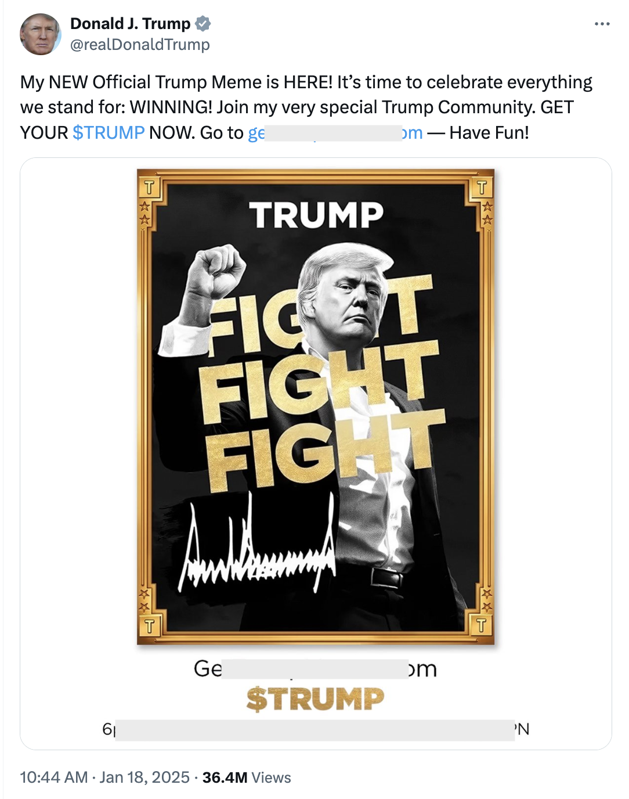

# Trump Meme开启疯狂2025

周六BTC多空在100k上方拉锯。各板块都在失血，向Solana集中。几大以太链ERC-20和BTC链铭文BRC-20型meme失血尤其严重，跌幅超过一般山寨。原因就是他们都遭到了一个横空出世的黑马竞争者Trump Meme强力吸血。

Trump Meme是一个模因币，在Solana链上发行。正是因为它的发行，导致Solana强力吸血以太坊，Trump Meme强力吸血其他memes。

Meme就是一张皮，价值全靠叙事。叙事就像流行，过气得很快。再说了，什么shib、pepe、ordi的，哪个叙事能比得过传奇总统的王者归来呢？

尤其是特朗普用认证的个人大号发了一个推广之后，几个小时之内，市值就从零暴涨到几十亿美刀。

现在它的FDV（全流通市值）已经达到240亿美刀。已经达到市值第一BTC的2万亿美刀总市值的1%。

这个步子确实很大。大得有些令人瞠目结舌。

有网友不无失望地说，Trump Meme用的Solana没用以太坊，以太坊真的是没落了。其实教链曾在2024.12.4《一块钱拆分成10个一毛钱，钱就多了10倍吗？》中指出过，以太坊创始人Vitalik Buterin“公开和美新当选班子的BTC储备战略以及DOGE削减开支计划唱反调”，在政治议题上四处发表评论，“靠不了中，疏远了美，开罪了俄”，“以太坊将如何自处？”

亦有网友感叹道，川普家族100多年三代打拼，家族财富好不容易攒到65亿美刀。未料到今天发了个土狗，一天之内市值就干到了200亿美刀。真的是够魔幻。

还有网友哭笑不得，说本来大家期待BTC战略储备计划落地，结果却等来了Trump Meme。

大胆设想一下，也许发行meme就是为自己上车BTC搞点儿钱也不好说呢？毕竟，国家储备都要有了，自己手里没货，岂不是亏了一波发财的确定性机会？

手里没货就要进货囤货。用自己的积蓄来进货，一是钱都压在别的生意上压缩不出来，二是压缩出来也拿不出多少来。还是得想别的辙。

最好的投资方法都不是用自己的钱投资。微策略是增发自家股票套美股股民的钱拿来加仓BTC。贝莱德是用ETF来吸收美股股民的钱来囤积BTC。前者收益大而风险也高，后者风险小而收益也低。更有创意的办法就是发meme圈钱去加仓BTC，钱不用还没有杠杆风险，加仓的BTC的增值都是自己的，收益很大。风险小，收益大，这就是发行meme圈钱的“优势”。

当理想主义的人还在质疑大国总统怎能不顾政治形象发土狗币割韭菜时，现实主义的人已经重金杀进杀出大晒利润了。

从态度转向亲加密，到直接发币，步子这么大，连以经常在社交媒体上搞喊单暗示、捉弄韭菜的马斯克看了都要沉默、流泪，毕竟马斯克是只敢操弄市场比如狗狗币，却不敢亲自下场。SEC的监管利剑，依然在其头顶高悬。

但是总统之权，却在SEC之上。

那么过去几年，因为发币被SEC罚款甚至打进牢狱的美国人有不少。又当作何而论？“只许州官放火，不许百姓点灯”？

正如某美国网友说的：如果这是合法的，那么2025年或将会是超过想象的疯狂。
