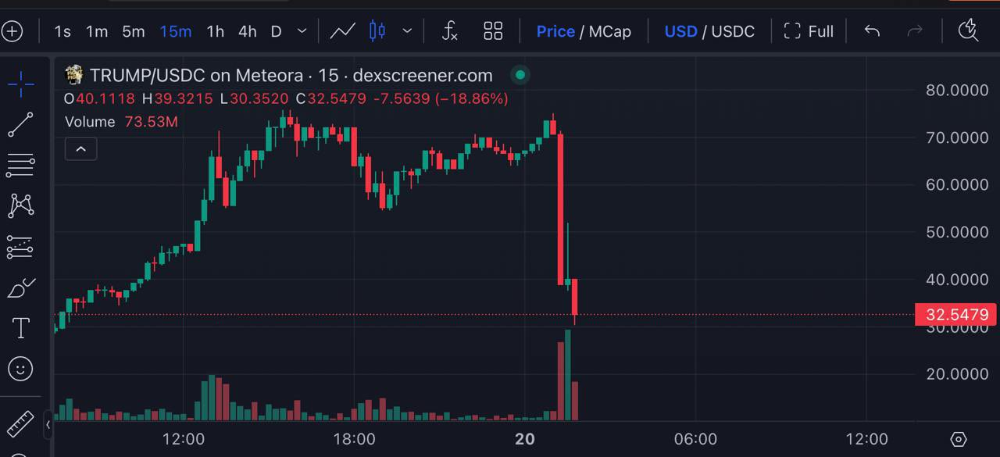

# 饕餮盛宴

隔夜加密市场全线崩溃。BTC从最高106k最低刺破100k目前暂居101-102k区间。前天总统币Trump meme横空出世，昨天各大CEX赶紧跟进上币，KOL群情亢奋。他们吹起来的哪里是总统，他们吹起来的明明是自己的钱包。

很不幸，韭菜以为这波格局要在大气层了，结果没想到还是一如既往的狗血剧情。

今早凌晨5点夫人币Melania meme突然出现，川普转推。

空手接白刃的CEX韭菜们傻眼了，原来你幻想格局，别人只想收割。于是作鸟兽散，Trump meme一度腰斩，连带整个大盘全面崩坏。

Meme狂热终究还是推动了一个历史进程，让韭菜们慢慢意识到，玩CEX就是接最后一棒的傻瓜，玩链上才能抢得先机。

没有什么重大历史进程是没有代价的。代价甚至是沉重的。不是财尽，就是人亡。只不过，区别在于，你是不是那个代价。

Bitcoin Magzine发帖说：Trump meme就是垃圾币。

网友Crypto Bitlord说：想象一下被美国总统收割的感觉……

当加密韭菜们正在为推翻SEC主席Gary Gensler等“三座大山”的压迫而扬眉吐气时，就被他们喜迎的“加密总统”来了个过肩摔。

教链从未见过鸡群里竞相转发人们大口啃吃炸鸡的喜悦照片，或者牛群里竞相传颂人们优雅进食牛排的美食画面，但却几乎天天看到各种炒币社群里热烈转发KOL收割利润排行榜的图片，津津乐道，艳羡不已。

每当有人谈论某某又转了几百几千万美刀的时候，教链就觉得有一种莫名的悲哀。教链看到的不是这个人赚了几百几千万美刀，教练看到的是一定有人亏掉了这几百几千万美刀。

这个世界上还有什么比菜单上的菜津津乐道地谈论饕餮盛宴更悲哀的事吗？

菜之所以是菜，首先是因为他们很菜。

韭菜为什么会FOMO（害怕错过），千里送人头？就是因为他们对自己几斤几两认不清楚，总以为别人能赚几百万几千万美刀，自己也行。

还自我洗脑、自我麻痹、自欺欺人地自我安慰说，每次亏损都是交学费，每次被割都是学习了，多学习早晚有一天也能成为镰刀收割别人。

鸡已经被人吃了无数只，还从来没有一只鸡能进化到做到餐桌旁和人一起吃炸鸡。

牛也已经被人吃了无数头，还从来没有一头牛能学习到做到餐桌旁和人一起吃牛排。

凭什么韭菜就觉得被收割的多了，就能学习和进化到可以和镰刀排排坐，一起收割后来的韭菜呢？

害怕错过，后悔错过，是最应该戒掉的心态和情绪。

对于镰刀，错过一次就是错失一次利润，也许值得惋惜两句。

但是对于韭菜，错过一次却是逃脱了一次收割和亏损，实在是大大的幸运！

叹息错过饕餮盛宴之前，先反问一句，谁的饕餮盛宴？

谚语说得好：早起的鸟儿有虫吃，早起的虫儿被鸟吃。

先搞明白自己是鸟，还是虫。

你不是饕餮，你是盛宴。

认知偏差害死人哟。
