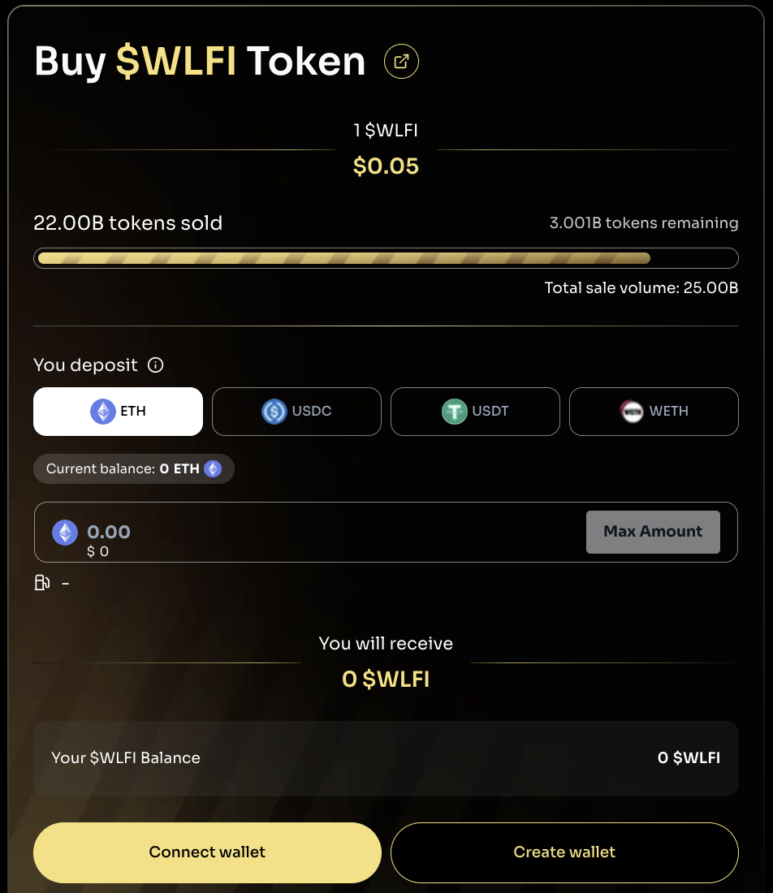
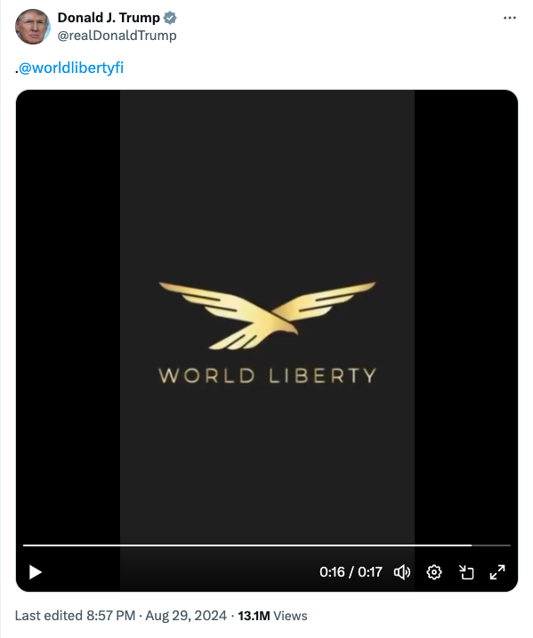
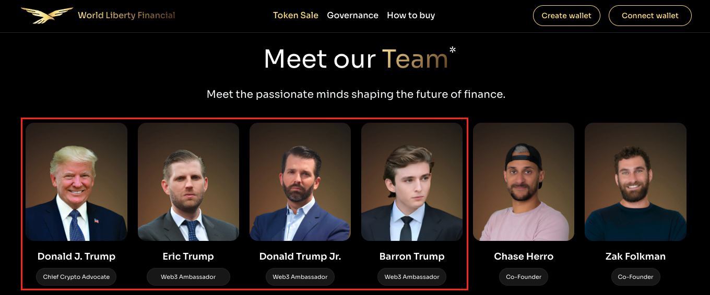
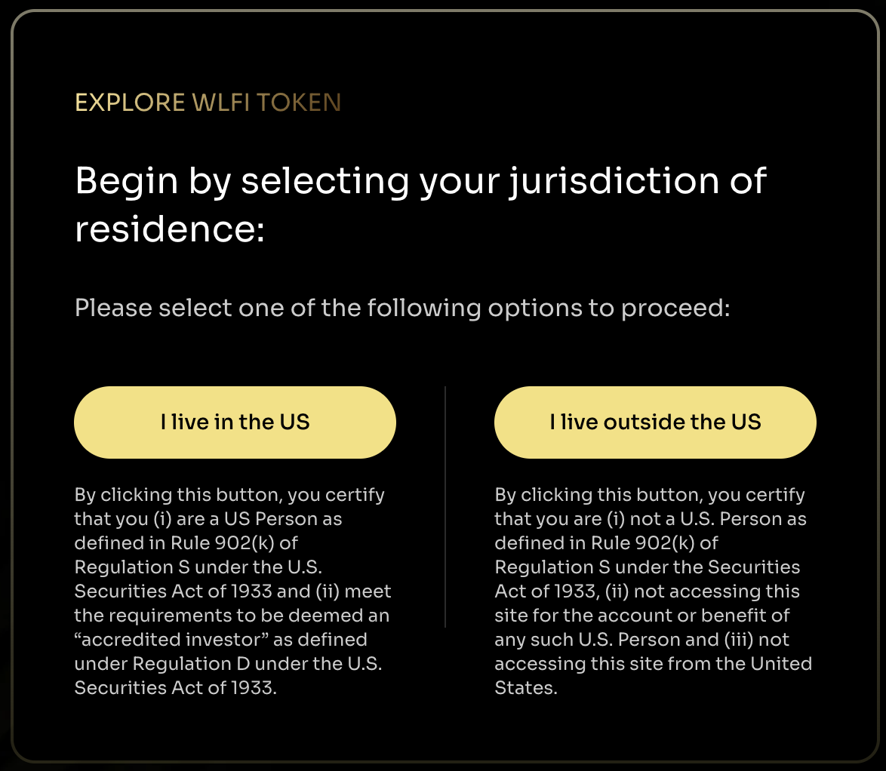
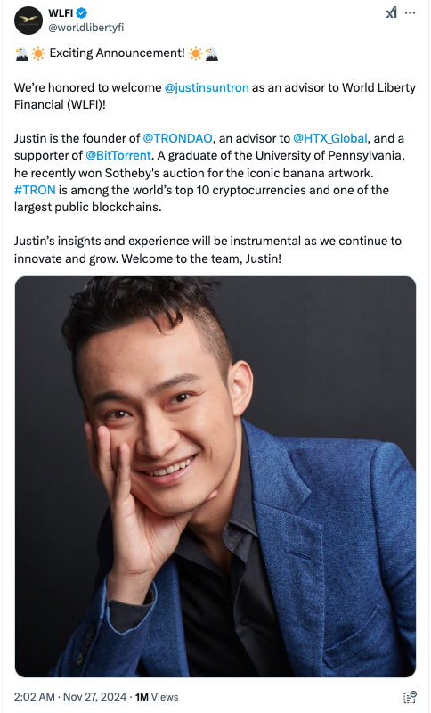

# 起底WLFI

昨日BTC收了个长长的十字星，开收盘几乎相等都在104.9k，低点99.5k和高点109.8k则拉出了夸张的上下影线，总长度高达10.3k，也就是1万刀的影线总长。回想一下六七年前BTC的价格高度也才1万刀上下，现在竟然一日波幅就能达到如此程度，真是令人唏嘘。十字星意味着激烈的博弈。自然这和特朗普总统就职事件紧密相关。

今日，BTC开始变盘下跌，一度下探至100k。目前仍暂居100k上方。

几天前周六日横空出世的总统币Trump meme和夫人币Melania meme把一向以离经叛道著称的加密市场都给整不会了。很快，天真的人们就会学到一个重要的知识点：自由资本主义没有铁拳，但是自由资本主义有镰刀。在做铁拳下的钉子，和做镰刀下的韭菜之间，你有任选其一的“自由”。

按照美国现在的修正资本主义，那么你就是被钉死的韭菜。MAGA保守主义要恢复自由资本主义的往日荣光，是重新找回“真正”的自由——镰刀收割的自由，韭菜被收割的自由。

人教人教不会，事教人一教就会。周六Trump meme现身，KOL大肆喊单，晒出百万利润，韭菜上头、冲动、懊悔、FOMO。周日韭菜冲锋，项目方、操盘方、KOL纷纷抛售，把利润落袋为安，用格局和伟大梦想交换走了韭菜兜里的真金白银。周一价格崩盘，韭菜高位站岗，纷纷套牢，被梦想窒息，为格局埋单。

三天一门课，学费还挺贵。

这般果决的收割，如此凌厉的刀法，究竟出自何方“高手”、“快刀”的点拨？

草蛇灰线，伏地千里。

20号，cryptorank报道，Trump meme和Melania meme的销售，极大地推动了川普家族的加密项目WLFI（世界自由金融）的项目代币的预售进展。[1]

其实早在2024年10月16号教链内参《周三，扶摇直上》中，教链就提到过这个WLFI项目。当时获得的消息称，WLFI是一个不可转让的治理代币，目标是筹款3亿美刀，估值15亿美刀。

据报道，2025年1月20号，WLFI项目官方发帖称，20%的代币销售已经完成。为了响应大家购买的热情，再开放5%的额度出来供大家购买！

这个WLFI代币总量是1000亿枚。预售价格0.015美刀。

所以我们可以迅速心算一下，20%就是200亿枚，乘以0.015美刀，恰好等于3亿美刀。这数字就对上了，严丝合缝。

3亿美刀除以20%，正好也就等于15亿美刀的估值。没毛病。

现在又拿出5%的份额也就是50亿枚，价格可就不是0.015美刀了，而是直接涨价到了0.05美刀一枚。下图是教链在WLFI官网上的截图。从截图中可以很直白地看到当前的售价是0.05美刀。

从图上的实时数据也可以知道，新拿出来卖的50亿枚WLFI，也已经卖掉了20亿枚，还剩30亿枚待售。

这样，WLFI的总估值就从15亿美刀暴涨到了1000亿乘以0.05美刀等于50亿美刀。

不用怀疑，项目得到了川普个人认证账号的推荐和背书。下图是2024年8月29号川普官推WLFI的截图。[2]

在WLFI官网上，包括川普本人在内的多位家族成员均列于项目团队成员名单中。

也许有人会疑惑，这么一个不能转让、不能交易也就不能炒的代币，有啥用呢？为啥有人会买？

不知你可听过一个词儿叫做：

投名状。

人人生而平等。但是有些人比其他人更平等。这是社会运行赤裸裸的真相。

投名状，就是挤进那个更平等的圈子的门槛。

不同的圈子有不同的投名状：有的投名状是人头。有的投名状是血缘或者出身。资本主义阶层镰刀圈子的投名状很直白——就是钱，money。

挤进镰刀圈子，你就获得了四大法宝：内幕消息，高人指点，权力护航，法律豁免。

有人说，人家圈子里都是商量正经事的，诚实做事，为大众谋福利，为社会做贡献。笑死人不偿命。一个底层普通人，遇到困难都会想办法托关系送钱找门路，居然会天真到以为一旦拥有了四大法宝，人性会变得纯洁起来？若明知人性幽暗，还这样为镰刀圈子辩护，那就真是洗地的坏了。

所以说道理其实很简单。韭菜之所以穷，就是因为挤不进镰刀圈层。而要挤进镰刀圈层，又需要大量的钱纳投名状。这就死循环了。

但是资本主义以钱作为投名状有个优势，那就是保持了足够的开放性。如果有聪明过人或者心狠手辣的新贵族出现，就可以很容易把他们吸纳进来，为我所用。

根据cryptorank的报道，WLFI项目的认购者已经超过了3.4万人或适格主体。

注意，WLFI是完全按照美国证券法合规发售的。对美国国内投资人，必须是符合Reg D规范的合格投资者。对国际投资人，则是敞开怀抱。

据报道，孙哥Justin Sun所创立并控制的TRON DAO（即波场项目）豪掷千金，认购了30亿枚WLFI，是WLFI最大的独立投资人。

孙哥是去年11月份认购的，因此认购的是早期便宜的代币。按上文所讲，0.015美刀一枚，30亿枚应该是投资了4500万美刀。

不过，孙哥应该是享受了折扣价。

据其他相关报道，2024年11月，孙哥向WLFI投资了3000万美刀。

也就是说，实际折扣价是0.01美刀一枚。0.01美刀乘以30亿枚，刚好是3000万美刀。

0.01美刀除以0.015美刀，66折，很大力度的折扣了。

孙哥也就得以登堂入室，顺理成章地和川普家族搭上了线。

WLFI官方号还在2024年11月27日郑重地发表了一篇公告，称「我们十分荣幸地欢迎孙哥成为WLFI的顾问（advisor）」。[3]

不过WLFI官网顾问名单里，并没有对孙哥进行露出。也许孙哥名声在外，不在乎这等虚名？还是孙哥远见卓识，故意隐身以图大计？我们就不得而知了。

当然，WLFI也并未如孙哥所愿发行在波场链上，而是发行在了以太坊上。

项目的智能合约开发负责人 Octavian Lojnita 此前在Dough Finance项目工作过，因此据泄露出来的代码看，似乎就是复制该项目源代码进行修改。[4]

从上面的认购截图中也能看出，认购支付货币采用的是ETH、WETH、USDT、USDC，也能很容易推知，WLFI代币是发行在以太坊上的。

因此，这一波Trump meme快、准、狠的操作，项目方出货给狂买Solana冲模因的韭菜，扭头就去买了被韭菜抛弃砸盘的以太坊。为何？人家WLFI的基本盘就在以太坊上啊。

又一次，镰刀和韭菜相向而行，擦肩而过。

又一次，一个颠扑不破的道理被再次验证：金融市场的赚钱诀窍就是与大众逆行。

有人虚空造围城。外面的人挤破头想进去。里面的人趁机舒舒服服地润出来。

润出来后便再造另一座围城。刚刚挤进或者没挤进去的人，忽然发现自己依然是在围城外。

于是掉头再向新的围城里面挤。

挤一次，本金被收割一次。

多挤几次，本金就被收割殆尽了。

《庄子·养生主》说得好：吾生也有涯，而知也无涯。以有涯随无涯，殆已！已而为知者，殆而已矣！

我的本金有限，而围城无限。以有限对无限，太危险了！既然已经知道这一点，还要去追求围城，那就更加危险了！

而WLFI这种对全世界开放纳投名状的办法，也势必在美国政治体系上凿开了一个透风的漏洞，让全世界资本得以绕过美国宪法有关限制，直接或间接影响美国政治议程。

正如美国众议院金融服务委员会民主党领袖、加州众议员 Maxine Waters 所批评的那样：「通过他的 meme 币，特朗普创造了一种规避国家安全和反腐败法律的方法，允许相关方匿名向他和他的核心圈子转移资金。」[5]

---
参考资料：
- [1] cryptorank.io/news/feed/8f0f1-trump-and-melania-memecoins-accelerates-wlfi
- [2] x.com/realDonaldTrump/status/1829141447087648796
- [3] x.com/worldlibertyfi/status/1861470615749972169
- [4] www.coindesk.com/business/2024/09/03/inside-the-trump-crypto-project-linked-to-a-2m-defi-hack-and-former-pick-up-artist
- [5] www.chaincatcher.com/article/2163783

