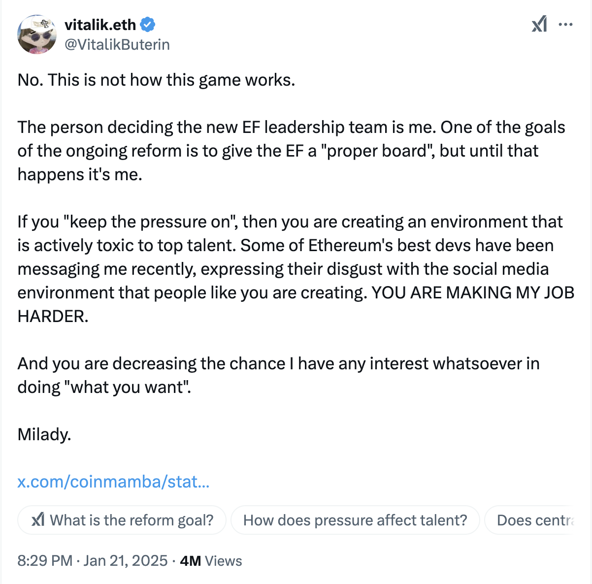

# V的逆反

经过前两天的激烈博弈，今天多头防守反击，尝试性攻上107k，并暂时稳在105k附近，守住了日内涨幅。空头已经无力进攻，根本没能画出下影线。

最近以太坊社区对以太坊创始人Vitalik Buterin猛烈建言，要求他改组EF也就是以太坊基金会，大有“逼宫”之势。

比如，1.6教链内参《建议以太坊基金会裁员80%并停止抛售ETH》提到：Aave生态参与者@lemiscate建议，应当立即解雇 80% 的非开发人员和当前领导层职位。

又比如，1.20教链内参《新高》提到：Curve 创始人 Michael Egorov建言，以太坊基金会应放弃以 L2 为中心的路线图，全力推动 L1 扩容。

再比如，1.21教链内参《百万美刀》提到：Aave 创始人 Stani Kulechov 给以太坊基金会提出几点改革建议，包括诸如“将员工人数削减至80人”，“仔细审查可留任人员。移除高管职位、顾问、任何兼职角色、实习生、搭便车者、蟑螂和寄生虫”，“仔细审查可留任人员。移除高管职位、顾问、任何兼职角色、实习生、搭便车者、蟑螂和寄生虫”，等等。

那么作为独揽大权的Vitalik Buterin对于这些声音作何反应呢？

他就像一个叛逆青春期的孩子，表示我不听、我不听，甚至表现出强烈的逆反心理，说，如果社区这样给他施压，只会降低他对做任何“社区想让他做的事”的兴趣。

「不，事情不是这么运作的。

决定新的EF（以太坊基金会）领导团队的人是我。当前改革的目标之一是为EF建立一个“合适的董事会”，但在那之前，决定权在我。

如果你“继续施压”，那么你正在创造一个对顶尖人才极其有害的环境。最近，以太坊一些最优秀的开发者给我发消息，表达他们对像你这样的人在社交媒体上制造的环境的厌恶。你让我的工作变得更难了。

而且，你正在减少我对做“你想让我做的事”产生任何兴趣的可能性。」

当然，他此番“抱怨”是针对某些网友“逼宫”，请求以太坊基金会开除某位成员。不过从此处管中窥豹，可以瞥见Vitalik此刻近乎“破防”的心态。

通过V的这番话，我们也许是第一次听到他本人亲口确认，以太坊基金会的治理结构目前依然是V一人独裁。

而以太坊基金会又统治着以太坊网络。

这就意味着，整个以太坊生态目前是独裁体制。

要知道，以太坊基金会在以太坊生态中的角色定位，与Bitcoin core在比特币生态中的角色定位是完全不同的。

以太坊基金会的经费来自于ICO发币融资。于是它就背上了受托责任。也就是说，无论基金会是V一人独裁，还是未来设立董事会集体决策，那么V或者董事会都要对投资人负责，这包括了所有曾在一级认购预挖代币，或者二级接盘基金会抛售其预挖代币的所有投资人。

发币融资一旦做了，就势必会陷入对资本负责的境地。也就是说，它给自己找了个老板，从此不可以自己想怎么来就怎么来。

资本必然要谋求掌控V，进而通过掌控V来掌控EF（以太坊基金会），通过掌控EF来掌控整个以太坊生态。

很多人看不见资本，不理解资本。资本就是上面教链说的一级二级投资人投下去的东西。这东西让所有投资人形成了利益共同体，进而凝聚了巨大的力量。力量其实是来自于人，而资本的力量则纯粹是在于它能通过利益对齐把人的力量聚集起来。

看透了、想透了这些，就更能明白中本聪当初不发币不融资不拿任何人一分钱资助，坚持自力更生，独自搞出比特币的良苦用心！

因为只有这样，中本聪，以及继承中本聪衣钵的Bitcoin core开发团队，才能够做到不背负来自于任何资本的受托责任，才真正能够自己做主人、自己做老板，成为整个生态系统彼此博弈制衡格局中的一极。

这就是棋子和棋手的天壤之别。

V可以逆反，可以倔强，但他的历史选择，决定了他目前只能做资本的棋子。

而中本聪，则从一开始就选择做棋手！

感谢中本聪的明智选择，继承衣钵的Bitcoin core开发团队，在比特币生态16年风云诡谲的政治斗争和激烈博弈中，也能挺直脊梁，做一个棋手，顶天立地、不屈不挠。

俗话说，吃人嘴软，拿人手短。

EF团队吃的既然是一二级投资人的饭，那么就必然要认后者是自己的老板，要时刻提醒自己对老板们负责。这是人类社会的基本商业道德和伦理。

Bitcoin core开发团队从来都是自带干粮，不吃BTC投资者的饭，那么自然就没有任何义务需要听后者说三道四。

只有这样，Bitcoin core开发团队才能真正一心一意地守护比特币的初心，做出最有利于比特币发展的技术决策。

简单地讲，Bitcoin core有资格站着说话办事，并成为知识权力的代表。

也只有Bitcoin core能立得住，比特币才能真正形成独特的权力相互制衡的去中心化格局：

矿工代表算力权力。持币用户代币资本权力。开发者代表知识权力。

任何一方都无权要求另外两方服从自己。

任何一方也都可以否决另外两方提出的无理要求。

贪婪、信念和理想主义的相互博弈。

有的时候，打开方式决定了一辈子要走的路，变成了一生要偿还的债。

这就是“慎始”的哲理。

「一旦 0.1 版本发布了，其核心设计就将在其整个生命周期中一成不变。」—— 中本聪，2010年6月17日。《比特币史话》第十四章第73话。
