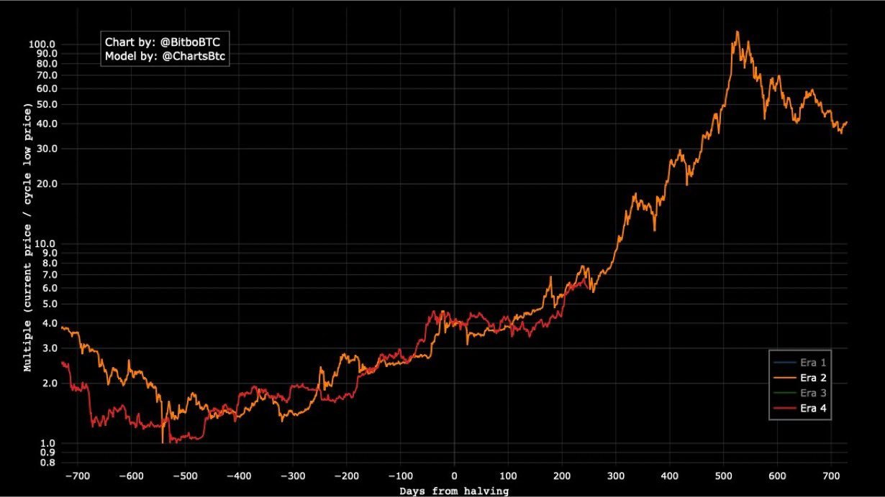
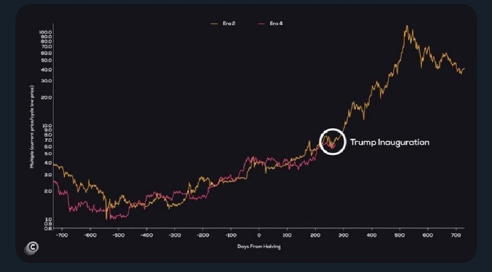
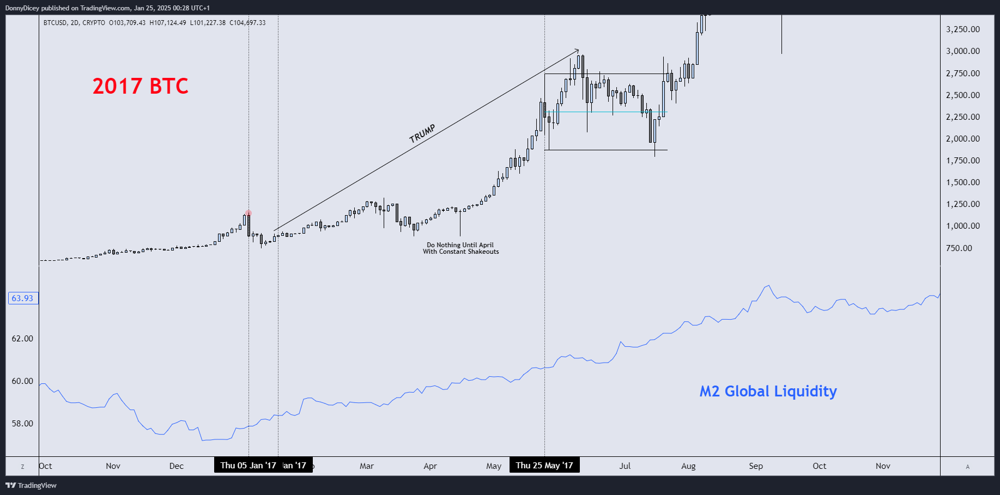
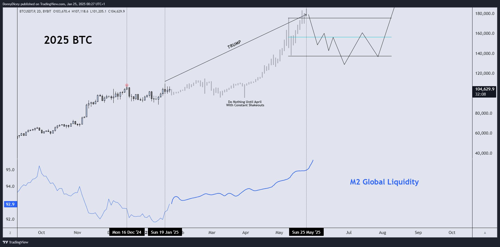
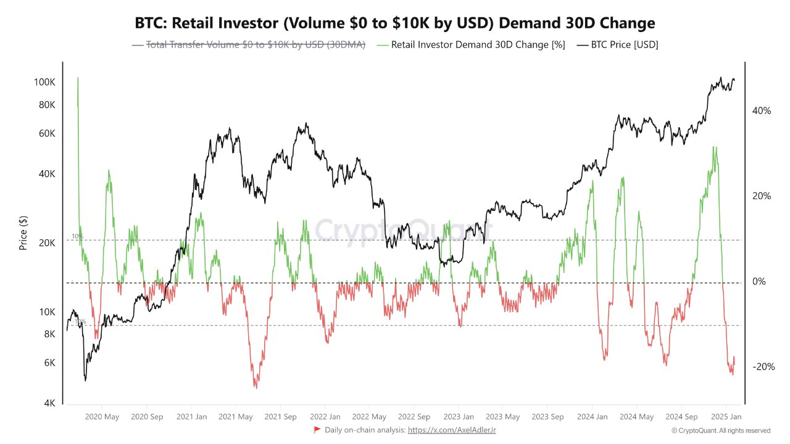
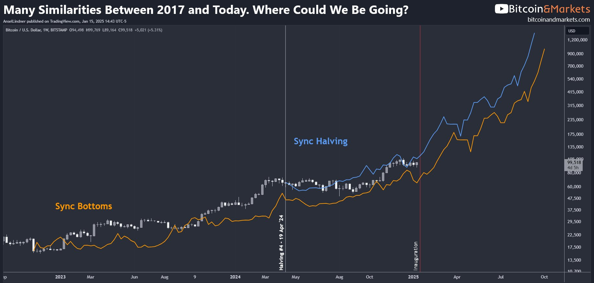

# BTC 105k

最近BTC横盘波动，几日下来就把中枢浮现出来，也就是隔夜BTC又回到的地方，105k。这就是动中有静，静中有动。

昨天1.24教链内参《春节将至》中提到，有glassnode的分析师认为，目前BTC似乎是正在复刻2016-2017的走势。但是他据此得出的顶部却是有些低，只有150k。

就在1.21教链内参《百万美刀》中，刚刚说过，coindesk的分析师也觉得现在BTC在走2016-2017周期，但是他对结果的预期却大相径庭，直接突破了100万刀，甚至最高推到了170万刀。

的确，如果按照底部倍乘关系，本轮周期迄今走的确实很像2016-2017。目前105k大概是走到底部7x（上图红色图线）的位置。2022年底底部15k，7x刚好大约是105k。

如果继续按前一轮周期那么走，顶部要突破100x，那就是1.5m+了。

真过了1m，那教链2024.10.17文章《大突破：BTC反幂律增长的另一种猜想》就梦想照进现实了。

数往以知来，见来而勉今。

心态上，不赌它能成，也不赌它不成。

仓位上，应确保大涨来了不错过，大跌来了扛得住。

对了，2017也是一个Trump周期。奇妙的缘分。

而横向对比全球M2流动性，似乎也是草蛇灰线。

现在BTC 105k。活在过去底部的人看到这是高处不胜寒的顶点。见到未来高度的人看出这是巍峨昆仑脚下的低点。

散户高山仰止，踟蹰不前。

上一次散户如此彷徨，似乎还是2021年“519”崩盘后的中期局部底。

上图中，橙色图线是底部价格对齐，蓝色曲线是减半日价格对齐。白色竖线是减半日。红色竖线是Trump就职日。

也许高速列车正在呼啸而至。

但是人们依旧无动于衷，不知所措。

站在BTC 105k的新起点处——

且听风吟。
