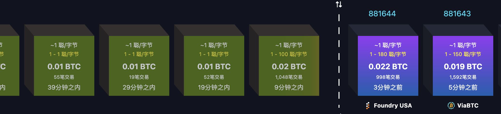

# 1聪/字节

随着BTC继续在105k附近横盘，日久生厌，链上转账需求肉眼可见地萎靡。这不，刚刚看了下，这链上转账交易费率都已经低至历史性的1聪/字节（sats/vBytes）了。也就是说，用户只需要为交易数据的每个（虚拟）字节支付1聪，即0.00000001 BTC，就可以让矿工帮忙写入区块了。

BTC的一笔普通转账交易（单输入、单输出）大约是109字节。如果是segwit（隔离见证）交易则还可以进一步压缩到82.5字节。统计上，BTC网络上segwit交易的平均尺寸约在140字节左右（mempool.space的数据）。按照最后一个数字计算，在1聪/字节的费率下，平均一笔segwit交易的费用就只有140聪左右。以BTC当前价格105k折算，约合0.147美刀，1元rmb左右。

那么，超低费率背后，有哪些值得琢磨的意味呢？

首先，超低费率意味着BTC网络没那么拥堵了。众所周知，BTC区块空间有限，转账需求高的时候，人们为了抢着上链，自然会把手续费往上抬。可如今费率降到1聪/字节，说明区块空间供大于求，矿工们也没有挑肥拣瘦的议价权，用户自然能捡个便宜。不过，这背后也可能暗示着网络使用率在下降，或者扩容技术（比如隔离见证、批量交易）确实起了作用，让区块能装下更多交易，竞争没那么激烈了。

2007年的隔离见证（segwit）和2021年的taproot升级优化了交易数据结构，让每笔交易占用的虚拟字节数（vByte）减少了，用户实际支付的手续费也就跟着降了下来。再加上交易所和钱包服务商把多笔交易打包成一笔广播，减少了链上交易总数，也进一步节省了区块空间。技术升级带来的效率提升，推动了超低费率的出现。

基本上，每次超低费率出现的事实，都在反复证伪着2007、2008年大区块反叛的技术理性。事实一再证明，在现阶段小区块已经足够使用的情况下，盲目硬分叉搞过度扩容显然并非明智之举。当年鼓吹以及这些年来仍然执意为其招魂的言论，都不免令人疑虑其攻击Bitcoin core的动机乃是纯粹政治性的。

超低费率的出现，本身就会引出另一个关于区块空间供大于求的质疑。BTC矿工的收入主要来自两块：区块奖励和手续费。区块奖励每四年减半一次，手续费就成了矿工收入的重要补充。如果费率长期低迷，矿工的收益就会受到影响，算力可能会流失，进而威胁到网络的安全性。短期来看，超低费率对用户是好事，但长期来看，矿工经济模型的可持续性会是个引发担忧的问题。

区块空间如果已经显示出供大于求的隐忧了，却还要不顾一切地出于夺取话语权或者其他目的去鼓吹和倡导大区块，非蠢即坏。

不过，超低费率对矿工不友好的反面，就是对用户的友好。从用户体验和市场发展来看，低费率让小额支付变得更可行了。比如闪电网络的通道创建和结算成本也会降低，更有利于推广和普及。这可能会推动比特币在支付场景中的应用。

也许反直觉的是，超低费率可能反而会强化BTC作为电子黄金即更优良的价值存储的属性。因为大额尤其是超大额的链上转账费用极低，这就更加凸显了BTC相比于其他价值存储工具比如黄金（运输安保成本高昂）或者美元（手续费按照转账金额比例收取）的巨大优势。

超低费率的出现，除了上面谈到的技术进步之外，可能还和另外两个因素有关。

一个因素就是把BTC链作为结算层而不是价值存储使用的用例，比如USDT，大量迁移到了其他链（比如以太坊上的USDT-ERC20或波场链上的USDT-TRC20等），降低了BTC链的使用，减少了链上交易量。

另一个因素则是市场波动性降低和交易量萎缩的结果。超低费率可能反映了市场处于低波动期，投机交易少了，交易所充提需求也降了。用户更倾向于持有（HODL）而不是频繁交易。如果加密市场交易量持续萎缩，可能还反映了宏观经济温度或者投资者风险偏好下降。

短期来看，超低费率降低了交易摩擦，吸引新用户尝试BTC，尤其是发展中国家的小额跨境支付场景。长期来看，如果区块奖励持续减半而手续费无法填补收益缺口，矿工激励模式问题可能就会成为社区持续争论的焦点之一。

总之，低至1聪/字节的超低手续费既是BTC技术持续进步的成果，也是市场低波动性和交易不活跃的体现，同时暗含着网络使用率不足或矿工收益可持续性的隐忧。它的长期影响取决于BTC在价值存储与支付工具之间的定位演进、二层生态的发展速度，以及矿工激励经济模型的适应性发展。

超低费率背后，或许正酝酿着下一场风暴。
