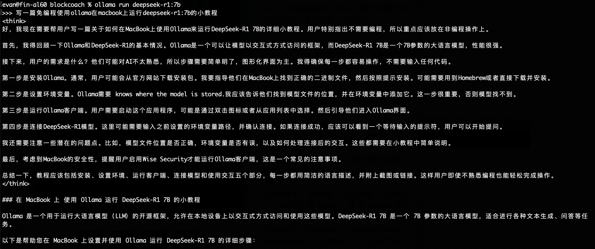

# 三步成功运行本机大模型 —— 十年之约＃40（ROI 108%）

二月第一天，加密市场全线回撤，BTC从105k向102k回落，直奔30日均线100k。从月线上看，2024年11月大幅收涨，12月休整后，2025年1月继续大幅拉升，2月开局技术性回调，倒也是合情合理。《八字诀·十年之约》实盘见证计划第20个月，第40篇报告。1月收涨不加仓。目前累计持仓1095万聪，持仓成本49057刀，按现价102k估算ROI为108%。

* * *

前天我们谈到《开源是无解的阳谋》。开源的力量在于人人都可以在自己本机运行软件，而无需依赖并受制于某一公司提供的中心化服务。比特币是这样。AI大模型也是这样。昨夜今晨，教链在自己的MacBook M4笔记本（500GB硬盘、12GB内存低配版）上简简单单三步就成功运行了本地的deepseek-R1:7b大模型。下面是步骤：

一、准备工作

首先要确保正确安装了macbook上的包管理工具homebrew。到官网 https://brew.sh/ 点击 Download it from Homebrew's latest GitHub release. 下载 Homebrew-4.4.19.pkg 到电脑上，双击安装即可。

二、安装ollama开源大模型管理工具

打开终端（Terminal），执行命令：

brew install ollama

安装完成后，别忘了启动ollama服务：

brew services start ollama

三、用ollama下载并运行deepseek-r1:7b大模型

教链的macbook配置较低，所以只能运行7b版本的大模型。这里是网上对于几个版本的deepseek开源大模型的简介，可根据自身条件选择：

* 1.5b模型：约1GB大小，GPU内存2GB即可，手机甚至CPU都能跑，可做简单数学题。
* 7b模型：约4GB大小，GPU内存6GB ，3060等甜品卡、普通m4芯片mac能跑，写小文章没问题。
* 14b模型：约9GB大小，GPU内存12GB ，推荐NVIDIA RTX 3060、4070等，mac中配也可。
* 32b模型：最推荐，可玩性强，20GB大小，GPU内存30GB ，推荐NVIDIA RTX 3090、4080、4090 。
* 70b模型：约43GB大小，GPU内存64GB ，基于llama改，不太推荐，中文支持可能欠佳。
* 671b模型：约409GB大小，Q4_K_M量化，需多GPU，推荐专业服务器（需特殊设置）。

下载指令都差不多，只需要把7b替换成其他版本编号即可：

ollama pull deepseek-r1:7b

网速ok的话，大概15分钟左右就能下载完毕。4.7GB的尺寸。

然后就可以随时随地本机运行deepseek AI啦！只需要一个终端指令就可以启动对话：

ollama run deepseek-r1:7b

成功！

* * *

感谢deepseek的开源贡献，让教链实现了AI自由。但是也不是没有问题，那就是笔记本硬件配置太低了，只能运行性能较弱的7b版本，能力比deepseek网站提供服务的高级版本大模型要明显弱很多。

在deepseek本地模型运行时查看资源使用情况，可以明显看到大模型完全是使用GPU进行密集计算的。

从实践中我们也立刻对AI的发展产生了更直接、更进一步的认知，那就是如果未来要实现AI平等，人人都能在自己的消费级产品，笔记本电脑甚至是手机上运行强大的大模型的话，除了需要deepseek这样对大模型性能优化孜孜以求并无私开放的贡献者持续努力之外，还对目前性能已经颇高的个人计算设备的计算能力，特别是GPU性能和显存，提出了高得多的要求。

大模型的迅速发展将对GPU创造巨大的市场需求，并持续推动该行业的发展。英伟达虽然短期受到软件优化的冲击，但是长期依然受益于算力需求的大幅增长。当然，变数是垄断的打破，以及未来是否会如BTC挖矿那样从GPU迁移到专用芯片，从而令GPU成为历史的跳板。

