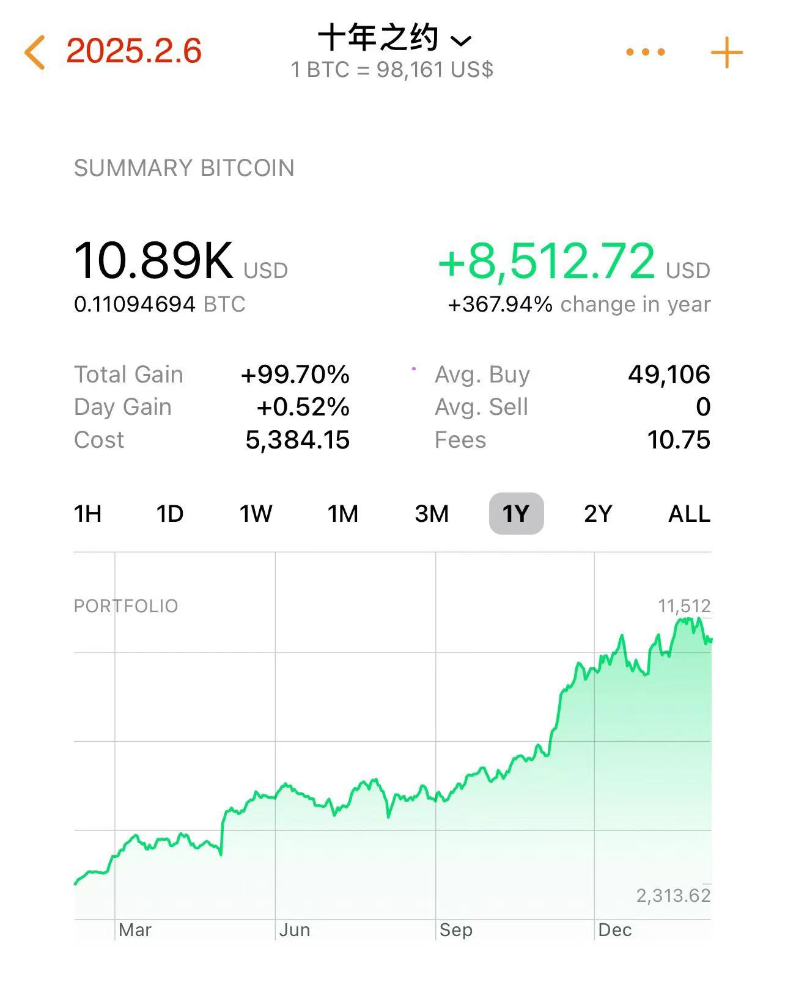

# [十年之约.41] 佛在人心中

隔夜BTC继续悬挂在30日均线100k下方，约98k上下的位置。连日的悬挂加上下影线，像极了冬日悬挂在屋檐下的冰凌柱。

今天又到了《八字诀·十年之约》实盘见证计划A份加仓时间点。于是以96873u的市价加仓137u，得141422聪。投后持仓量增至1109万聪，持仓成本49667u，ROI回撤到96%。关于这个“十年之约”计划的详细情况，可参阅2024.10.6文章《月薪5000工薪族的财务自由计划 —— 十年之约＃33（ROI 34%）》。

假期陪娃访了几座名山，以及若干儒释道各家圣地，如衡山祝融峰、嵩阳书院、龙门石窟等。南岳衡山是中国著名的道教、佛教圣地，山神即是火神祝融，民间相传他被黄帝委任镇守衡山，教民用火，化育万物，死后葬于衡山赤帝峰，被当地尊称南岳圣帝。嵩阳书院位于中岳嵩山峻极峰下，为宋代程朱理学的发源地之一，其建筑风格是研究中国古代书院建筑、教育制度以及儒家文化的“标本”。龙门石窟则由北魏孝文帝前后以及唐代四帝前后两期大规模开窟造像所成，形成具有“中原风格”和“大唐风范”的寺窟造像风格，风靡中日韩，代表了中国石刻艺术的高峰。

由此想到，以明末清初文艺复兴为分水岭，此前人类热衷于塑造神的形象，此后普通人才开始成为艺术关注和塑造的对象。代表这一转折的著名作品之一便是达芬奇的《蒙娜丽莎》。人类的关注焦点，从神性转移到人性。

可是，教链不由得要追问一个问题：神性从哪里来？这些神佛仙圣的塑像究竟从哪里来？

这些艺术瑰宝，直接来源是古代工匠巧夺天工的双手和劳动。但教链更进一步的思考，它们的来源，或许是人类的自省需求。人的自我意识需要通过和一个代表绝对理性的对象对话来完成自我反省和意识进化。这个对象就被抽象为佛、仙、上帝或者圣人。圣人像虽附着于凡人形象之上，但其所意指的圣人却是一种超越凡人之上的神圣性。

神圣性的来源，终究只能是人，或者更具体的，是人的理性。神圣性打个比方就好像圆形。实际上我们人类不可能在现实物理世界画出一个真正的圆。我们画的每一个圆，无论多么精细，放大来看都是由许多原子组成的不规则图形。

纯粹数学意义上的完美的圆，在物理世界中似乎并不存在。它只存在于我们的头脑中。或者更具体地，存在于我们的理性之中。

但是，圆似乎又和其他主观感受全然不同。一些感受，比如喜怒哀乐，是各人不同的。同样的食物，甲吃起来觉得是美味，乙吃起来可能就味同嚼蜡。但是，同样是从一堆原子（铅笔痕迹）的堆积中，甲看出来一个圆形，乙就决然难以看成一个方形。

可见，我们人类的理性构建之中，有一些基础的东西，并非后天习得，也并非我们可以用主观意愿操纵或改变的，而仿佛是与生俱来的，是先天具有的了。

人类能够思考和刻画神圣性，终归和人类能思考和刻画圆形一样，是由这些先天具有的基础构建所决定的。

因此我们就知道，神佛并不在工匠所雕刻的石头之中，而在每个人的心中。

石头雕刻而成的神佛，是有形的神佛，并不是真正的神佛。所以这些只能叫“神像”、“佛像”，意思是这些只是“像”神佛而已，并非“是”神佛。

每个人心中先天自具的神佛，是无形的神佛，才是真正的神佛。

传习录：人胸中各有个圣人。

诗曰：春风杨柳万千条，六亿神州尽舜尧。

圣心本具，何须外求？

只不过，大多数人宁可去信有形的神佛，去拜有形的神佛像，而不愿意去信无形的神佛，去寻找心中先天自具的神佛。

投资是一件需要发展理性，用理性克制感性冲动的事。

所以做投资，本身就是在寻求磨炼和提升自身理性的过程。或者说，见心中佛的过程。这是标准的修行。

金刚经云：若见诸相非相，即见如来。

一句话醍醐灌顶，指明了修行的法门，那就是要认识到“诸相非相”。

什么叫“诸相非相”？就是一切你所能看见的事物外表，都是虚假，不真实的。

你看到BTC跌了，这是表象，是虚假的。你需要透过现象看本质，看到债务美元的持续超发，看到美联储的利率操纵，看到美元潮汐的收割和背后博弈的暗流涌动，……

当你见到一切表象的虚假，不被纷纷扰扰、人为操弄的表象所迷惑，能够认识到所见之相并非真相，你就不再会为庄家疯狂的上下插针而恐惧，不会为突然暴拉而FOMO焦虑，不会为持续暴跌、阴跌而绝望和生无可恋，你心静如水，看淡一切涨跌，仓位涨了十倍还是跌去九成，都在你心中丝毫不能泛起一丝涟漪…… 于是你就见到了如来，见到了心中之佛。见到心中之佛，你也就了然了，原来自己本就自具佛性，自己本就是佛。

真正的BTC，也是存在于每个人内心的理性之中、佛性之中。

BTC在哪里？是在Bitcoin core客户端的代码里吗？是在不眠不休执行哈希计算的矿机的轰鸣声中吗？是在分布存储于全世界数万个全节点上的区块链账本之中吗？

最初，它在中本聪一个人的佛心之中。

现在，它在全世界数亿持饼人的佛心之中。
