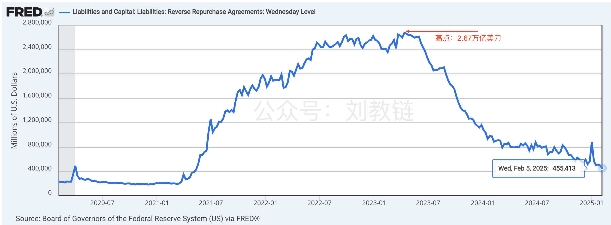
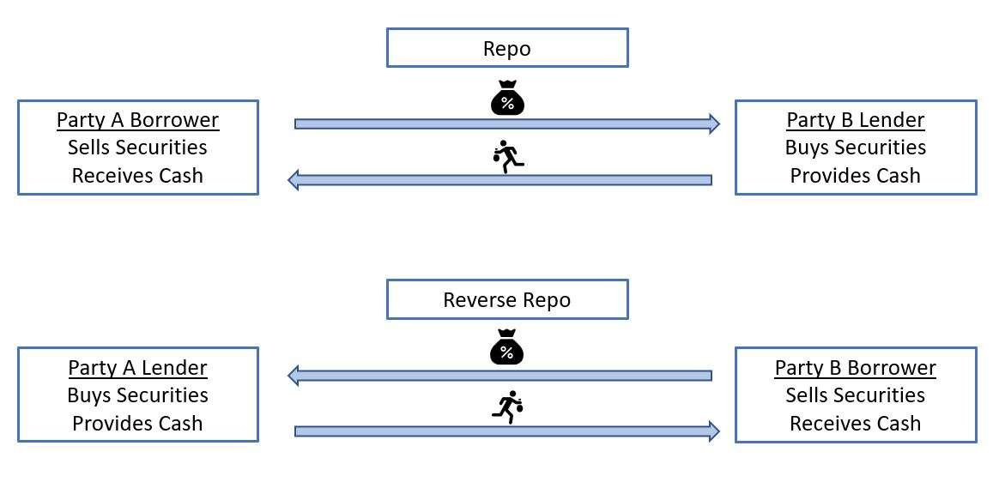
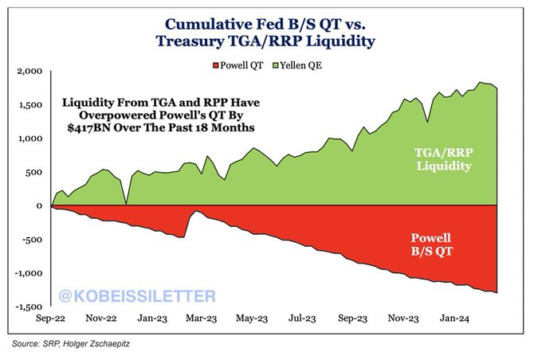

# 超额流动性即将枯竭

隔夜BTC继续维持在97k附近，小幅拉升。2.9教链内参《第5周 加密市场冷冷清清 跌跌不休回测支撑》对上周做了一些复盘。

一个值得注意的宏观态势是美元的超额流动性似乎正处在枯竭的边缘。直观的数据是，美联储RRP（隔夜逆回购）蓄水池只剩下不到5000亿美刀，距离2023年初高点2.6万亿美刀已经暴降2万多亿美刀。

关于RRP的操作原理，教链在2023.10.4文章《美联储世纪大裁员》中曾有所介绍。简单来说，就是银行把美元借给美联储，后者用美债作为抵押品，每天隔夜计一次利息。

在美联储每次FOMC议息会议后的执行摘要（Implementation Note）中，我们都会看到这样一句话：

「以4.25%的利率开展隔夜逆回购协议操作，每个交易对手的每日限额为1600亿美元。」（Conduct standing overnight reverse repurchase agreement operations at an offering rate of 4.25 percent and with a per‑counterparty limit of $160 billion per day.）（教链注：这句来自2025年1月29日的执行摘要）

可以看到，RRP给出的利率，正是美联储调节联邦利率的区间下限利率。

这意味着，市场上低于4.25%的投资机会，就失去了投资意义——你还不如把美元放到美联储的RRP池子里吃印钞机给的无风险利息。

机构的行动是预判性的。2021年下半年开始，RRP飙升，这显示出机构预期美联储要快速加息，从而提前把流动性从市场上回收并放入RRP。而从2023年年中开始，RRP开始暴跌，这同样显示出机构预期美联储可能要降息，或者市场上出现了更有吸引力的投资机会，导致资金从RRP中撤出。

终究而言，从市场上回收的一度高达2.6万亿美刀的RRP流动性蓄积，实则来自于2020年疫情救市期间无限量QE（量化宽松）放出去的水。

回顾一下教链在2020年12月写的《刘教链2020年年终复盘展望报告》，其中指出「在整个2020年，美联储疯狂印钞，一年印出了占美元107年历史所印全部美元总量比例21%的美元，相当于一年增发了26.6%的美元。」图表显示，仅2020年一年美元流动性就暴增约4.5万亿美刀。

为了应对流动性泛滥带来的通胀冲击，美联储使出“吸星大法”，RRP蓄水池一度吸收并蓄积了高达2.6万亿美刀的超额流动性，超过2020年大放水量的一半，可谓“居功至伟”了。

在美联储随即启动并延续至今的QT（量化紧缩）过程中，RRP蓄水池则又充当了“暗渡陈仓”的缓冲器。

一方面，如果市场上出现了更好的投资机会，比如黄金或BTC，资金就会从RRP中撤出，重新回到市场。

另一方面，RRP还为财政部发债融资提供了购买力来源。只要财政部给的收益率足够好，就可以把资金从RRP吸引到TGA即财政部账户去。这部分钱又会通过美国政府支出项目被迅速花掉，重新流向市场。

因此，我们可以把TGA/RRP看作是美联储QT的对冲。

事实上，TGA/RRP向市场上释放的流动性，确实压倒了美联储QT从市场上回收的流动性。

为什么我们会看到BTC从2023年开始顶着美联储的高息和QT一路高歌猛进，突破10万刀，续创历史新高？为什么我们会看到黄金也是节节攀升？为什么我们看到美股继续唱歌继续舞？归根结底，美联储QT变成了障眼法。超额流动性正在从RRP中迅速释放到市场上。

金融的魔术就在于跨时空的财富转移。很多人看不懂，庄家对自己的收割到底发生在什么时候。

2020年美元大放水，2021-2022年蓄积在RRP中，2023-2024年RRP大释放。

如果把美元USD看成是一种土狗币的话，那么收割并非发生在2020年“铸造”4.5万亿的时候，也并非发生在2021-2022年“锁仓”2.6万亿的时候，而是发生在2023-2024年“抛售”2.5万亿的过程中。在这个过程中，庄家把土狗币USD卖给了你，换走了你手里的真实价值（比如有用的货物）或者硬通货（比如BTC、黄金）。

经历过币圈毒打的人，大抵上对于世间一切金融收割手法都会看得通透。

庄家零成本发了一大堆土狗币，要如何操盘才能收割到最大收益呢？直接无脑出货，肯定是卖不出好价钱的。

首先要先大搞“空投”，吸引韭菜，建立所谓“共识”。——这就是2019-2020年前后几年的“直升机撒钱”，惹得世人好生羡慕。

然后大搞“锁仓”、“存币生息”，给出高收益，人为制造稀缺性，造成一币难求的局面。——这就是美联储暴力加息，高息揽储，吸引全球流动性回流。

还要开动舆论宣传，通过各种拿钱说话的合作媒体、KOL满世界喊单，炒热市场、炒高预期，无死角覆盖到每一颗韭菜。——这方面对于控制全球舆论、全球媒体以及远程养殖技术世界一流的大老美简直不要太容易。

只有当忽悠出了一个巨大的趋势，惹得满世界的韭菜奋不顾身地朝里冲的时候，此时才到了最后一步，逆着韭菜的冲锋，果断出货、抛售，把手里的筹码分批次、有节奏地卖给这群傻韭菜。——目前我们正处于这个关键的收官阶段。

从操盘收割的视角来看美联储的操作，就更容易理解它为什么对于降息有些犹犹豫豫。

什么通胀，什么就业，都是托词。最最最关键的是，它必须尽量维持整个高位出货过程中，美元的强势，也就是不能让韭菜看透了真相，停止了冲锋。

就像一个土狗币的庄家，高位出货的时候，必然要配合炮制各种利好，不断测试市场支撑力度，其实就是韭菜冲锋的信心和力度，尽量维持出货过程中的价格水平，不要一下子把市场砸熄火了，这样才能最终实现把筹码卖出最好的价格，以及最终收益的最大化。

和某些割一把就跑路的meme土狗币不同的是，美元这个盘子不能只割一把，而是要长久地玩。

毕竟，链上发个meme土狗，也就是几分钟的事。所以玩废一个盘子，就另起一个盘子玩新的。而要建立一套美元体系，那是要花费不少时间和心血的。

但是美元甚至不如土狗。土狗币人家在链上好歹是智能合约写死总量限制，庄家可能也无法随意超发，割完一波想下次继续，就只能砸盘洗盘，低位回收筹码，难度很高，一不小心还会被散户反噬，所以大部分meme土狗币都是选择直接弃盘，“交给社区”，转而发个新币重新从头玩。而美元是可以由庄家控制，随意超发的，庄家稳赢。

因此不妨把每次QE超发的一批美元都看作一个新的土狗币。只不过这些土狗币有个品牌延续性，都叫USD。这样就好理解了。

美联储做QT量化紧缩，就是为了回收之前一批土狗USD。这就好比是回收旧筹码，为下一波铸造、派发新筹码，开启新的收割打基础。

所以，若用币圈的语言来描述一下现在RRP蓄水池行将枯竭的事，大致上就是说：

上一个土狗USD盘子已经快要完成收割准备收官。完事应该就要开始准备启动下一个土狗USD盘子，开启新一轮的发币收割了。
