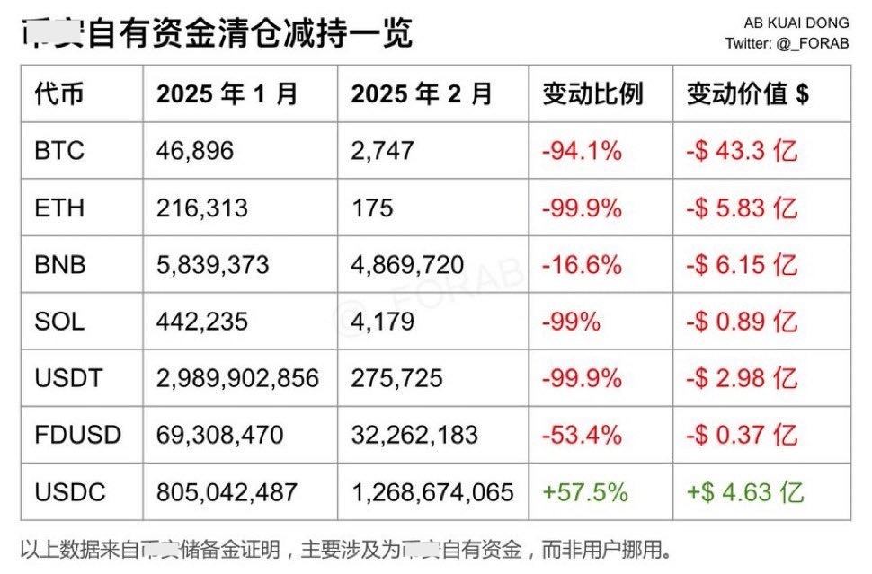

# 清仓

隔夜BTC继续下挫至95k一线。现在的问题是，市场是不是要去回补2月3号那根下影线。那根下影线好长，从99k直直戳到了91k。

下影线这种东西，大概是操盘手在测试市场的深浅。毕竟，如果抛售不能把市场砸崩，自己就会沦为被小虾米们分食的巨鲸。

病来如山倒。有的时候“咵喳”一下子就病倒了。头疼体乏，文章也写不了，操作也做不得了。这大抵是内外因同时作用。病毒想打倒身体，也需等待体虚困乏的时候才得可乘之机。就如空头想要砸盘，也要待市场人心涣散，外部利空来袭时，才好见机行事。

听闻某大所抛售清仓了平台的代币收入，可能是交易手续费之类的流水。这其实也很正常，毕竟交易平台大大小小那么多代币，交易对的手续费收入五花八门，总不能一直持有几千种币，总归是要归拢，也方便财务上做账。

工资和各项开支估计还都是法币（USD）计价，所以从财务管理上讲，把非稳定的加密代币定期抛售掉，换成美元稳定币，也算是合理举措。

只是在这横盘洗盘、风声鹤唳、人心惶惶的时候做这个事情，难免引起大家的纷纷议论和猜测。

要说在这波谲诡变的加密市场上生存和盈利，教链的体会就是四个字：做确定性。

做确定性的反面，就是赌不确定性。

就比如说交易平台吧。它赚的就是确定性的钱——无论你是买入还是卖出，多头还是空头，每笔交易都要给平台支付手续费。而作为交易者，你可能就不是在做确定性——每一笔买入或卖出，并不确定是否盈利或者亏损。

风险对价原理看起来似乎是失效了一般。不承担市场波动性风险的交易平台，稳稳地赚大钱。承担市场波动性风险的交易者，却九亏一盈。

再比如炒meme币。你羡慕KOL动辄晒出几百万甚至几千万美刀利润，以为自己也行。真是大错特错。

用教链指出的原理来分析一下，KOL在PVP游戏中赚大钱，真的是和你一样公平博弈吗？

有没有可能KOL是在做确定性，而你只是在赌不确定性呢？

比如说，操盘方和KOL有合作，KOL可以利用信息差优势，在极早期进入，成本则由操盘方“报销”（为了制造链上自行买入的假象），建仓后向自己的粉丝群体喊单，高位出货套现。这盈利就几乎是确定性的。

更甚至KOL自己起盘、操盘，翻手为云，覆手为雨。像前几天某所链搞的什么所谓测试币来回拉扯，遮遮掩掩，又当又立，你一个小韭菜又能奈何？

教链为什么只是个韭菜，而不是KOL？因为教链不荐币、不喊单、不推广呀。

又比如合约杠杆。教链看到太多新韭菜一入行就玩裸杠杆，这实在是极其危险的事情。因为你只是在赌，而你的对手却是在做确定性。

怎么做确定性？做市商能从系统后台看到所有韭菜开多开空的单子，点位，爆仓价。它们就是捕食者。借势消息面，吸引多头或者空头杠杆，积累到一定深度（养韭菜），就找机会定向爆破，赚个盆满钵满。

教链为什么不做杠杆？就是因为不知道作为散户韭菜，有什么可以做确定性的办法。

话说回来，中本聪发明BTC，最大的特点之一就是提供了一个确定性：2100万枚总量上限。

把财富存储在BTC里，不会被稀释。

存储在其他任何东西里，都会因为无限超发总量或者不断新增盘子而被持续稀释。

最后，教链说的做确定性也不是要否定贝叶斯思维。

毕竟，这世界上就没有什么100%确定的事情，不是么？

关键是，从变量中找到和把握不变量，从不确定中找到和把握确定性，从而让概率成为自己盈利的朋友，而不是敌人。
