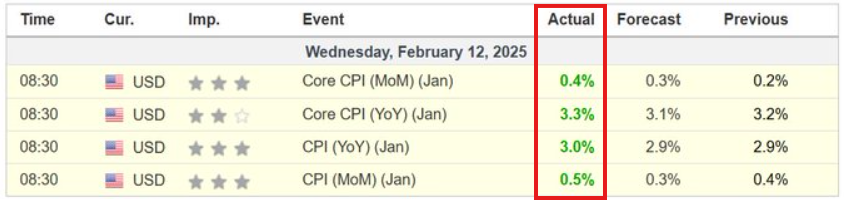
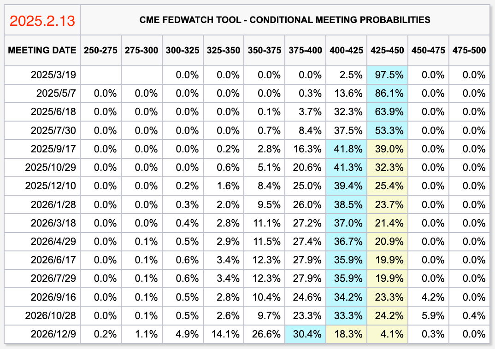
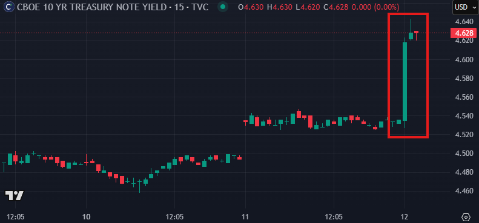
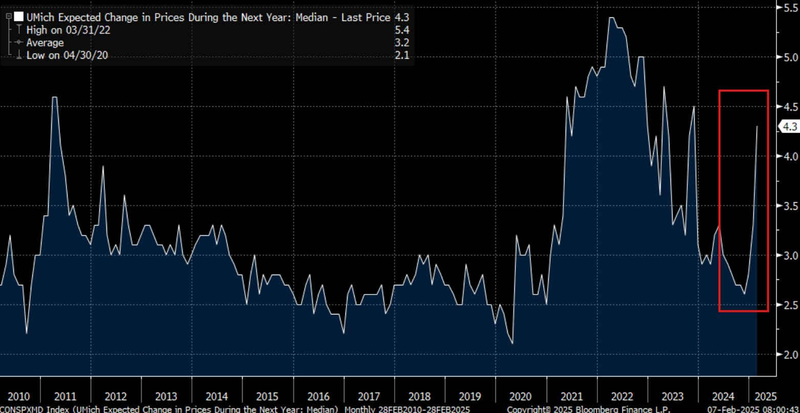
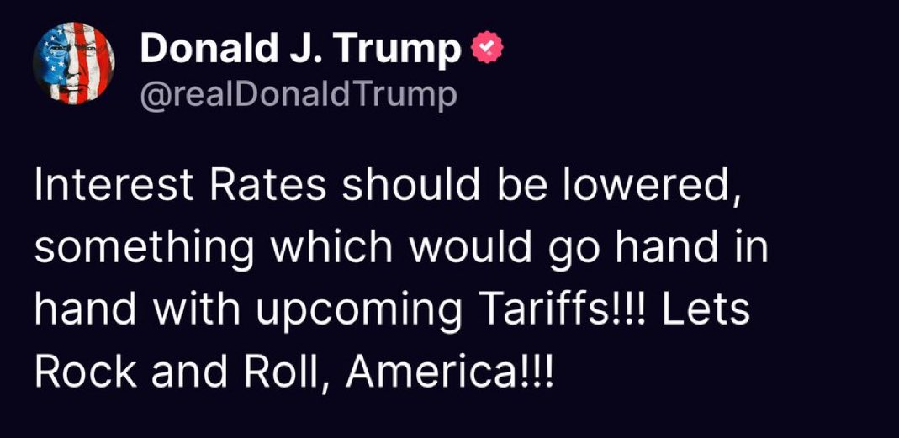
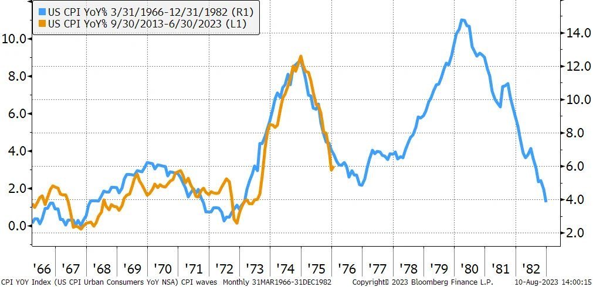
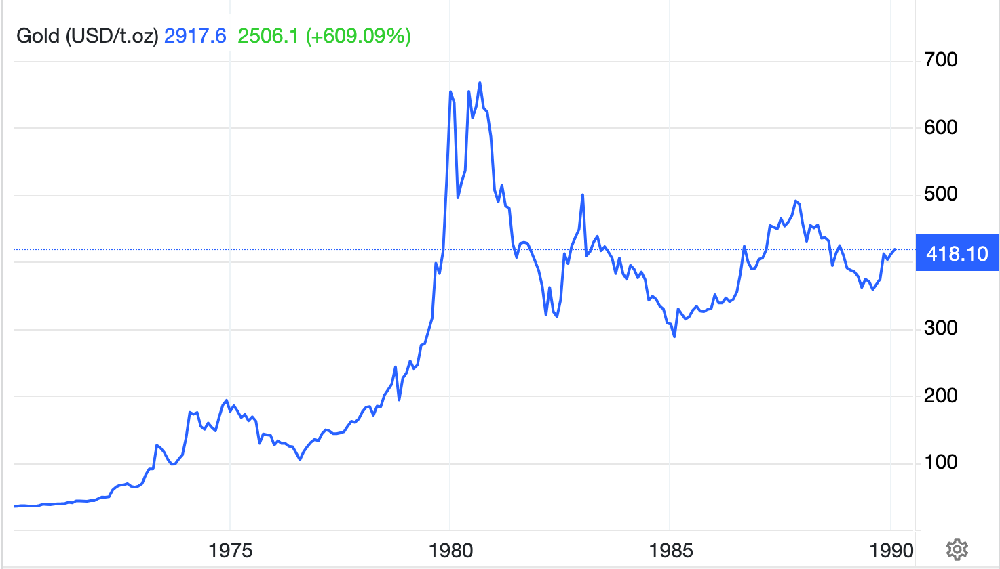

# 坏消息

隔夜BTC在向低试探94k后反拉至97k。原因自然是昨晚9点美CPI数据发布。CPI通胀率在1月份增长了0.5%，这是自2023年8月以来的最大涨幅。核心CPI通胀率原本预计会降至3.1%，但反而上升至3.3%。

通胀数据全面超出预期，迫使市场大幅推迟了对美联储2025年降息节奏的估计。2025年很可能只有一次降息。而第二次则直接推迟到了2026年底！

昨天2.12教链内参《Uni & Pi》已经通报了很多“山雨欲来风满楼”的消息。在CPI数据正式公布之前，美联储就已经在吹风，并不急于降息了。美联储想必是要比市场更早拿到通胀数据的吧。

尽管如此，美股和加密市场，在CPI数据发布的一刻，还是用应声下跌表达了态度。

美债收益率也是应声大涨。

不过，随后BTC就从94k开始了反弹。一路上攻，直至今晨已站上97k。

正如昨天2.12教链内参《Uni & Pi》说的，在美联储不打算进一步降息这个“2025年最坏的消息”面前，市场都没有发生大规模抛售，“是不是说市场已经消化了美联储2025年不降息的预期了呢？”

雪上加霜的是，预期白宫将要实施的关税壁垒政策或将会进一步推高美国国内通胀水平。

这可能也是令美联储对于降息之事犹犹豫豫的原因之一吧！

当然，川普经济学呼吁，降利率应该和加关税一起实施。

你可以说火上浇油岂非通胀要上天？

但你也可以说加关税从贸易中回收了美元，就可以替代掉靠加息回收美元的功效了，不是么？

美联储加息从来都不能真正控制通胀。它只能把通胀推迟。今天加的息，都是未来放的水。

债务乘以利率等于利息。利息就是新增的水。

加关税的思路是创收。创收还债减少债务。减少债务就可以减少利息开支。减少利息开支就减少未来对放水的需求。

加息的思路是去杠杆。如果债务违约，那么就是在没收财富；如果不允许债务违约，那么就要增加利息支出。没收财富无异于抢劫。增加利息支出就要增加未来对放水的需求。放水，则无异于盗窃。

针尖对麦芒。

如此看来，打直拳的加关税，比起来抢劫和盗窃的加息，反倒是相当卡哇伊了呢！

长者说过一句名言：人的命运当然要靠奋斗，但也要考虑到历史的进程。

借用一下，可以说，美联储当然是在为控制通胀而奋斗，但是更重要的是历史的进程。

早在2023年，经济学界就已经为目前的通胀进程是否在复现上世纪70年代美国超级大通胀的历史而争论不休了。

上图蓝色曲线便是上世纪60-80年代美国通胀走势。而橙色曲线则是2013-2023年的通胀数据。

脑补上2024至今的数据，可以看到，继续以近乎完美复刻的方式在2024年呈现通胀下行，但是随即在2025年1月份触底反弹。

如果按照上世纪70-80年代的历史，大通胀就要不可避免的降临的话，美联储就不但不能降息，可能还要面临当年“沃尔克时刻”的超激进加息的艰难抉择。

回顾那段历史，不妨再读一下教链2025.1.5文章《未来30年》。

只不过，以美债如今的天量规模，恐怕鲍威尔就算想效仿沃尔克“杀身成仁”，也是有心无力吧？

当真正失控脱缰的超级通胀降临时，作为通胀对冲工具的零息资产，是何表现呢？

那时候还没有BTC。我们看看黄金好了。

不要太美。
