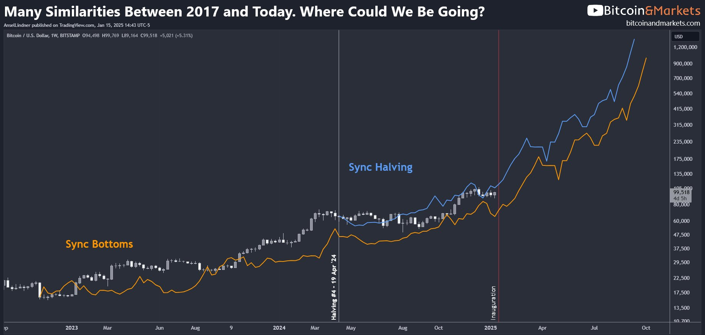
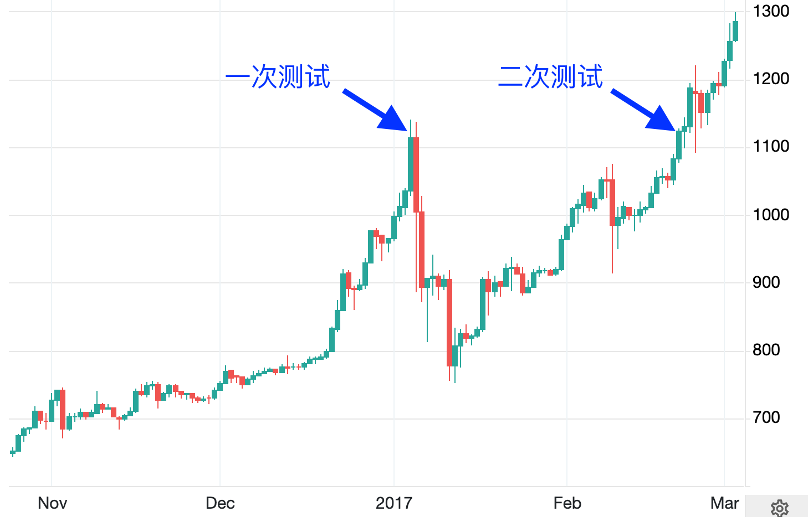
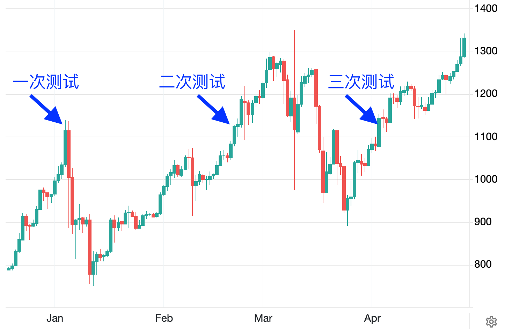
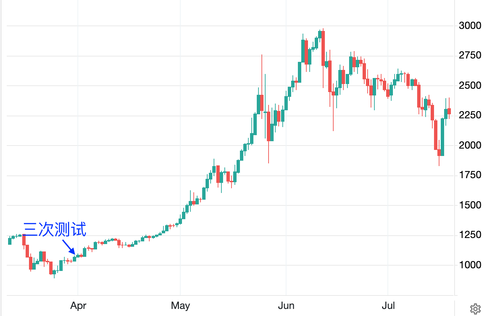
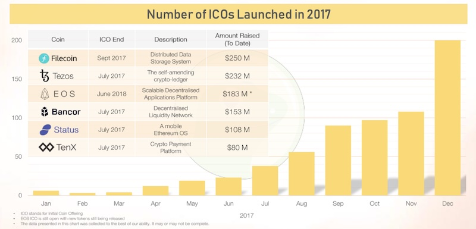
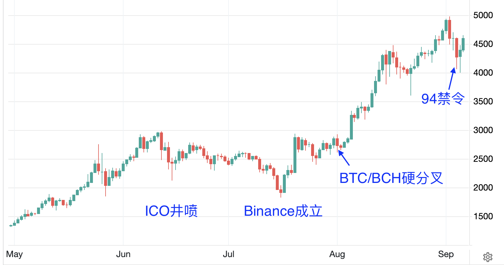
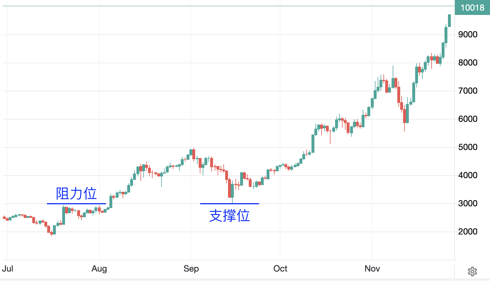
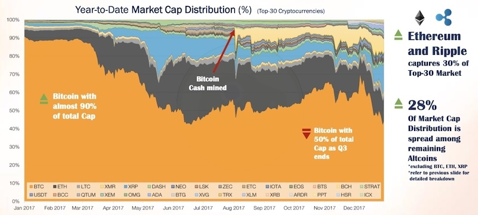
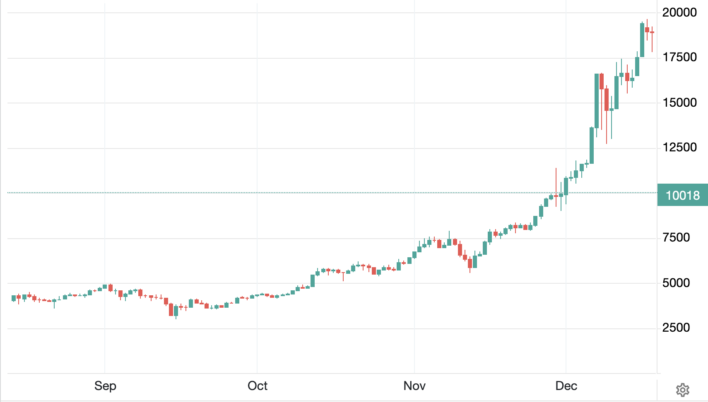
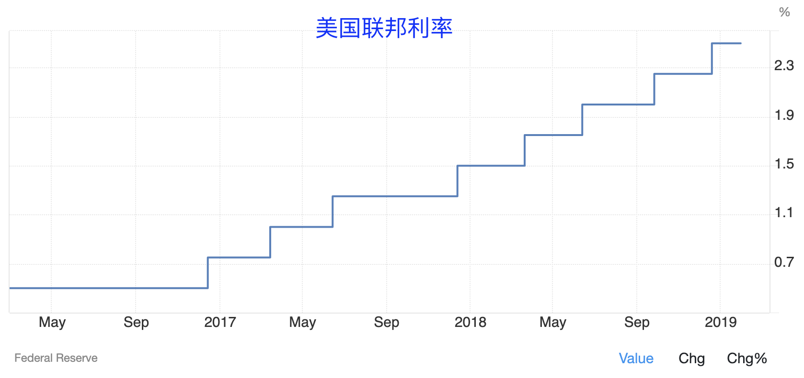

# 破茧成蝶

隔夜加密市场普遍回暖，BTC重新站上97k。如昨日2.13教链内参《乐观与悲观》所言，市场或已消化美联储的行动预期。美元指数下跌，令市场暂时松了一口气。

在年初三篇，包括1.21教链内参《百万美刀》、1.24教链内参《春节将至》以及1.25文章《BTC 105k》中，反复提及，不少海外分析师感觉，本轮周期似乎在走2016-2017牛市周期，而不是2020-2021牛市周期。

2016年的BTC，刚刚从2015年的熊市悲痛中走出来，步入犹豫不决的复苏进程。年初1月1号开盘在430美刀左右，年底12月31号收盘就已经回升到了960多美刀，已经接近于2013年底的历史高点1100美刀。短短4天之后的2017年1月4号，BTC就冲上了所谓2013年的前高，即1100美刀。

好景转瞬即逝。对前高的测试迅速吸引了套牢盘慌张的出逃砸盘。2017年1月5号盘面就急转直下，到1月11号，BTC已经从1100美刀大幅回撤到了最低755美刀附近，跌幅超过30%。

这倒极为应景地展示了教链在《小杂感》中说的“韭菜三宝”之一，“回本止盈”。每次突破前高的地方，总是会面临套牢盘解套跑路抛售的阻力。

不过他们的跑路并不能阻挡牛市的进程。很快，多头重整旗鼓，在2月21号重新测试前高阻力位，并成功突破。

不过，二次测试仍然是一个假突破。2017年3月份，空头又杀了一个回马枪。

直到2017年4月初，蹉跎了整整一个一季度的时间，BTC才第三次重新测试前高阻力位，并取得实质性的进展。

这次测试让BTC彻底摆脱了1000美刀的束缚。到2017年6月上旬，二季度还未结束时，就冲到了接近3000美刀的位置。短短不到三个月时间，涨了2倍。

2017年的牛市由三大主线剧情交织而成：

一、ICO发币浪潮。

二、BTC/BCH硬分叉。

三、“94禁令”和交易所洗牌。

市场常常认为，是叙事推动了牛市。教链却觉得，与其说是叙事推动了牛市，毋宁说是牛市推动了叙事。

在二季度BTC终于实质性突破前高，火箭发射升空，飞向星辰大海时，市场才终于确信，牛市是真的来了。于是我们看到2017年6-7月在创下历史新高后的回撤，或许是蠢蠢欲动的资本在抛售BTC，不是离场，而是置换资本准备大干一场。

2017年6月，大规模的ICO开始井喷，发币融资、一夜暴富的神话引人注目。人人都想参与，人人都在打听怎么参与。这市场的干柴烈火一直持续到2018年下旬才被步入熊市的BTC给熄灭掉。大量的发币造就了大量的交易需求，为交易所格局洗牌埋下了伏笔；留下了大量的代币遗产，成为链上交易协议的需求来源，催生了Uniswap（2018年初）这类协议孵化而出。

2017年7月，Binance成立。短短半年之后，到2017年12月底，按照日交易量计算，它就已经冲上了全球加密货币交易所排行榜的榜首一哥位置！从初创到世界第一，只有半年。这就是加密行业的速度！

2017年8月，在BTC区块高度478588处，BCH正式从BTC硬分叉出去，开始了独立的扩容之路。当然，也造成了社区的撕裂和混乱。很多人信了BCH的大区块扩容路线，抛售了所有的BTC持仓，全部换仓成了BCH。这个分道扬镳的区块时间戳是2017-08-01 21:16:14。

但是BTC/BCH的硬分叉并未阻挡牛市的热情，反而推动BTC迅速突破3000美刀阻力位，在一个月内再添2000美刀，冲上5000美刀历史新高度！至此，相比于年初1000美刀阻力位，经过三个季度的牛市进程，BTC已经从1楼坐电梯上到了5楼。

福兮祸之所伏。由于ICO发币实在是太火爆，非法证券发行的指控和欺诈隐患也随之而来。

2017年9月4号，监管利剑出鞘，剑指ICO和境内虚拟货币交易所。境内介绍ICO的网站紧急关停。大量火爆的交易所关停并转，或者出走海外。

发币项目方开始寻求海外（比如新加坡）落地发币主体，进行所谓“合规”。

交易所行业大洗牌，乱世危局，让刚刚成立仅2个月的Binance抓住了历史性的机遇，承接了大量仓皇出逃的用户和泼天的富贵，一跃成为全球交易量最大的加密货币交易平台。

更为戏剧性的是，某些项目方在监管要求之下进行退币，即退回认购资金，换回自己发的代币，结果却“因祸得福”，原价退币换回来的代币在年底出人意料的超级大牛市中几十上百倍地暴涨，于是趁机高价出货，反而赚了比当初私募认购所募集的资金多得多得多的钱。屌丝项目方直接逆袭成了行业大佬。

“94”冲击之下，行业并未如当时许多人恐慌的那样走向覆灭。BTC只是回测了一下几个月前的阻力位3000美刀，确认一下它是不是翻转成了支撑位。确认之后，便一骑绝尘，直冲10000美刀而去也。

这波一级不如二级的经验，也许在亲历者心中留下了难以磨灭的深刻印象，催生了2019年初的IEO，即跳过ICO的私募环节，直接上交易所发行，拉高出货，从二级市场收割。

有趣的是，在2024年SEC和XRP（瑞波币）的案子里，我们反而会看到，美国法院认为，一级市场募资有更大嫌疑涉嫌非法证券发行，而二级市场募资（收割）反而被认为是不涉嫌证券。也就是说，IEO比ICO的合规风险更低。也许原因是，法官会认为，二级市场的透明度更高，信息更充分，比一级市场发生欺诈的可能性更低吧。

学到了这些经验的人，在这轮周期，2023-2024年，就都用到了meme币（模因币）的发行、炒作和收割方法上。

到了2017年三季度，BTC的市值在整个加密市场的占比，从年初的90%一路下降到了50%。可见，山寨币在迅速扩容，无论是数量方面，还是价格方面。其中，主要是代币发行平台以太坊、“妖币”XRP（瑞波）以及硬分叉出来的BCH，迅速扩大并占据了相当份额。

巨大的惯性让BTC在12月初冲破10000美刀后根本停不下来，反而以加速度拉升。短短半个月便再次近乎翻倍，在12月中旬从1万美刀冲到了2017年牛市顶点19800美刀，接近2万美刀。最终实现了全年近20倍的涨幅。

那些在年初，从熊市的地下室刚刚回到1楼就匆忙逃离的人，也许肠子都要悔青了。那些在9月份5楼下车，或者因为“94”电梯下坠恐慌逃跑的人，也错过了20楼的好风景。

从1楼上到5楼就感到头晕目眩有些恐高的人，自然很难坚持到20楼而不吐。

当然，坚持坐电梯上到20楼，一览众山小之后，继续持仓经过2018年熊市，还会坐电梯下楼，一直下到3楼-4楼。这是后话，暂且不表。

可以看到，这电梯运行的速度是相当不平稳。

仿佛是要尽量引起最多人不适和呕吐似的。

开始3个月好像是坏掉了，不怎么向上走，甚至还向地下走，一步三倒退的样子。把猴急的人熬下车，“骗”他们去爬楼梯。

而后开始加速上升，花三个月上到3楼，再花三个月上到5楼。上到5楼猛地失控下坠（“94” -40%），吓得胆小的人夺门而逃。

胆小的应跑近跑了，退币的应退尽退了，筹码重新回到庄家手里了。筹码集中了，“车轻了”，于是拉盘就变得更加容易。

于是电梯开始骤然加速。两个月时间不仅收复5楼，而且翻一倍上到10楼。再半个月直接二次翻倍冲顶20楼。

2个月 = 9个月。0.5个月 = 11个月。

与此同时，美联储在干嘛呢？在忙着加息呢！

从2017年开始，美联储把联邦利率从0开始，一路加息。到2019年初已经加到2.5%。但这根本就没有挡得住2017年BTC破茧成蝶。

外因从来都不是根本性的障碍。就像压在野草种子上面的石头，当野草生长出来的时候，就要把石头顶开了。

虽然目前BTC看似仍然持续受到美联储宏观态势的压制，但是当内因的力量突然爆发的那一天，就要冲破这枷锁。
