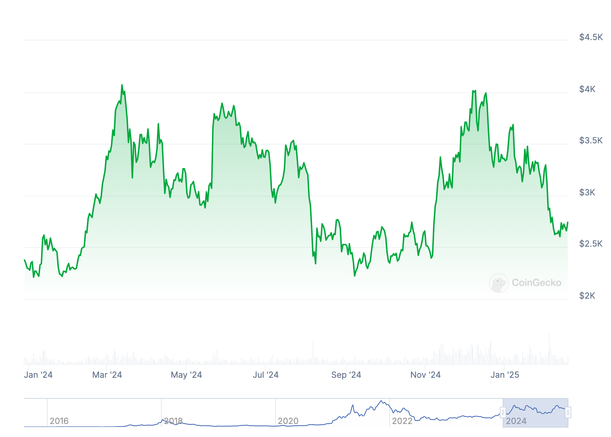

# 等不来的山寨季

隔夜BTC在96k上下晃悠，一副欲下不下、欲上不上的样子。昨晚教链在2.17内参《蠢蠢欲动》中说，看BTC微跌山寨却普遍上涨，是不是山寨季正在蠢蠢欲动呢？可是这轮周期的山寨季，却是盼星星盼月亮，怎么盼也盼不到，怎么等也等不来。

「我等到花儿都谢了 / 我等到海水都枯了 / 我等到星星换成了太阳 / 又等到太阳换成了星星 / 却还是没有等来 / 那该死的山寨季节」

就看市值第二的“山寨头子”ETH过去一年多的表现吧。从2024年初至今，在2.5k和4k之间稳稳震荡。做LP的狂喜（无常损失等于零啊），囤积待涨者简直欲哭无泪。「青春，以太坊你还我的青春……」

教链已经不是第一次看到有各路大小自媒体吆喝山寨季要来，山寨季要来了。印象中从2023年底开始，就陆陆续续不绝于耳。

市场却堕入了地狱般的轮回之苦，套在了“燃起希望-跺脚梭哈-失望割肉-重燃希望”的死循环之中。

在一次次的大饼到山寨、山寨到大饼的换仓中，在一次次的追涨杀跌中，本金被操盘的庄家狠狠地反复摩擦，越磨越少，快要消耗殆尽了。

本金消耗殆尽，心气也就要消耗殆尽了。

没有了心气，还在市场里混什么混？

这一轮周期，这一轮牛市，简直就是魔鬼。

每一个押宝山寨的人，仿佛是和魔鬼签订了契约。

不，是自身变成了魔鬼。

忽然想起娃儿们给教链讲的段子：黑袍子里面只剩一副骨架的魔鬼，其实内心是无比善良的；而血肉丰满、肌肤水灵的天使，却并没有表面看起来那么善良。因为善良的魔鬼把自己的血肉都割下来施舍给别人了，所以才只剩下一副空荡荡的骨架，不得不用黑袍子来遮掩。

山寨币的爱好者，也是一个内心善良、割肉伺人的魔鬼吗？

教链猛地惊觉，是娃儿们把段子讲错了。

那魔鬼哪里是因为内心善良才割肉伺人的哟！

魔鬼明明是因为贪婪和恐惧的驱使才被迫割肉的嘛。

这才很好地解释了，为什么魔鬼成为了魔鬼。

小心。当我们手里有魔鬼（山寨仓位）、内心有魔鬼（贪婪恐惧）的时候，我们最好不要拿“善良”当挡箭牌，自我美化，自我安慰。

教链忽然发觉，所谓美德，其底层本质是力量。

能够让你更有力量的信念，能够让人们更有力量的信念，就会被称为美德。

恶行可以在一时、一处具有局部力量优势，但是从来都没有一种恶行，可以永远的、整体的对美德具有压倒性的优势力量。

这简直太容易证明了：如果这样的恶行存在，那么今天所有的美德都应该早已被消灭。只要这世界上还存在美德，就可以证明上述命题。这就是反证法。

此刻，教链的思想已经超越了善恶，触摸到了心之本体。

即王阳明所说的“无善无恶心之体”。

从心之本体的高度去俯视二级市场上一切追涨杀跌、贪婪恐惧、拉盘砸盘、操盘收割，就像老师站在讲台上俯瞰整个教室，每位同学的小动作和听课状态，尽收眼底，都是透明。

为什么有些同学洋洋自得地规划什么几月建仓、几月减仓、几月逃顶，都是徒劳无功？

只要是对山寨季充满希望、积极布局筹码的人还在，哪个山寨币的庄家会好心拉盘让他们逃顶获利反割庄家？

哪次市场的突然拉盘不是韭菜绝望到失望，割肉清仓、抛掉筹码之后，庄家才开始意外拉盘，吸引韭菜杀回来高位上车接盘，庄家好把筹码高位派发给追涨的韭菜？

力量在市场中的流动，像水，像云，又像风。

法无定法，形无常形，势无常势。

真正的投资，你不要去立flag。

投资应该有计划，有纪律，但不应该立flag。

什么是立flag？

立flag就是像上面说的某些同学，自作聪明地预测和预定未来一个确切的时间一定要干什么，加仓或者清仓，抄底或者逃顶。

什么时候适合抄底？唯一正确的答案是：底到来的时候适合抄底。

什么时候适合逃顶？唯一正确的答案是：顶到来的时候适合逃顶。

而永远不会是一个未卜先知的、确切的时间。

同样的，还有同学会对仓位的数字立flag，比如，要买够N个BTC，或者，价格到X就减仓，又或者，等赚够XXX万或者赚到XX倍就清仓，诸如此类。

往往当你固着在这样的对数字的执念时，错过了加仓的机会，拍断大腿，或者，错过了高位减持的机会，坐了过山车。

什么价格适合买入？唯一正确的答案是：应该买入的价格。

什么价格适合卖出？唯一正确的答案是：应该卖出的价格。

而永远不会是一个未卜先知的、确切的价格或倍数。

只有经历过，才知其中痛。

王阳明说：「此心不动，随“机”而动。」

他说的“机”就是时机，是机会，是“未卜先知的、确切的时间”和“未卜先知的、确切的价格或倍数”的反义词。

只在当时机和机会降临的时候才心动行动。

时机不到，便如如不动，非善非恶，恪守心之本体。
