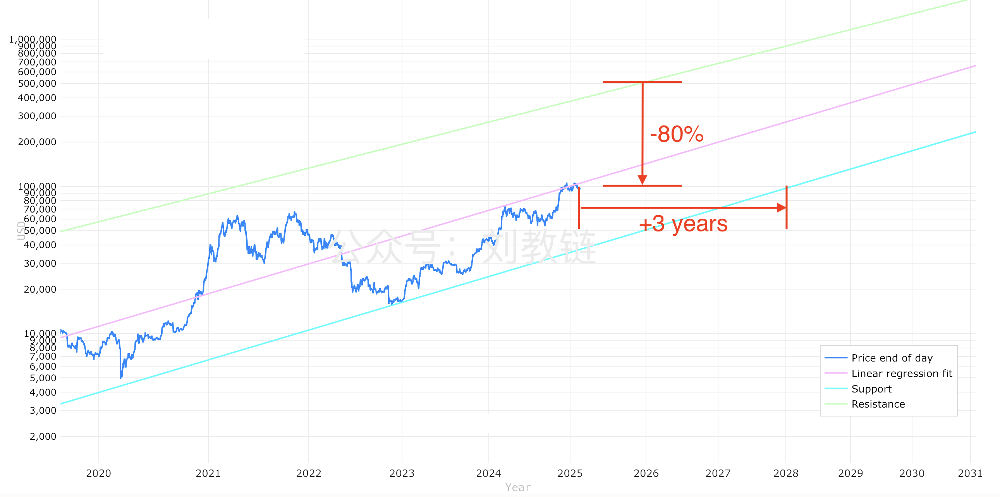
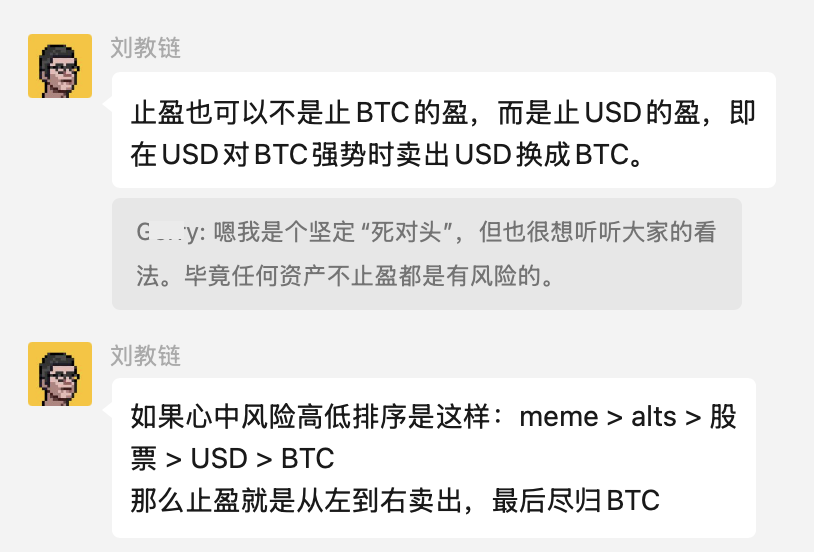

# 止盈

隔夜BTC继续下滑，一度滑倒在93k一线，晨时复又拉回95k左右。

现在是什么阶段？

有人说牛市已结束。而且还是双顶结束。2024年初是第一次冲顶。2024年底、2025年初是第二次冲顶。不过教链打开周线图一看，这倒不像是双顶。这分明是上台阶嘛。

昨天2.18教链内参《中期洗盘》介绍了一些业内分析机构的观点。目前普遍的看法还是说，现在是牛市中期。我们似乎距离尾部还有距离。

当然，尾部风险肯定会越来越大。

有的人选择10万刀减持清仓，“不吃鱼尾”，规避风险，落袋为安。

也有的人喜欢搏击风浪。“风浪越大鱼越贵”。

拿得住u，拿得住币，这本就是两种不同思维。一为u本位。一为币本位。u指稳定币。币若是B，币本位就是B本位，BTC本位。

把BTC换成u，所忖度的，乃是卖飞的风险。就算本轮牛市冲到幂律高轨50万刀，跌去80%也仍然会回到10万刀。

把u换成BTC，所思虑的，乃是套牢的风险。2025年初的10万刀位于幂律中轨，待低轨运行至此，还需3年。即，套牢的最长时间也许不会超过3年。

前者参照的是过去的经验。后者所看的是未来的预见。不过，未来也是过去。

前者的希冀，乃是等得一个更低价格抄底的机会。

后者的所愿，乃是不要错过增持BTC数量的机会。

前者丈量的，是空间的相对性。

后者目测的，是时间的相对性。

VIP群里的小伙伴讨论“止盈”的话题。教链自己的看法是，不是卖掉资产就是止盈，而是把高风险的资产置换成低风险的资产。

教链心中的风险排序是这样的：meme > alts > 股票 > USD > BTC。

三个月前教链就写过，《牛市宜挣钱》（2024.11.18文章）。核心意思就是牛市是发现和抓住落袋时机的好时候。

当然，前提是熊市有积累。

有积累，才会有盈可止。

无积累，只能颗粒无收。

错过牛市有两种：一种是不知道有牛市；另一种是眼睁睁看着牛市，手里却没有筹码可以抓住。

不知道有牛市固然可惜。抓不住牛市却尤为抓心挠肝。

但是，千万不要因为抓心挠肝就去做错误的方向，就FOMO（害怕错过），就从右向左置换资产，把低风险仓位置换成高风险仓位。

牛市要保守。熊市要冒险。做反了，不敢说一定会亏损，但是大概率要遭受套牢之苦。

教链虽然这么写，但也是做不到。

却还是要写一写，提醒自己，这一次要做的比上一次好一点点。有一点点进步，就可以了。

投资这事儿，要战胜的最大敌人，不是别人，而是自己，自己心中的魔。
