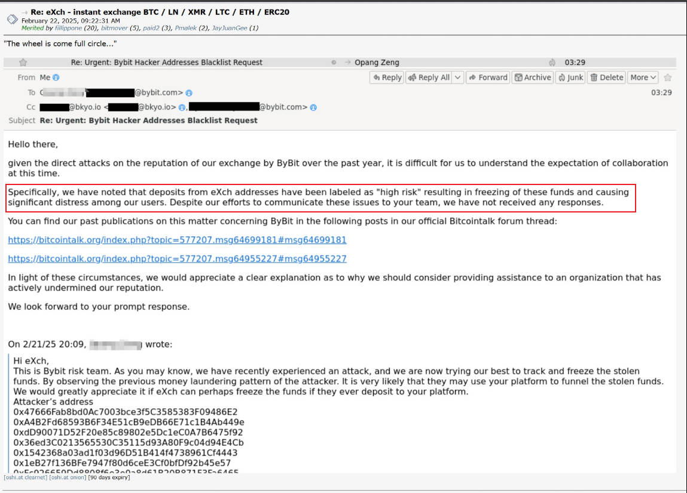
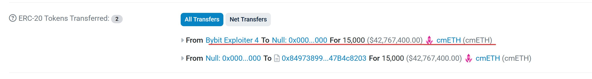

# 癖马案

周末BTC继续下行至95k一线。十年期中债收益率显著反弹，这在今日2.23教链内参《第7周 发币丑闻终结模因时代 惊天一盗或促市场转折》中有述。

周末bybit冷钱包盗币案继续发酵。有几个事情颇为耐人寻味。

一是某个叫eXch的混币器在bitcointalk论坛贴出bybit风控团队请求封杀若干黑客地址的邮件回复，霸气回怼称后者曾持续攻击其声誉，并随意封杀前者客户地址，造成极大困扰，故而反问后者有何颜面请求前者配合封杀？

此举在业内迅速引起争议。有人挺eXch坚持去中心化精神，拒绝沦为无执法权的私人机构“动用私刑”的打手。也有人批评eXch是为坏人服务，不道德。还有人说他们双方是狗咬狗一嘴毛。

二是跨链交换协议chainflip发声，说ETH到BTC的跨链转换是去中心化的，他们项目方也没有能力冻结黑客的资金。不过，他们依然提供了一些帮助，修改了前端，增加了使用难度。

这算是中规中矩的做法了。像cmETH那样协助冻结吧，似乎就是明晃晃地宣誓项目方其实对整个系统资金有任意处置的超级权限。不做吧，又恐怕会遭到像eXch所遭受的非议，被戳脊梁骨说成是与黑客为虎作伥。

这次bybit黑客也做出了惊人之举。当cmETH项目方冻结了衍生资产转换回ETH的通路之后，黑客直接把手里的cmETH转到黑洞地址销毁了！总价值超过4200万美刀！大手笔！

销毁了“白条”，其实就是把底层资产ETH直接拱手送给了项目方。这招挺厉害，这下子把皮球踢给cmETH项目方了。看你们是不是要把这些ETH拿出来还给bybit？如果项目方这么干了，就坐实了他们对整个协议池子里的用户资金具有支配和窃取的后门权限，不是吗？

要说这黑客还真是相当懂人性，懂博弈。

三是有人说此次14.6亿美刀ETH资产被盗，把以太坊基金会和创始人Vitalik Buterin架在火上烤，推入了一个两难境地。如果他们接受社区建议，进行投票硬分叉回滚以太链，那么就证实了以太坊的中心化控制本质。如果他们不推动硬分叉回滚帮助追回赃款，那么就可能会面临美国OFAC的帮助金融洗钱犯罪等指控。

当然也有人指出，以太坊基金会和Vitalik并没有能力推动以太链的硬分叉。从以往基金会主导的那么多次硬分叉来看，包括使用逻辑炸弹绑架矿工，似乎一直在证明他们就是实际的主导者和控制者。

遇到事儿了，他们就忽然变得不能主导了。

主打一个身段灵活是吧？

历史上确实有一个著名的关于“期待可能性”的法律案例叫做“癖马绕缰案”或者“癖马案”（Leinenfänger Case）。

在该案件中，被告是一名马车夫，长期受雇驾驶一辆双匹马车，其中一匹马名叫莱伦芳格（Leinenfänger），有以其尾巴绕住缰绳并用力压低的恶癖。马车夫和雇主都知道这一癖性。1896年7月19日，马车夫在雇主的命令下被迫使用这匹马，结果在途中马匹再次发作，尾巴绕住缰绳并用力下压，马车夫无法控制，导致马匹狂奔，撞伤了一名路过的铁匠，致其脚部骨折。检察官以过失伤害罪对马车夫提起公诉，但原审法院宣告被告无罪。检察官不服，向德意志帝国法院提起上告，1897年3月23日，帝国法院驳回了上告，维持原判。法院认为，虽然马车夫知道马匹的癖性可能导致伤害，但在雇主以解雇相威胁的情况下，很难期待马车夫违抗命令拒绝驾驭该马。这一判决确立了期待可能性理论，即法律不强人所难，如果行为人无法选择合法行为，即使实施了违法行为，也不负刑事责任。

要做到项目的完全去中心化，之所以困难，就在于你始终无法彻底消除掉人们对你作为项目方的期待可能性。

哪怕你移交了全部的权限，人们可能还会期待你振臂一呼，一呼百应，就能把社区团结起来去做一个所谓正义的事情呢。

除非，你能像中本聪一样激流勇退，彻底消失。
