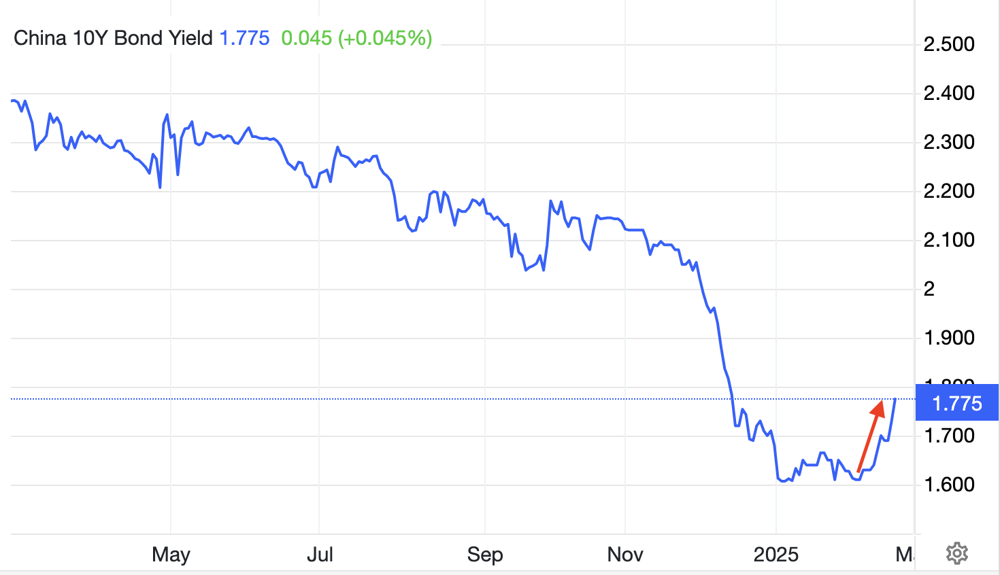
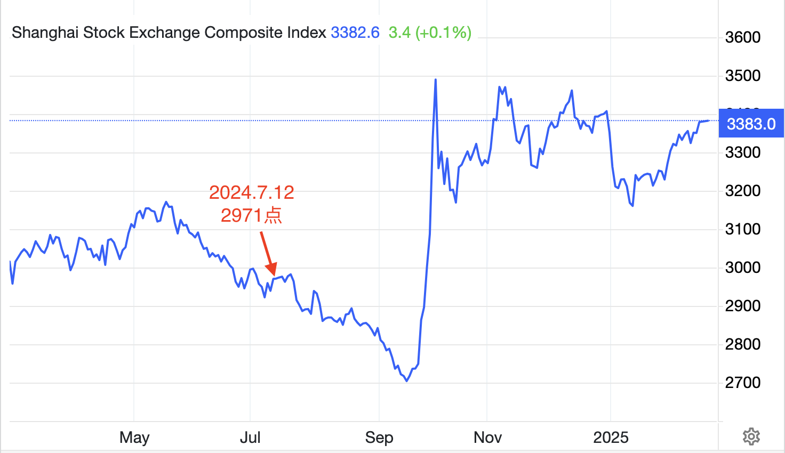

# 先声夺人

隔夜BTC小幅修复至96k附近。昨周日2.23内参一周回顾《第7周 发币丑闻终结模因时代 惊天一盗或促市场转折》中提到十年期中债收益率反弹一事。什么个情况呢？看下图。本月初2月8号还在1.61%的历史低点。今天2月24号已经大幅攀升16.5个基点至1.775%。

举目四望，简中大V们还在坚持天天讲所谓“A股粪坑论”的时候，事情已经悄然发生了变化。上证指数已经走出去年9月2704点低谷的阴霾，回升到3380点。

在上图中，教链特意标记出了2024年7月12日2971点的位置。因为就在那一天，教链在微信公众号上公开发表了一篇文章《鲍威尔意外松口，BTC十万可期》。

在那篇文章里，教链明确写了这样一句：「至于大A，也将迎来它20年级别的楔形突破。」

低位加仓的机会不常有。最常见的往往是错过后高位追涨。

文章末尾如是写道：「不敢迎风撒尿的，不是热血青年。不敢在熊市逆势加仓的，也不会成为牛市的赢家。」

写文当天，BTC 5.7万美刀。

5个月后，2024年12月17号，BTC 10.8万美刀。

* * *

教链7月12号文章一个月后，2024.8.29文章《金融战败后美元或将被迫涌入加密市场》中，教链指出，「除了简中自媒体还有几个崇美学者扬言美联储绝不会降息（言下之意，决不投降，绝不承认本轮金融战败）之外，恐怕连美国人自己都没几个相信这种鬼话。」

教链7月12号文章两个月后，2024.9.19文章《美联储降息落地，一半的人都错了》记载，美联储9月议息会议超预期降息50基点。

又过了5天，2024年9月24号，央妈放大招。参见教链2024.9.25文章《央妈大招之后的热思考》。

次日，2024年9月25号，我火箭军成功试射洲际弹道导弹。美方表示赞赏。

又次日，2024年9月26号，政治局开会。

27号，教链发文《大A重回3000点，BTC重回65000》。

* * *

2024年11月6号，美国大选结果揭晓，特朗普胜选。教链发表11.6内参《特朗普胜选对加密后市意味着什么？》。大A 3383点。BTC 7.6万美刀。

2024年12月26号，疑似六代机首飞的照片在网上传出。美方表示美国是爱好和平的国家。教链在2024.12.28文章《双飞》中写了一个双关隐喻。

2024年最后一天，12月31号教链内参的标题是《深度求索》。谁是深度求索？DeepSeek。在内参中教链如此记录：「年底私董会上教链说到的那个国产AI deepseek，最近教链从chatgpt切到deepseek，发现它比chatgpt确实只强不弱。」

一个月后，2025年1月27日，DeepSeek忽然就“爆”了，全球走红。OpenAI、英伟达、美股，忽然遭到突如其来的一记重拳，眼冒金星，脑袋嗡嗡。2025.1.27教链发文《暴击》。

春节档，国产动画电影《哪吒2》上映。教链带娃旅行途中见缝插针到洛阳一家电影院观看后，写了一篇《魔童闹海》（2025.2.5），当天票房刚刚50亿rmb。很快，2月17日，《哪吒2》票房就突破120.5亿，冲进了全球影史票房榜前十名，成为首部进入全球票房榜前十的亚洲电影！

* * *

今时今日，站在2025年2月24号的当下，重新回读半年多前2024年7月12号文章中的话，「BTC十万可期」，「大A也将迎来它20年级别的楔形突破」，那是充满乐观的先声，先声夺人。

教链半年多前写文时，很少人敢于想象，到底是什么级别的利好，才能把坠落3000点的大A拉出泥淖，推向史诗级别的反转和突破？

仅仅半年多，历史已经用铁的事实向怀疑者呈现了到底是何等量级的惊天变局：

经过数十年的厚积薄发，中国突然以迅雷不及掩耳之势，在美国捍卫多年的金融霸权、军事霸权、科技霸权、文化霸权等各条战线上，雷霆出击，势如破竹。

可想见，如果各条战线继续节节取胜，能不能撑得起大A超长线级别的反转突破？

各人尽可自由心证。

历史大势，浩浩荡荡。顺之者昌，逆之者亡。

大势既成，就会不断自我强化，加速前进。

滚滚历史车轮前，不自量力的螳臂当车，只会被碾作肉酱。

见风使舵的大英帝国传媒巨头BBC，一改往日滤镜和风格，献上一部《中国制造2025》纪录片，一时间让网友惊呼这还是那个熟悉的BBC吗？（当然这背后还有马斯克断粮的暗线之功）

* * *

小小寰球，有几个苍蝇碰壁。
嗡嗡叫，几声凄厉，几声抽泣。
蚂蚁缘槐夸大国，蚍蜉撼树谈何易。
正西风落叶下长安，飞鸣镝。

多少事，从来急；
天地转，光阴迫。
一万年太久，只争朝夕。
四海翻腾云水怒，五洲震荡风雷激。
要扫除一切害人虫，全无敌。

* * *

百年变局，忽然出现了局部加速的拐点。

也是与此同时，BTC作为策应的力量，成功实施了特洛伊木马战术，借由促成特朗普亲加密立场的转变以及当选，登堂入室，渗透到了美元堡垒的内部。

俗话说得好，堡垒总是从内部攻破更为容易。

有人天真的认为，美国将会借助BTC加强美元的霸权地位。

BTC不是霸权货币。

要么被BTC打败，被迫放弃霸权。要么接纳BTC，主动放弃霸权。二选一。

* * *

教链大A仓位的收益，超出同期建仓的山寨币仓位的收益。

投资这事儿不要听别人说东说西。自己亲自试试才知道。

A股仓位还能每年分红，也是场外现金流（相对于币市而言的“场外”）的有益补充。

教链关心中债收益率，是因为2024.8.31文章写过，《中国长期国债收益率与BTC的奇妙相关》。

中债、A股、BTC，以不为人知的千丝万缕的联系，发生着某种联动。

本轮周期，继续验证。
