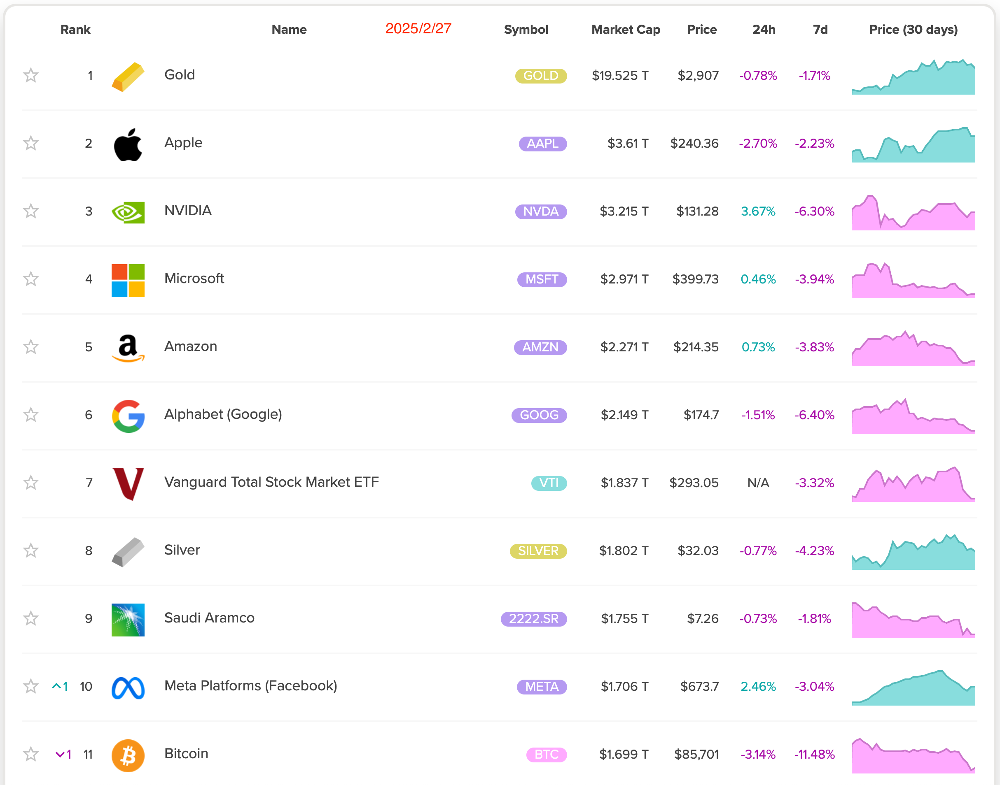
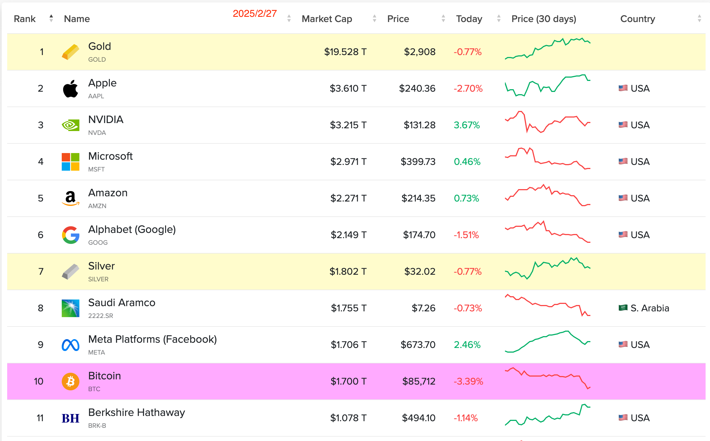

# 跌出前十

随着BTC骤然落向8万刀，2025年的这个2月份恐怕就要成为多头的滑铁卢。20%的跌幅，并不能确认牛熊。毕竟在牛市中，20-30%乃至于40%的回踩洗盘，都是非常常见的。作为满仓、重仓扛过超过75%回撤的老韭菜，教链在春节前就已经开启了持u待机模式，并一直在观察和思考市场的动向和应对之策。今早略作回顾，都写在今天2.27教链内参《当下一个阶段的基本战略方针》里面了，会员朋友可移步阅读。

随着BTC的进一步下跌，有统计网站报告，其市值已跌出全球资产市值榜前十名。不过，也有其他统计排名，还是在第十名的边缘上。下面两幅图，各位亲爱的读者可以自行对比一下。

虽然仓位如此回撤，但是教链心里还是蛮平静的。甚至有一点点儿开心。不仅仅是因为有更便宜的大饼可以重新考虑逢跌加仓了，还因为教链欣喜地看到一些预判正在成为现实，基本面在按照自己心中的推演在逐步改善。

只要基本面在改善，其实并不需要太在乎价格一时的低估或崩溃。洗掉瞎冲蛮干的人，洗掉认知配不上持仓的仓位，洗尽铅华，后市才有更加光明的预期。

前几天朋友的朋友说其子赋闲在家，专心炒股炒币。一问，说是学金融的，感觉可以在二级市场闯出一番天地。教链反而不很看好，对朋友说，恰恰相反，学金融也许最不适合在二级市场炒股炒币。为啥？基本面研究，需要的是对硬科技的认知，反而可能是理工科背景更适合。一个学金融的孩子，你说他是能搞懂DeepSeek优化LLM的门道，还是能明白比特币Proof-of-Work的跨学科意义？学金融对搞懂这些本质问题不仅没有帮助，反而有可能成为限制开放思考的条条框框。

书本上学的知识，都是些抽象的理论。甚至有时候，更糟糕的，是别人意图植入你脑子的思想钢印。所以咱们老祖宗说，尽信书，不如无书。悟性不强的人，思想单纯的像一张白纸，对思想病毒毫无抵抗力，一不小心就被意识塑形了，终生都难以扭转。

教条主义要不得。但是人却很容易落入教条主义的窠臼。看看那些过去十几年来拿着各种传统经济学理论来质疑BTC，来论断BTC必然归零、必然失败的人们吧。当本本上的理论和现实中的实际南辕北辙时，他们不仅拒绝反思自己的教条思维，拒绝怀疑书本上的理论是不是有哪怕一丝丝错误，甚至持之以恒地坚持认为是现实错了。实在是可悲可叹呀！

那么教条主义的反面就是对的吗？不相信任何书本，不总结任何理论，做事全凭经验，刻舟求剑。上一个牛市炒DeFi币赚到钱，这一轮牛市还想布局山寨币，结果发现只有BTC和meme浪潮。过去靠上杠杆成功投机，觉得自己天赋异禀，于是总想着再搞一次大的，一把实现财富自由。这就是陷入了定式思维，总觉得市场会简单重复过去的模式，于是栽了跟头。这就是经验主义的错误和悲剧。

做事既不靠理论支持，也不靠经验指导，全凭想象，或者凭一腔热情，又或者是凭内心冲动和情绪，凭感觉操作，跟着感觉走，想一出是一出，成了价格波动的提线木偶，心态完全迷失在市场的暴风骤雨之中。涨了追高被套，跌了割肉做实亏损，高买低卖，连连亏损。这就是陷入了盲动主义。

在市场时机的判断和把握上，要么是不顾市场发展阶段，硬是要提前做出时机并不成熟的操作，这是左倾机会主义；要么是市场发展阶段已经过去，却打死不愿意承认客观条件已经变化，仍然固执己见按照错误的方向操作，这就成了右倾机会主义。

这里的左和右，与我们讲二级市场上左侧交易（操作）和右侧交易（操作）其实是完全一致的。左侧，就是在市场客观情况变化（信号）之前预判并提前行动。右侧，就是在看到市场客观条件变化（信号）之后再行动。

教链常讲的“八字诀”中的逢跌加仓，就是典型的左侧操作。如果左侧操作操之过急，也许就成了左倾机会主义。比如这次从10万刀下跌，如果刚跌了一点跌到9.5万刀就着急抄底，那就有可能是过于左倾了，市是在博市场不会大跌而是会很快反弹继续走牛。

而像2022年初像教链那样觉得牛市不会才刚摸到7万刀就草草结束，继而认为牛市还将继续续创新高，那就是犯了右倾机会主义的错误。直到2022年6月份BTC彻底击穿3万刀，教链才确信市场已经转入熊市了。

在市场中实战的难点在于，根本就不存在既灵敏又有效的信号。不是你想犯左倾或者右倾的错误，而是我们根本不能正确感知市场发生的变化。往往是变化已成定局，我们才后知后觉。

还有最重要的就是，我们会把主观想象错当成理论指导或者客观事实，从而陷入一种执着的心态。

一旦陷入执着，就会固执于自己的想象，而拒绝承认现实。

但是如果完全跟随现实，就会被波动洗下车。

教链目前认为，最终还是要在内心坚信某种东西。

只不过，你需要坚信一个最终正确的东西。

而最终正确这件事，只有时间到了最终，并且结局证明其正确性，才能说明这是最终正确的。

比如，教链坚信BTC会成功的。而这件事，除非最终BTC成功了，否则根本无法提前证明。

你只能选择相信，或者是不信。

在信念原点上，不要辩经。一旦你明白了上面的道理，就知道辩经毫无意义。

信念的背后，或者说和信念一体两面的东西，是什么呢？

是——牺牲。

也就是说，如果我的信念失败了，我将失去全部的押注。就像革命者如果失败了，就将失去宝贵的生命一般。

为了避免无谓的牺牲，就要求我们在思想上不要犯上述五种主观主义的错误，不断纠偏我们的思想，使之符合客观的实际。

这也就是要求我们：

实事求是。
