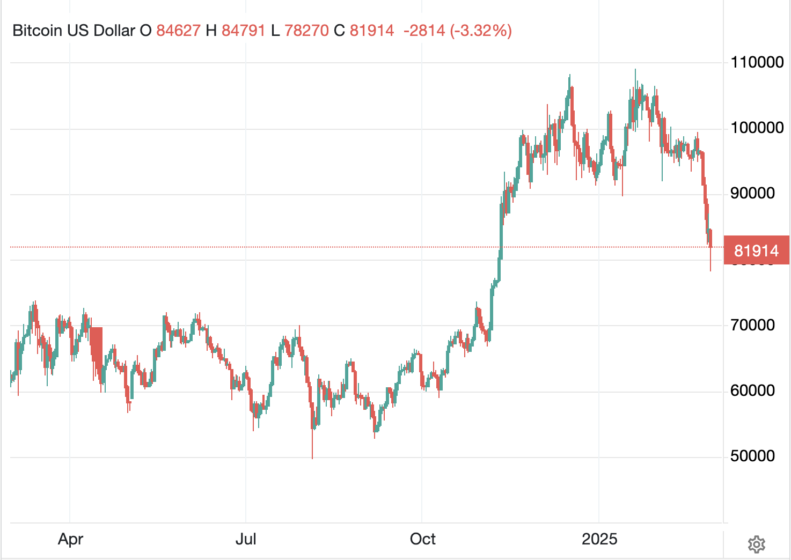
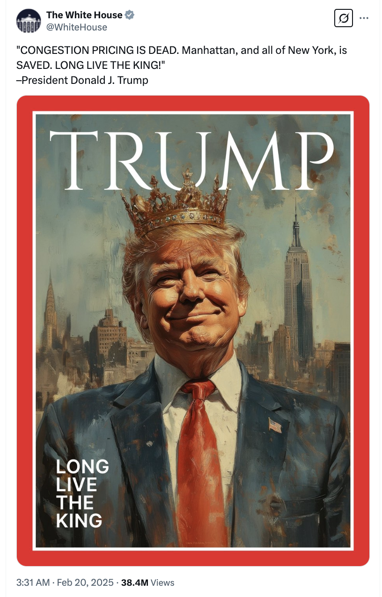

# 抢跑川皇的人尝到了苦头

随着BTC加速坠落，日内一度击穿80k整数关口，跌回“7字头”，整个加密市场陷入了巨大的恐慌之中。

兜兜转转，在这个2月份的最后一天，空头给市场送来了一份“大礼”——BTC一夜梦回2024年11月初川总胜选后向上冲刺的价格。

在BTC迅速脱离7万刀，径直升至9万的过程中，市场是猝不及防的。也因此，在这个区间的筹码就没有充分换手，这就形成了一个支撑薄弱的跳空区间。

有人胆敢抢跑川总！典型的比如现在已经改名叫策略（Strategy）的微策略（Microstrategy）。

要知道现在川总已经不仅是“总统”，而且是被白宫官方高呼“吾皇万岁”（Long Live The King）了。

川总俨然已是川皇。

教链记得，去年破10万刀前后，市场就有人在议论，川皇在动手建仓BTC之前就把要建立美国国家BTC战略储备的大事高调宣扬了出去，难道他不怕别人抢跑吗？

要知道建立国家储备要经过设立部门研究、立法、预算、执行等诸多环节，时间漫长，如此过早地泄露机密，让市场上的投机者低价抢筹，拉高价位，待到战略储备预算到位，岂不是当了接盘侠，白白便宜了那些个抢跑的投机者了吗？

哼，此等凡人都能想到的问题，难道深谙赢学之道的川皇会不懂吗？要知道川皇可是另有一个别称正是“懂王”！

何况，就算川皇不懂，手下自有高手如云。比如教链在2025.1.21文章《起底WLFI》中所揭示的那些伏地万里的草蛇灰线。

你以为你预判了川皇。其实川皇早已预判了你的预判！

不禁让人想起，加密江湖里多年来流传着一句“孙哥一笑，生死难料”，道尽了韭菜们对于预判被预判所尝尽的苦楚。

这是一个简单的不能更简单的博弈论：

如果庄家打出明牌要给你当接盘侠，那么这张明牌必然是诱多的陷阱。

嗯，现在最高调、最明牌的抢跑者，策略公司的董事长Michael Saylor已经在谈论卖肾保大饼了。

抢跑川皇的人尝到了苦头。

更进一步，川皇如果只拉BTC，又有何益？

谋篇布局，自然不落孤子。

连点成线，一气呵成。

2025.1.19教链内参记载道，《第2周 回踩反拉再破十万 川普模因震惊市场》。

织线成网，疏而不漏。

2025.2.28教链内参又把零散的事串起来看，《SEC给川皇补票，国会帮忙焊死车门》。

高手在围棋棋盘上一枚一枚的落子。有的人眼里看到的只是一个个孤零零的、甚至是有些凌乱无章法的棋子。有的人眼里却看到一张缜密周全的、甚至是细思极恐的、不断收紧的大网正在细细织就。

那大网里活蹦乱跳的，不正是市场上鲜活鲜活的鱼虾吗？

耳畔响起《潜伏》中那个情报贩子谢若林用那独特的、结结巴巴的腔调吟诵一句：「夏日消溶，江河横溢，人或为鱼鳖。千秋功罪，谁人曾与评说？」
