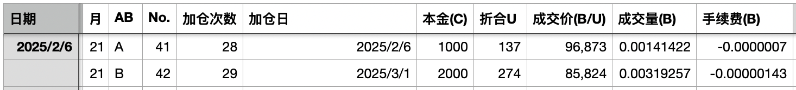
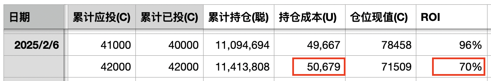
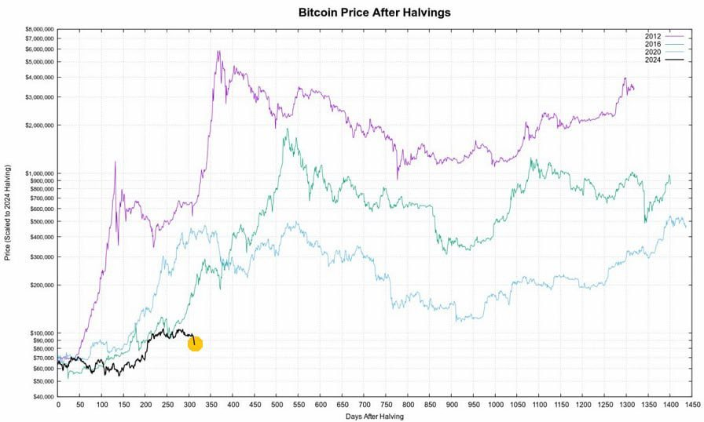

# [十年之约.42] 脱离

惊魂未定的周五已经结束。周六市场迎来2月的结束和3月的开始。BTC周五收盘前从78k插针低点反拉回84k。周六继续拉升，逼近86k。

市场度过了一个悲惨的2月。开盘105k，收盘84k。

不过这对于“十年之约”实盘见证计划的执行是极好的。又可以在比较低的价位加仓了。这次对2月份的B份回顾加仓，要把1月收涨未加的一份也算上，所以是加双份。

本次加仓后，平均持仓成本升破5万刀，投资回报率回撤至70%。

从减产后市走势对比图上来看，这轮周期走到这里，走到这个位置，已经脱离了所有人刻舟求剑的预期，成功踏入了未知的荒野。

刚开始，市场显然不是复刻2011牛市。

稍后，市场在2024年持续横盘或阴跌洗盘，似乎也不是复刻2021牛市。

然后，当11月份BTC忽然急促拉高，似乎是追上了2017牛市的步伐。市场中一片叫好声。机构分析师纷纷出来讲，各项指标表明，这轮周期很可能正在复刻2017年周期。

毕竟，还有一点惊人相似：都是川皇当选嘛。

但是当市场走过11月，走过12月，走过1月，在2月份不仅不向上修复，反而一个猛子扎下来，显著脱离了2017年周期的走势。

市场迷茫了，仿佛探险者失去了北极星。

显然事情现在才开始变得有趣起来。

有趣就有趣在，每一轮周期的走法都不一样。

让你摸不着北。

这才是高智商生物对低智商生物的碾压——如果BTC是一个生物的话。

你琢磨不透、把握不住它的脾气。

它忽快忽慢，忽高忽低，忽然直冲云霄，忽然走出双顶……

你永远都猜不到，下一次它会跳出什么样的舞步。

但是总体上，它又是在一直向上攀登。向上。

也许它只是在用飘忽不定、捉摸不透来告诫人们，不要试图去做那些徒劳无功的事，请关注真正的东西，做正确的事情。

走入荒野，走入无人区，便意味着摆脱定势思维的束缚，一切皆有可能！

当想象无所参照和依托时，便解放了想象，获得了放飞的自由。

后市，也就充满了无限想象的空间。
