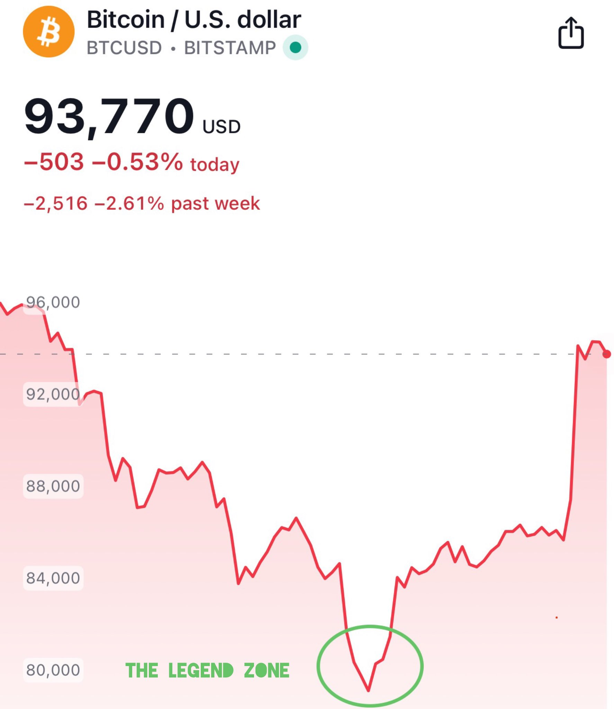
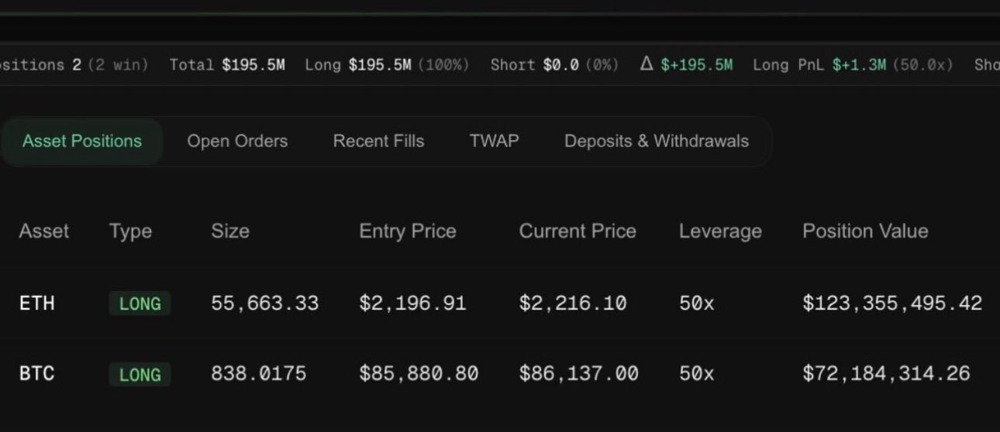
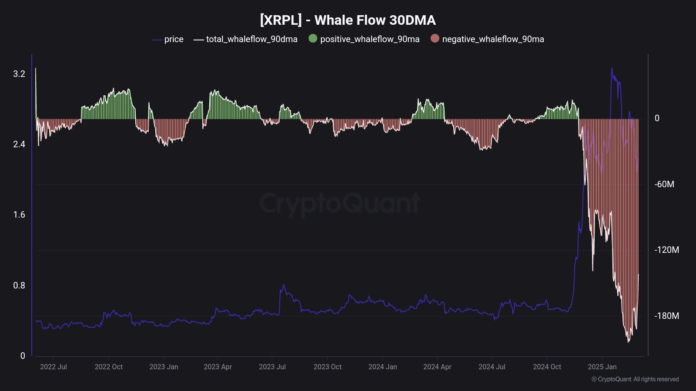
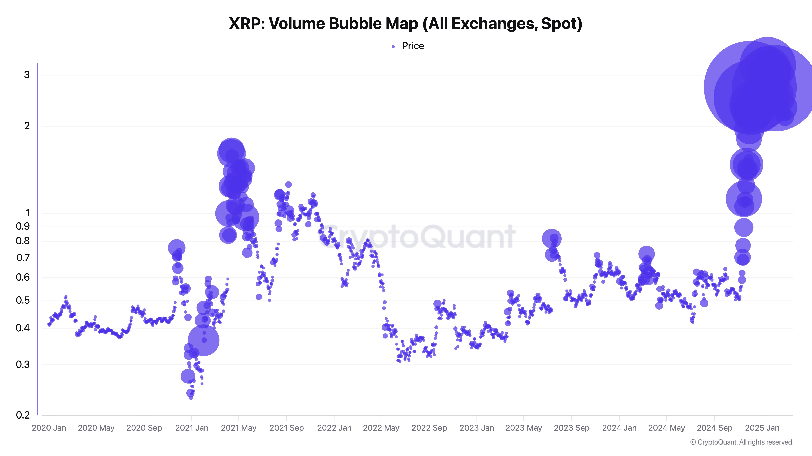
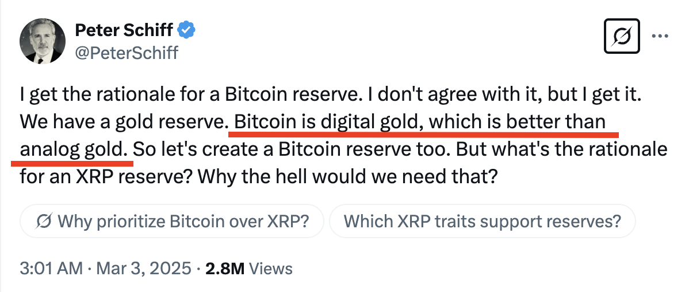

# 深V反转背后的精准开单和拉高出货

隔夜今晨，一夜牛回。BTC在接触30日均线阻力后暂时回落至92k附近。今天3.3教链内参《总统突然喊单，大饼向上测试》，介绍了背后的直接原因。

短短6、7天，市场走出一个剧烈的深V反转。

三天前还在地狱，三天后又上天堂。

在V之最深处得手加仓的，乃是传奇一抄。

但是也不要FOMO（害怕错过）。车速越快，越要冷静。

暴力喊单的背后，隐约透出些许令人隐隐不安的蛛丝马迹。

有网友发现，未知账户50倍杠杆提前开大额多单埋伏，喊单后平仓，精准获利。

要知道，以50倍杠杆倍数之高，意味着2%的波动就可以爆仓。是什么人如此艺高人胆大？

如此精准操作，不由得让很多网友纷纷猜测，是否存在内幕交易？

更令人捉摸不透的是，为何喊单的不是去年战略储备的目标标的BTC，却是三个山寨币？

更有网友一针见血地评价：

「加密货币战略储备：

XRP - 字面意义上的无人使用，只有不断解锁和内部人士向散户无尽地抛售

ADA - 无人使用，创始人在爱泼斯坦的名单上

SOL - 主要用来搞拉盘砸盘的meme币（模因币）诈骗」

以XRP为例，伴随着价格拉升，鲸鱼抛售也达到了高峰。

分析师评论道，XRP正处于分发阶段。

甚至连数年如一日抨击BTC的黄金吹捧者Peter Schiff都看不过去了，罕见公开表达了“BTC是数字黄金，比模拟的黄金更好”的话。以此质疑XRP储备是个什么鬼？

也有网友敏锐的指出，在白宫官网公布的此前与加密货币相关的总统行政令中，甚至根本就没有出现过“战略储备”这个词儿。

以战略储备之名，行拉盘砸盘之实？

如此点名不太可能进入国家战略储备的山寨币，是李代桃僵之术，还是喊单出货？

市场需要信心。但是比信心更重要的，是实打实的流动性，而不是空头支票的反复透支。
