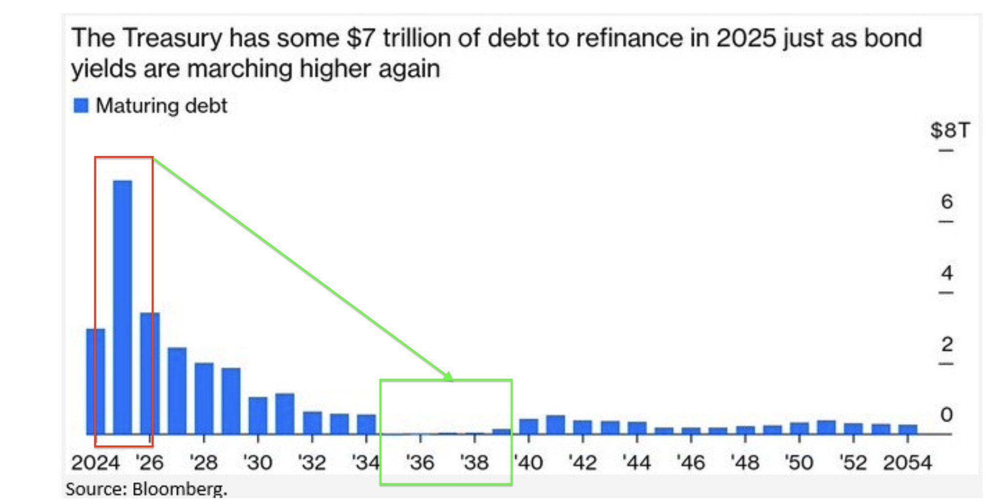
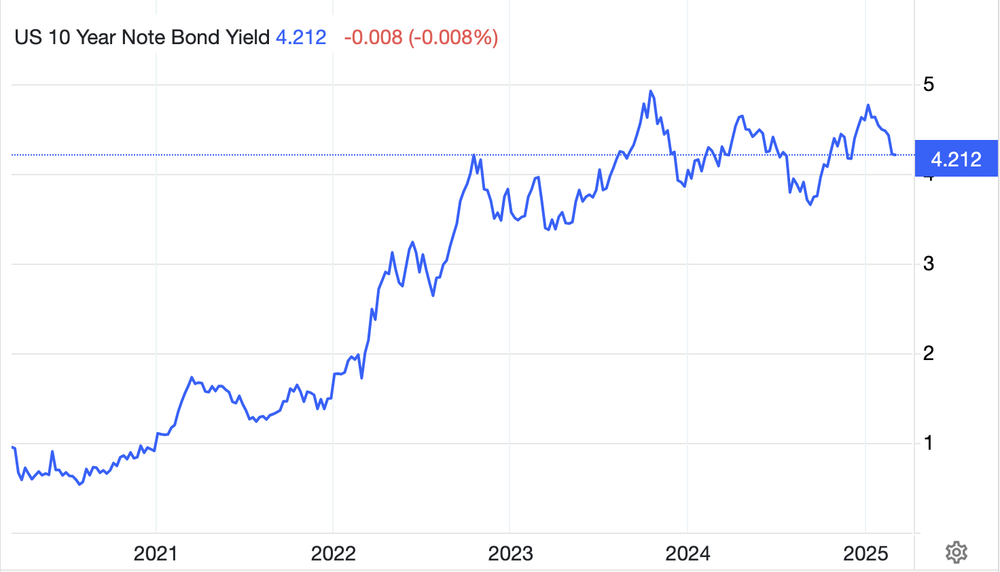
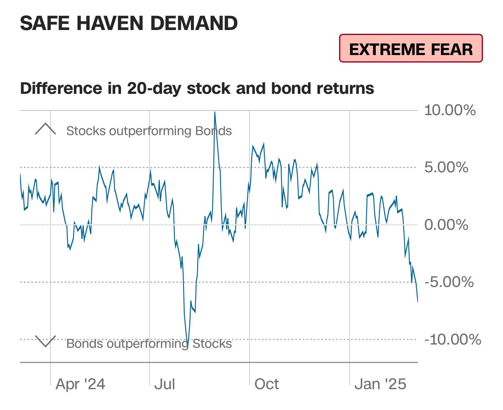
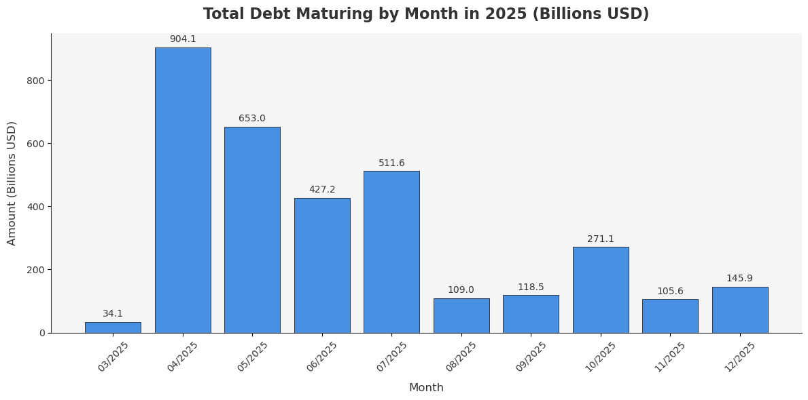
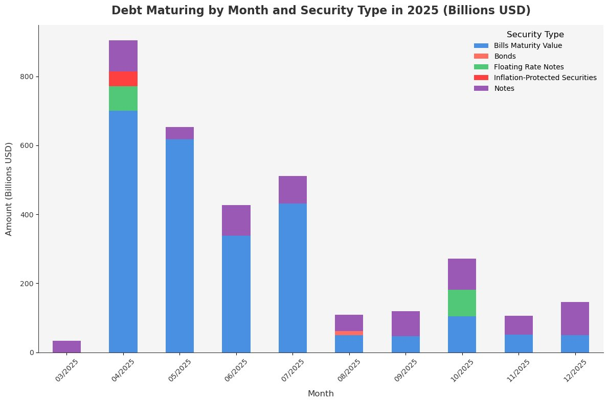

# 人造衰退

最近的市场仿佛被一只翻云覆雨手来回操弄。前天总统喊单爆拉至95k。昨天加关税暴跌至81k。今天又旱地拔葱猛涨超8%回到9万刀附近。杠杆多空头都被摁在地上反复摩擦。

今天的爆拉，可能和网传消息，美商务部长说，特朗普总统将要在本周五（3月7号，北京时间3月8号凌晨）即将举办的白宫首届加密货币峰会上宣布BTC战略储备。并指出，其他代币也会被积极对待，但会有所不同。话的意思很明白，BTC是独特的。

还有就是今天3.5教链内参《关税影响货币政策的分歧》中提到的，据称特朗普总统正在考虑要削减一些对墨西哥加征关税加征力度。这个风也是商务部长放出来的。被市场普遍解读为利好，是在挽救市场的信心。

虽然还是嘴炮，但这次是双响炮。别说，市场还就吃这套，显得挺受用。这不昨天刚丧失的信心，今天就变成FOMO了？难怪俗话说，大炮一响，黄金万两。

只是这价格忽上忽下，来回多空双爆，利好和利空密集交织、迅速切换，速度之快、频率之高、振幅之大，令人瞠目结舌、头晕目眩，一时找不清个东西南北。

今天3.5教链内参《关税影响货币政策的分歧》中谈到，美国若因全面开启关税战而导致经济衰退，无疑是一场人祸。只是这其中的目的和谋略，却是云山雾罩。

教链看到一种有趣的解读，就是人为制造剧烈的市场波动和衰退预期，为的是把资本赶到债券里面去，从而压低债券收益率，进而倒逼美联储降低利率，从而为联邦化债——即用长期的低息债置换短期的高息债——创造空间。

好一个声东击西。看起来是打的关税牌，真正目的却是化解债务困局。

2025年大概有7万亿美刀的债务到期。环顾四周，历年之最。如何处理，十分棘手。不用多想，肯定是要借新还旧。

但是，看看现在的融资利率是多少？十年期美债收益率还在4%以上呢！

如果以此等高息融资，把自己端到美联储背后的银行家的餐桌上，这口气川皇肯定是忍不了，这大亏川皇肯定也不能吃。

那就需要逼一逼美联储。美联储不配合，那就先逼一逼市场。

经济学家惊呼，加征关税损人不利己，势必将损害美国经济，恐将使美经济陷入衰退。

道理谁不懂？问题是，如果制造一场衰退或者衰退预期本就是战术目标呢？

经济学家以为自己站在最高层。殊不知川皇直接站在了大气层。

制造市场恐慌，把羊群赶进羊圈。让流动性从风险市场（美股）撤出，涌入避险市场（债券）。

当然，也有多种手段来制造波动，制造恐慌。甚至也许还可以把资本吸引到加密市场，猛拉猛砸。

若说时间紧迫性，那就看看2025年各个月份到期的美债规模图表。

川皇在接受关于加征关税的采访时意味深长地说：「我们可能会在短期内经历一些，少许的痛苦。而人们是理解这一点的。」（We may have short term, some, a little pain. And people understand that.）

短期的痛苦，长期的收获。
