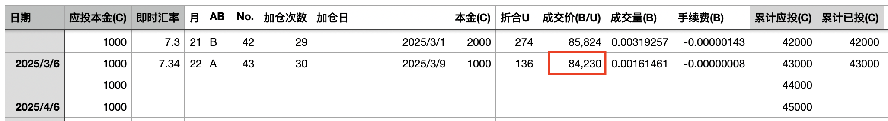
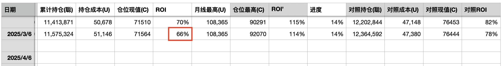
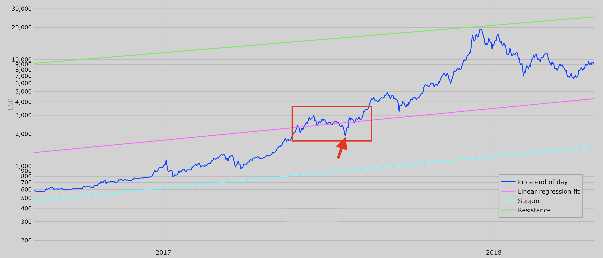
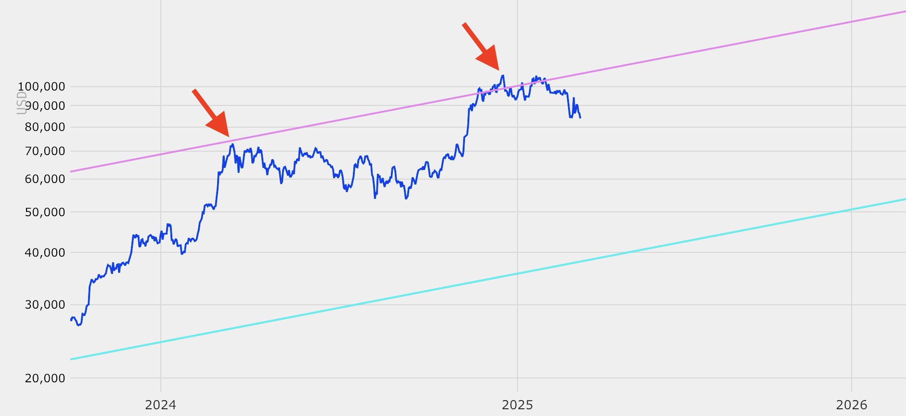

# 十年之约系列(43)：透心凉

尚未从2月暴跌的悲痛中走出的韭菜们，又要被3月的“川市”震吐了。今天3.9教链内参刚刚做了一周回顾，《第9周 战略储备造川市 月底召开私董会》。

“川市”的车速太快。接连几个180度大掉头，让人晕的忘乎所以。忘乎所以，以至于教链都忘记了每月6号“八字诀·十年之约”定投加仓了。

于是今天亡羊补牢，时犹未晚。

本次是“十年之约”实盘见证计划第43篇笔记，第30次加仓，加仓价格84230刀。投后持仓成本升至51146刀，收益率66%。

惊不惊喜，意不意外？大饼再一次倒车接人了。

错过了2月28号的78k，错过了3月4号的82k，现在，3月9号，大饼再一次回到了83k附近。

接连三天的下跌，一直在连续缩量。

教链说过，缩量下跌，表现出市场多头消极承接。

多头之所以消极，一个可能是有钱没意愿，第二个可能就是已经满仓了，实在拿不出更多子弹，真的是有心无力了。

对于第二种情况，没有什么好办法，只能等，等韭菜场外打螺丝赚到钱。

对于第一种情况，方法就是下跌。高价没意向，那就打折，狠狠地打折，一直打到多头心动的折扣价。

缩量下跌，就是如此。

要说这轮周期走到现在，真的是完全不同于以往几轮周期了。

没有人敢说现在是个什么情况。

在2024年底市场共识牛市已至之时，有人对着2021年牛市计划上半年减仓，有人则想着4年周期论盼着年底逃顶。

火车跑得快，全凭车头带。
庄家带了头，韭菜有劲头。
韭菜没领导，肯定投不好。
不是赚得少，就是跑不了(liao3)。 

现在看起来，市场不一定想让他们跑得了，甚至，都不一定想让他们盈利。

不过，要说这牛市年骤然回踩，从幂律中轨回踩踩破，给刚刚燃起的牛市希望当头浇一头冷水的，2017年牛市中途也发生过那么一次。

'17年5月份BTC才晃悠悠地向上穿越了中轨，6月创了新高2970刀。

但这是一次大胆的诱多。在随后的一个月里，BTC重新跌破中轨，7月中旬最低跌破2000刀整数关口，跌到1910刀附近，跌幅高达34%。

就在被当头泼了冷水浇个透心凉的人们以为牛市要完犊子的时候，它又旱地拔葱，一个鲤鱼打挺，短短几天重新站上中轨，并在8月份突破下一个整数关口3000刀，不断续创历史新高度。

当然，也有不祥的类比。那就是把2024年初突破7万刀，以及2024年底、2025年初突破10万刀，类比成2021年牛市的双顶形态。那么后面的剧本，就是提前进入2022年了。

历史从不会简单重复过去。

何况，2027年的下轨就要升至7万刀了。

市场总是在犹豫中前进，在希望中毁灭。

现在似乎仍是犹豫之春，而非希望之冬。
