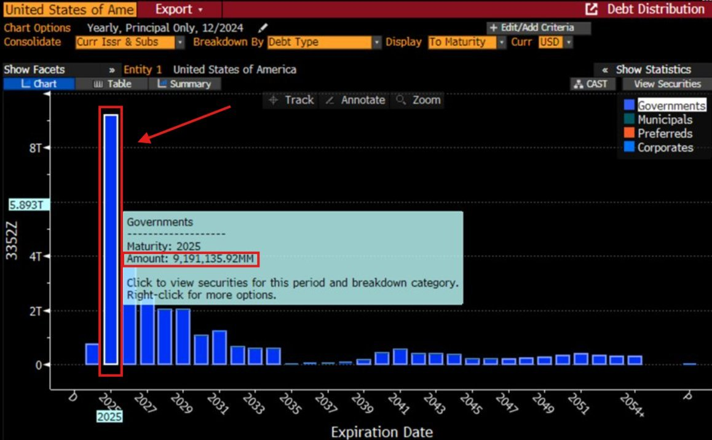

# 跌到7万又如何

隔夜BTC急速跌至8万刀，回踩并刺破30周均线支撑，引起市场极度恐慌。这波回调的目标区间在哪里？是逢跌加仓，还是空仓避险？教链已在今天内参《牛市进入深水区》进行了一些分析。

就像内参里计算的，就算从目前的均线支撑83k再回撤个15%到7万刀，又能怎样？

从2025.1.20瞬时高点109.8k起算，7万刀也不过是回撤36%而已。

而那一周的周收盘价105k是历史最高，到7万刀的回撤就仅有33%。

来币圈必须有的基本觉悟是：浮亏三分之一谈笑风生，浮亏一半面不改色，浮亏八成心态不崩。

回调到7万刀，也仅仅是谈笑风生的级别而已。

7万刀这个位置教链在近几个月来的文章和内参里反复提过。这里是2026年底的幂律下轨。

2026年底的意思，就是从现在2025年3月份开始，不到2年的时间。

时间就是空间。空间就是时间。这就是爱因斯坦的相对论原理。

7万刀，其实是在为未来2年的时光定价。

而10万刀，则是未来3年光阴的最低定价。

照此推算，若教链愿意以极大耐心，给BTC 15年时间，则最低定价约为150万刀。换句话说，150万刀，就是未来15年光阴（2025-2040）的价格。

15年岁月，孕育了多少欢声笑语、痛苦悲伤，涌现了多少非凡成就、人生价值、文明进步？

给岁月以文明。给文明以成就。给成就以价值。给价值以度量。给度量以数字。（参阅教链2025.3.2文章《持仓的意义》）

站在10万刀的高度，回看当年800刀、700刀，彼时百分之十几的波动，已成一望无际的平原。

同样可想见，未来站在100万刀的高度，回看今日8万刀、7万刀，此刻百分之十几的差别，已经不可分辨，已经无需分辨。

我们早已洞悉，这场《人造衰退》（教链2025.3.5文章）的操盘手法。

那手法就是：喊单拉升。发币收割。炮制利空。制造衰退。倒逼宽松。放水救市。低息化债。炮制利好。大幅拉高。高位出货。

前日白宫加密峰会已经完成对“自己人”的识别。

现在挡在川皇回馈同盟之路前面的，就剩下一个软硬不吃的鲍威尔。

仿佛全然忘了当年川皇一手提名的“恩情”。

川皇一定眼角眉梢都是恨。

恨不当饭吃。必须有手段。

川皇的身后是加密资本，是新势力。

鲍威尔的背后是金融资本，是“old money”。

天雷对地火。

黑云压城城欲摧。北风卷地百草折。

神仙斗法，虾米遭殃。

持BTC，度天地劫。

手捏八字口诀，心中默念《加密心经》。

没有恐惧，从不绝望。
