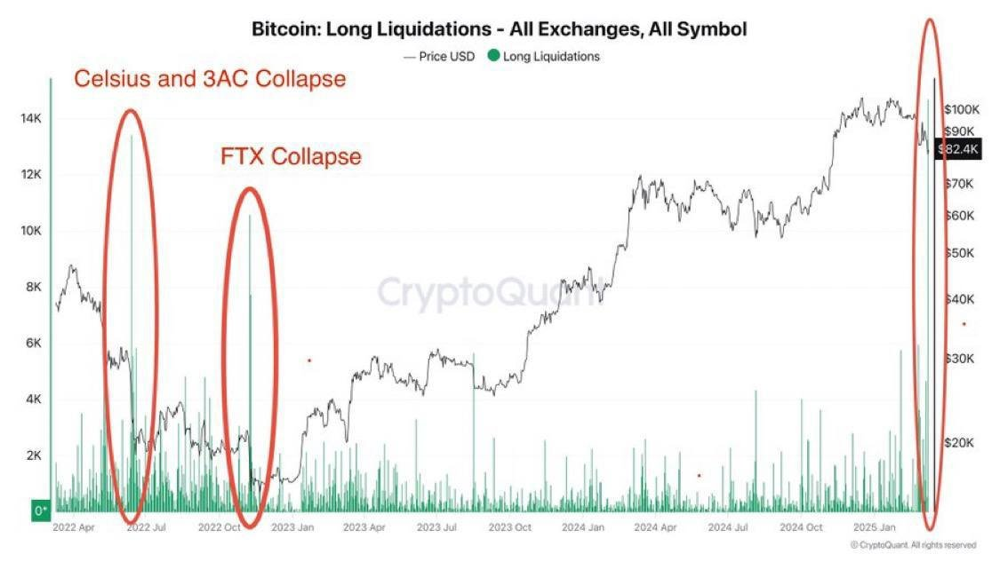
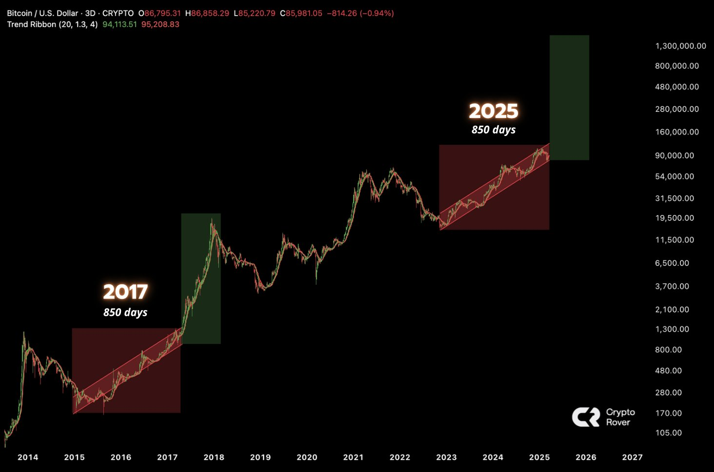

# 大爆仓

2020年的“312”，2025年的“311”。死神也学会抢跑了[惊喜]。昨天创下了2022年下半年熊市大洗盘以来最大的爆仓规模。主爆多头。

就在BTC昨天短促插针到76.6k途中，教链抢到76.9k市价单。这就是对今天3.12教链内参所说《该出手时就出手》的生动实践。

坚定执行的背后，是从去年底“特朗普交易”开始后便默默地等待再入时机，是2.27教链内参《当下一个阶段的基本战略方针》提前半个多月就已经在心里盘算好了，若时机到，如何行动。

教链讲“八字诀”，逢跌加仓的操作，就是与死神拔河。

那便是交易大师说的：在市场血流成河时加仓，即使那里面有你自己的血！

真的战士，总能在舔舐伤口之后，挥剑反杀。

不过是向30周均线的正常回调，何足惧也？

很显然，牛市正在昂首阔步地走在康庄大道上。

也许此番向30周均线的回调，恰如今天3.12教链内参《该出手时就出手》中所说，「大概是牛市下半场启动前为数不多的建仓机会了吧？」

虽然2025.3.2教链内参《第8周 风云突变回踩八万 有问有答新鲜上线》中的成本分布图告诉我们，75-85k有个跳空区间。

但是，教链的操作原则是，稳（高胜率），狠（重仓），但不追求准（精准买在最低/卖在最高）。所以不贪最低。

稳准狠是个不可能三角。

学过“刘教链比特币原理”的朋友都知道，不可能三角贯穿技术、经济的方方面面。

深入学习BTC，知识点成百上千，不可能三角一定是一个令人印象深刻的词。

学的融会贯通之后，这知识就能迁移到仓位操作上来。

中本聪是如何破解不可能三角的，我们就可以学到如何破解不可能三角。

方法其实就是一层窗户纸：舍得。

老祖宗说，舍得一身剐，敢把皇帝拉下马。

在面对系统可用性（要求24h * 365天全年不停机）、分区容忍性（去中心化）和一致性（数据完美无错复制）的不可能三角，中本聪舍了什么又得了什么？

学懂了BTC，你就知道了这个问题的答案。

当然，反之，能不能正确回答这个问题，也可以作为检验一个人是不是真正弄懂BTC的“试金石”。

无论一个人是如何侃侃而谈，吹嘘有多么懂BTC，你只要让他谈一谈这个问题，听一听他的答案，就足以判断出来，他是真的懂，还是吹牛逼。

本文就此打住，不再深入技术问题。权且留给各位读者朋友思索。

这里要用这个例子，来启发我们 —— 舍得，是解决不可能三角的方法论。

对于稳准狠的不可能三角，如果必须舍得一个，你选择舍哪一个？

很显然，没有唯一标准答案。

开合约，追求狠和准，舍弃的是稳。

炒土狗（或者meme币），追求稳和准，舍弃的是狠。

囤现货（八字诀），追求稳和狠，舍弃的是准。

这就是取胜之道。

反之，取错了，舍错了，就是求败之道。
