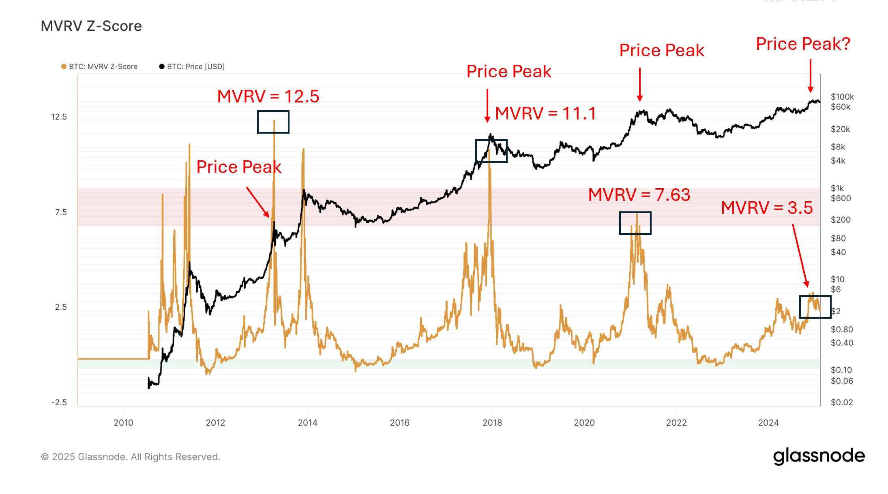

# 币市熊出没

隔夜BTC继续回升至30周均线83k上方。看近几期教链内参中的内容，就能直观地体会到目前市场对后市看法分歧之剧烈。本轮牛市果真要止步于此了吗？那些看熊的观点究竟有没有道理和事实依据呢？

研究团队The DeFi Report给出了他们的看法。他们认为，本轮牛市已经结束，先后经历了早期、中期、晚期三个阶段：

早期牛市是从2023年1月到10月，BTC从16.5k的深熊中复苏，一步三回头地涨到33k。

中期牛市是从2023年11月到2024年3月，BTC从33k涨至72k，突破2021年牛市前高。这也是BTC历史上首次在产量减半日前突破前高。与此同时，ETH从1500刀涨到3600刀，SOL从20刀暴涨至200刀。财富效应开始酝酿，meme季的癫狂由此而始。

晚期牛市则从2024年3月到2025年1月，BTC经过回落盘整，年底因特朗普交易快速拉升至历史新高，突破10万刀大关。meme季一日千币、万币，持续榨干市场流动性，直到Trump meme最后一棒。

按照他们的阶段划分，从2025年1月至今，就是晚期牛市见顶回落转入熊市早期的阶段了。证据之一就是战略储备利好落地转利空。据说熊市的一个特征就是消息面利好无法再继续刺激市场上涨，反而会出现消息面利好和价格面下跌的背离现象。

不过教链觉得，在ETH和很多altcoins（山寨币）这一轮还没有突破前高的情况下，牛市就这么不明不白地结束了，是不是有些太草率呢？

教链直觉上感觉，现在的盘整，更像是2017年初首破前高后，持续三个月的震荡洗盘。

那次洗到5月，这次也洗到5月？

看时间轴，后面有哪些事情可能发生。今天3.13教链内参《以太坊的下一个大叙事》对此做了些介绍。

还有就是昨天3.12教链内参《该出手时就出手》最后说的，要相信 messari 和教链年终报告的含金量。

代表美国加密资本传声筒的研究机构messari，去年底和前年底的喊单有怎样的不同？

2025.1.1教链内参《Messari对ETH和SOL展望竟反转》早已有所介绍。

俗话说，贼不走空。

看熊报告给出的论据之一，就是Solana链上活跃度数据的断崖式下跌。3.12教链内参《该出手时就出手》其实已经介绍过，链收入暴跌93%，DApp收入暴跌86%，TVL暴跌50%。原因很简单，就是meme季狂潮的冷却和结束。

其实并非不可预料。

2024年底Solana画出双顶下跌，就已经展示出，2022年套牢其中的大资本，已经借助meme季的市场狂热，成功解套，逃出生天了。

套在DeFi等VC币上的资本，也势必要努力自救，期冀在新的山寨季中解脱。

所以，它们又怎会轻言放弃？

看熊报告给出的另一个论据，就是BTC的MVRV图线。

关于这个MVRV指标，忘了的话可以先温习一下教链2025.5.30文章《长期持有者(LTH)真的都是钻石手吗？》中的相关科普。

简单地讲，就是赚多少倍才跑路。

2017年那轮周期，最有耐心的人赚了11.1倍才开始抛售。

到了2021年，最多就只忍到了7.63倍。

而当前这轮周期，最高点只到3.5倍。

喂，难道是市场越来越缺乏耐心了吗？

教链觉得，过去几轮周期的这个现象，可能是和早期巨鲸的苏醒抛售有关。

对这些巨鲸来说，所谓的周期牛市熊市，其实只是赚多赚少的问题，他们极早期囤币的成本极其地低。

如果2013年的拉升没有让他心动放弃手中的筹码，那么2017年的拉升就会用开出更高的价格。如果2017开出的价格依然不能令其满意，那么2021年的牛市就会释放出更具诱惑力的抛售信号。

直至…… 筹码洗出来，完成新旧交替和换手。

新进入者拿到高成本筹码，才会有动力追求更高的拉升倍数，而不是见好就收。

因此，教链隐约感觉，在某一个四年小周期，就会大体上完成这样的换筹洗盘，然后开启BTC市场发展的新阶段。

而不是一直重复，小周期一轮轮涨幅消退的旧模式。
