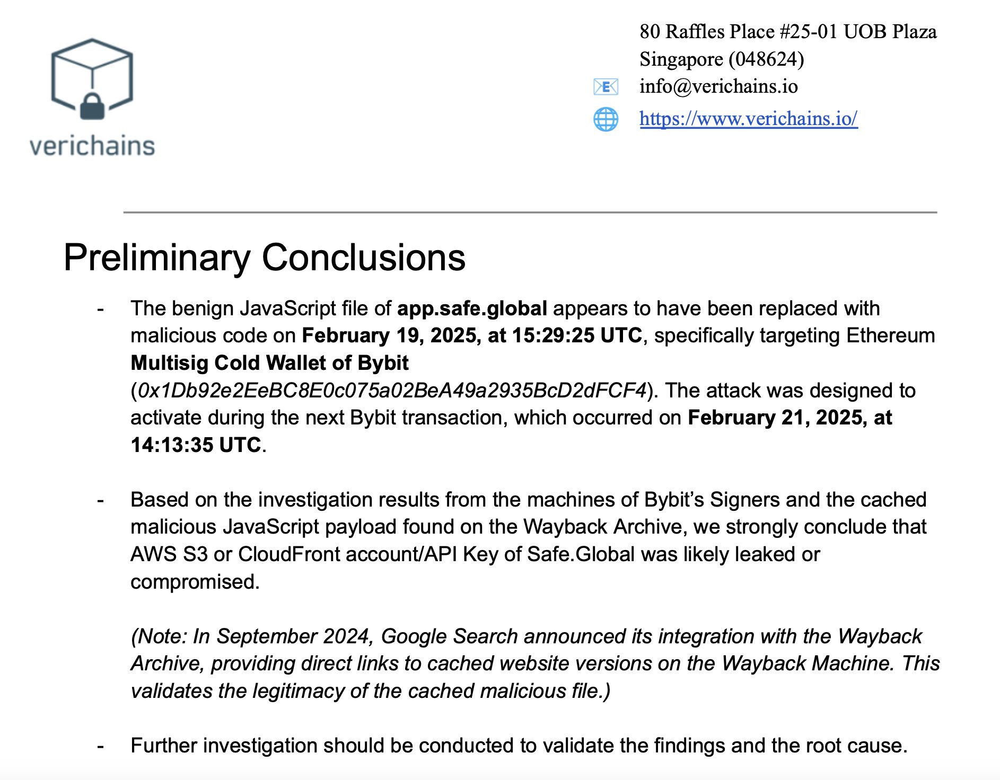

# 冷钱包为何被盗

周日BTC再度跌破83k。「过去一周是BTC触底反弹的一周」，这是今天3.16教链内参《第10周 插针反弹仍显疲态 压力测试正当其时》的陈述。不过，这个底不过是个局部低点，后续是否还要再三回踩测试75k附近区间支撑，尚存变数。回踩支撑就像种树后踩土，多踩几脚才能更扎实。

向后回顾一下就会发现，这波回调一个关键转折点，从10万刀下方急转直下，正是从2月22号始。22号开盘98k，到了28号就插针到78k了。短短6天跌掉了2万刀，最大跌幅20%。

当时发生了什么大事件？教链2025.2.22文章《100亿惊天一盗》记载，某交易所前一天深夜被黑客盗走了存储用户资金的一个“冷钱包”中的资产，总价值大约15亿美刀！

经过几天的拉扯，终于查明并获得各方承认，纰漏出现在该交易所负责对“冷钱包”进行多签操作所使用的多签钱包前端网站上面。

他们使用的是业内知名的以太坊合约钱包Safe。

多签操作人使用硬件钱包来隔离私钥，以提升私钥的安全性。然而事实上，遗憾的是，对于合约钱包而言，多签人的私钥安全，不等于链上合约就一定安全。

而合约钱包的资金恰恰是由链上合约来持有，而不是由任何一个多签人持有。如果链上合约的控制权被黑客夺取，那么合约持有的资金就会完全归了黑客。

要夺取合约钱包的控制权，就要从有操作权限的多签人这里下手。

同时窃取多个多签人的私钥是极其困难的，尤其是在他们都使用硬件钱包并小心保管的情况下。

于是黑客想到了一个高明的办法：利用他们在正常业务操作需要时，合作进行的多人签名。

只需要找到一个办法，欺骗过多签人的眼睛，让他们以为自己只是在签署一笔普通的转账交易，但其实却是把合约钱包的控制权转交给黑客。

而这个办法甚至只需要瞒过最后一个多签人的眼睛就可以，因为通常而言，是由最后一个多签人调用智能合约的执行函数的。

如何才能骗得了多签人的眼睛，从而实现对被签名数据的偷梁换柱，瞒天过海呢？

答案是篡改掉Safe钱包的前端页面。让页面对于有毒的待签名数据，仍然伪装成正常的交易数据并进行显示。

这样一来，多签人在看到网页上被篡改过的显示正常的数据和签名操作，就很有可能会不加怀疑地执行签名操作，并在硬件钱包上进行签名。一旦签名并发送，黑客就得手了。

那么最后一环也是至关重要的一环，就是如何才能篡改掉Safe钱包的前端页面呢？

说难也不难，就是渗透。可以是远程的入侵，也可以是社会工程学的欺骗，甚至可以是美人计等等，核心目标就是要拿下有前端页面代码发布和部署能力的技术人员。

拿下有部署权限的技术人员，就可以利用他的权限，悄悄地把生产环境上的页面代码替换成有毒的页面。

上面的调查报告显示，Safe项目官方托管在亚马逊云上的前端网页的账号或API key疑似是被黑客给搞到了。

于是黑客就部署了有毒页面，钓到了大鱼。

至于黑客是如何搞定Safe的高权限开发者，并顺利拿到部署权限的，那可能就是线下的事情了，调查报告也没有继续深入。

学习过《刘教链超级小白课》的同学都知道，相比于课上讲的BTC冷钱包，该平台被盗的所谓“冷钱包”实在是称不上“冷”。

通常我们讲冷钱包，是指私钥不触网（不接触互联网），甚至不触电（非电子形态）。但对于合约钱包，不能这么讲。

讲私钥，是因为普通账户地址中的资产控制权是在私钥，且只在私钥。而合约钱包的资产控制权却不在私钥，而在合约。

是合约在控制资产，而不是私钥在控制资产。

这就打破了私钥不触网即为冷钱包的准则。

严格地讲，应该说冷钱包是指控制权不触网、不触电。

合约在链上，可以说是永远在线。只要合约的控制权被窃取，资产的所有权也就易手了。

因此合约钱包，即由智能合约控制资产，就不能被称之为冷钱包，而全都是热钱包。

为什么BTC没有这个问题？因为BTC没有智能合约呀，朋友。

回想一下，Vitalik Buterin最早出走BTC社区，发起以太坊，不就是因为BTC社区不接受他智能合约的想法吗？

另外一点就是教链在《刘教链超级小白课》上反复讲的，BTC冷钱包的动币操作有一个原则就是，每个地址只使用一次。

这个原则是中本聪提出的。

而很显然，上面的案例中，该多签钱包一定是被反复使用的。

反复使用，就意味着反复签名。在反复签名的过程中，有一次被劫持了。剩余资金就全数归了黑客。

如果遵循教链讲的中本聪的建议呢？每次签名动币，都确保清空旧地址。用不完的币，也转入到新的找零地址去。

那么即使黑客在这个操作过程中窃取到了旧地址的控制权，也只不过是撬开了一座空空如也的仓库罢了。

但是，不幸的是，以太坊，以及绝大多数智能合约链，都抛弃了BTC的UTXO记账模型，而采取了传统的账户模型。

这就基本上注定了，地址即账户，同一账户会被重复使用，多次使用。

一旦黑客在某一次使用中窃取到账户控制权，就足以把剩余资金甚至后续转入资金全部洗劫一空。

教训不可谓不深刻。

最后，广而告之一下，刘教链超级小白课第7期正在招生中，课程内容涵盖BTC冷钱包制作和使用、以太坊及DApp安全操作等内容（详情请点击《刘教链超级小白课》查看），欢迎感兴趣的朋友报名学习，联系教链转课时费998并填写登记表即可报名。
