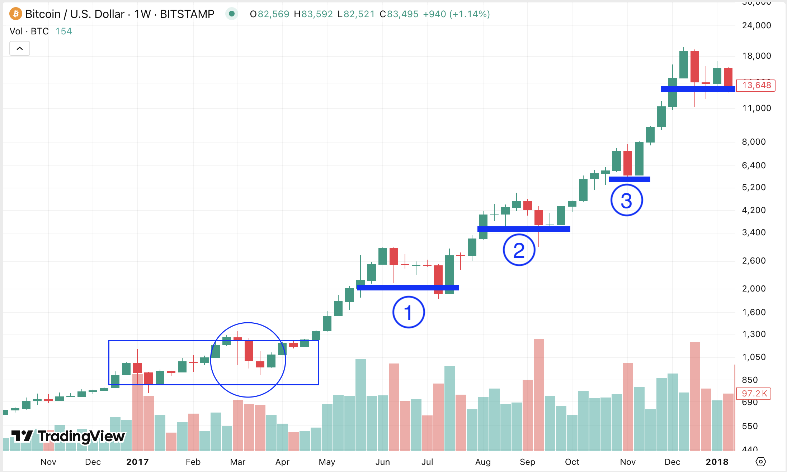
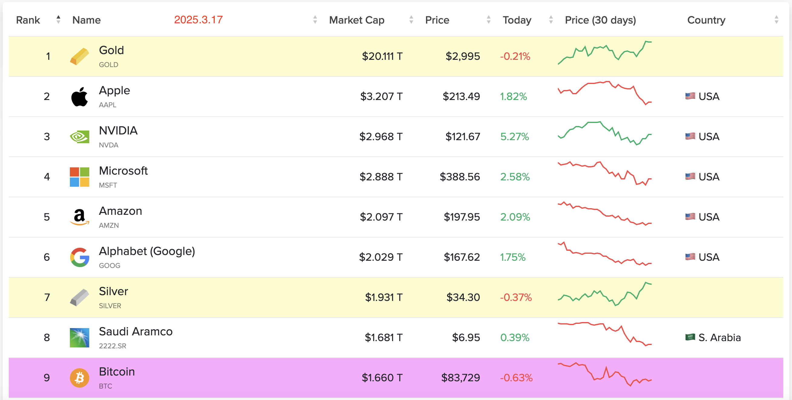

# 慢牛

隔夜BTC跌至83k一线。现在的高度，紧贴着30周均线83.8k。这轮牛市走的不同以往。前期快了些，现在慢了些。今早3.17内参《牛市或未终结》里分享了一张图，从图里可以清晰看出这个节奏。

若说慢吧，其实也没慢多少。

教链在文章和内参里说过很多次了。这轮周期的牛市走的更像是2017，而不是2021。

现在这个回调的时机和节奏（下图圆圈），或许恰好和2017年3月的回调音声相和、同气相求。似乎还要更慢一些。慢牛。

慢牛的感觉，大抵也是因为许多人的记忆只有上一轮牛市，也就是2021那一轮周期。

2021牛开年就冲了。又早，又猛，又急。

但是老子说，飘风不终朝，骤雨不终日。

起步冲的太猛，很快牛就累了。于是乎上一轮牛市最后走了个3万刀至6万刀的横盘箱体大震荡。平平无奇。

就像一个猴急的精壮小伙子，上来就拼尽全力，很快就泄了气，草草结束了比赛。哪怕是中场休息之后再比一场，也是疲师远征，不能爆发出更高的水平。

相比之下，2017牛则像是一个从容、有力的中年成熟男人，三进一回头，始终耐心地控制速度不要太快，保持一个良好的推进节奏，不急于爆发出全部的力量，而是先慢后快，逐渐加力，末段冲刺，回味无穷。

快牛，先爽后折磨。慢牛，先折磨后爽。

而2025牛，甚至比2017牛还要折磨人。

2017牛毕竟在前面三个月（上图方框）还是由低向高，不断上涨的大趋势。

而2025牛则是先冲了高，而且是冲破了关键整数关口10万刀，然后骤然回头跌落。

一下子猛地抽离，抽离得整个市场心里空落落的。

2017牛最后末段冲刺太猛。不仅冲破了1万刀新的数量级，而且几乎摸到了2万刀。2万刀，就是深熊回调80%也只能回到4000刀。离年初准备阶段1000刀区间还有相当的距离。

从1000到2万，20倍。从10万20倍，那得200万。似乎太高太高了。

10倍到100万。市值就要赶上黄金。

5倍到50万。市值大概可以到黄金的一半。十万亿，美刀。彻底脱离美股的市值区间。

2倍到20万。市值4万亿刀，力压美股第一。

从看得见、摸得着，到可以想一想，再到想都不敢想。三选一。选一个吧。
