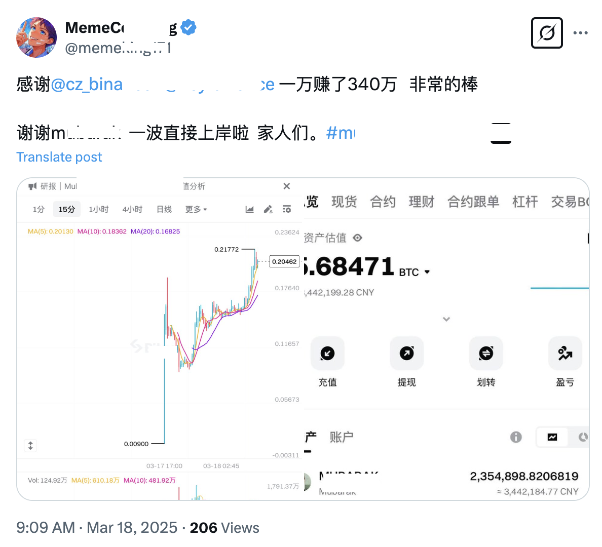

# 醉翁之意不在酒

周二的加密市场继续陷于恐慌和分歧之中。BTC也继续回落，跌破83k。教链不断听到两种声音：一种是各种认为本轮牛市还没结束，逢跌加仓等待下半场；另一种则是认为本轮牛市已经完了，清仓离场洗洗睡，等2028年卷土重来。

教链忽然就悟到了“本位”的另一层含义。所谓金本位（USD本位）或者币本位（BTC本位），并非简单的以什么作为换算单位，以增长哪个数量为目标，而是还有一个不起眼但很重要的行为模式，就是当深陷不确定性之中的时候，行动变得谨慎起来，躺平尽量少操作，此时躺平不动的躺平，是躺平在什么上面。

当想躺平的时候，金本位者要躺在USD上，所以如果他目前持有币，就需要清仓离场。而币本位者则是要躺在BTC上，所以如果他本就是满手大饼，他就什么都不需要干，即不需要加仓，也不需要清仓。

动辄需要进行所谓清仓离场操作的人，根本就不是币本位。他们在大饼上躺不住。

如果在大饼上躺得住、躺得稳，那么下跌又有什么不好的呢？这是为去年底到今年初FOMO进场高位接盘的人一个极佳的降成本的机会呀。今天3.18教链内参《摊低成本的两个时机》就指出了这一点。

牛市在不在，依教链的感觉，恐怕还得看主力是不是还有信心和决心，还有奋斗的动力，是不是还在努力搞事情。

现在的加密市场，其体量已经不是几个散户能够轻易撼动的了。更何况，散户如果没有指引，就像无头苍蝇一样到处乱转，也绝难形成合力和共识。

火车跑得快，全靠车头带。

这轮牛市走到现在，为啥是meme和BTC一路红火，为啥solana风光无两，为啥以DeFi为代表的VC币集体哑火，为啥ETH惨烈如斯？

因为2023-2024这两年，加密市场就是两大主力在搞事。一股资本在搞meme，借此盘活solana。另一股资本在搞ETF+战略储备叙事，把BTC推上新高度。没有主力在搞DeFi和ETH呀！

成也资本，败也资本。

主力资本去哪里搞事，哪里就热钱滚滚。哪里热钱滚滚，哪里就有财富效应。哪里有财富效应，嗅觉就像苍蝇一样敏锐无比的KOL们就围着哪里嗡嗡嗡嗡。哪里有KOL在大声嗡嗡，哪里就有聚光灯的关注以及蜂拥而至的散户流量。

不过也别以为主力搞事，吸引流量和散户，就是为了割散户的韭菜。主力之所以是主力，绝不是那么小的格局。

当然，主力的格局大，绝不是因为它善良，而只是因为，小虾米根本满足不了它的大胃口。

格局越大，胃口越大。主力要吃的，是其他的主力。最次，也得是大户。

君不见：2022年，CZ弹指一挥间，FTX灰飞烟灭。2023年，美资齐心协力，终报一箭之仇。

在2.23教链内参《第7周 发币丑闻终结模因时代 惊天一盗或促市场转折》中，教链就谈过，美资主力在solana上搞事，借meme做局完成解套，操盘计划和逃顶结局堪称教科书级别。

其实如果是深度参与过2020-2022年也就是上一轮周期的NFT市场的朋友，应该能够敏锐地嗅到其中操盘手法的高度相似之处。

像NFT、meme这种近乎“空气”的东西，天然就是操盘的绝佳载体。可谓主力资本搞事的天生神器。

市场价格是价值的体现。价值来源有二，一是生产，二是转移。生产多慢啊，直接注入资本，强行拉升价值，这才是最快的办法。

有的事情对资本免疫，比如死而复生。有的事情却纯粹资本驱动，比如meme。

主力没本事生产，但主力有钱啊。发挥长处，规避短处。搞什么研发高科技？肯定是炒meme能最快制造财富效应，迅速抓住眼球，进而引爆市场！

你以为当年NFT几个破头像就几十万上百万刀地赚，真是你能力强或者命中富贵？

错错错。

那是你端着个破碗碰巧站到了主力撒钱的地方。

而主力，也是醉翁之意不在酒。

小花几十亿美刀，给韭菜接盘NFT，那是为了捧红NFT交易市场平台的头牌opensea。估值几千亿美刀，上市交给下一棒接盘的主力。可惜呀，终究是太贪婪，opensea既没有及时发币，也没有成功IPO登陆美股市场。深熊一来，NFT凉到现在，这盘菜算是白炒了。

小花几十亿美刀，给韭菜接盘meme，那是为了拉出solana新公链的地位。Solana进了前十，最高点市值接近1300亿美刀。主力精准双顶解套，华丽得不要太潇洒！

现在，solana meme凉凉了。但是，新主力开始搞事了。

他们不像是同一波主力。甚至可能是冤家。

只不过，作为一颗小韭菜，千万要明白自己吃到的饭是哪里来的。

吃的是主力锅里的饭。

当然，能吃到主力锅里的饭，也是要靠本事的。
