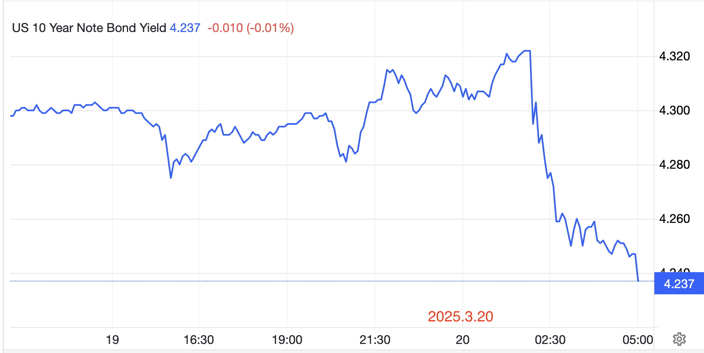
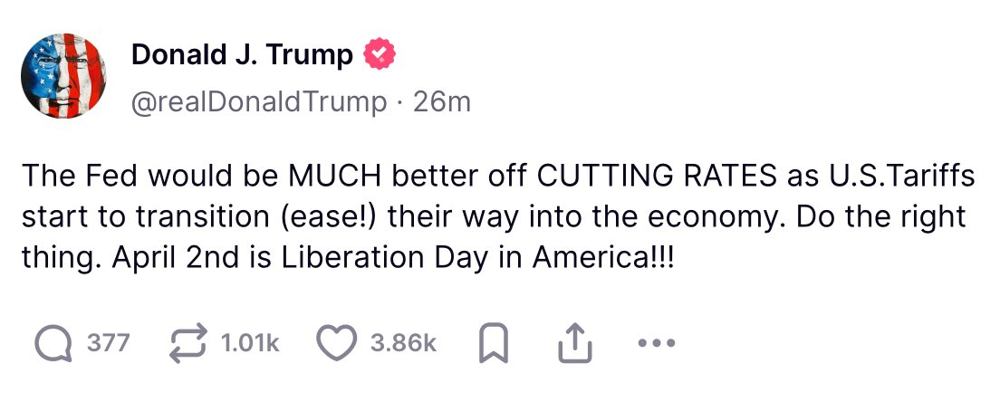

# 美联储吃下夹生饭

今晨，美联储三月议息会议结束。美股全线反弹。加密市场涨跌互现。BTC向上测试30日均线87k后回落。今天3.20教链内参《美联储放缓QT》中有记述，此次会议未降息，符合预期，对美经济展望偏负面，并推出了一个流动性支持的打折版本，就是放缓QT（量化紧缩）。

事实上，在过去几年的QT期间，市场一直在靠ONRRP（隔夜逆回购）蓄水池中释放的流动性在度日。教链很早之前就点过这个问题，比如在一年多前2024.1.16文章《美国回购市场危机会在春季重演吗？》中就谈过这个问题，而在一个多月前2025.2.10文章《超额流动性即将枯竭》中也进行了预警。

昨天2025.3.19文章《降息陷阱》中进一步指出，美联储目前面临的局面，要在流动性支持手段，是A、立刻降息，还是B、结束紧缩之间二选一，那么很可能只能选B。

不过，美联储耍了个花招，在选A和选B之间，选择了C。也就是没有完全结束紧缩，而是把紧缩的速度给放慢了。

也就是今日3.20教链内参《美联储放缓QT》中写的：「对于3月到期的美联储持有的国债本金支付，若超过每月250亿美元的上限，将在拍卖中展期。自4月1日起，对于每月到期的美联储持有的国债本金支付，若超过每月50亿美元的上限，将在拍卖中展期。赎回国债息票证券，直至达到每月上限，若息票本金支付低于上限，则赎回国债票据。」

把美联储这咬文嚼字的表述翻译成大白话说就是，以前每个月要向市场净抛售价值250亿美刀的美债，即从美债市场净回收250亿美刀流动性，现在把这个抛压直接降低到50亿美刀，也就是少抽走200亿美刀的流动性。

抽水机关小了，而且关小了不少，关小了四分之三。

效果立竿见影。美债收益率应声下跌，击穿4.3关口，从4.32一路回落至4.23附近。

美联储减少美债净抛压，就降低了对美债上涨的抑制。美债上涨，收益率自然就会下跌。

虽然美联储要到4月1号才开始执行这一政策。但是市场听到信号就势必开始提前行动了。

如此一来，美联储就实现了，一方面基准利率维持不变，另一方面美债收益率下降。

而教链在昨天2025.3.19文章《降息陷阱》里已经写了，今年急需债务再融资的美国联邦政府，更关心的是美债收益率能不能降下来。

鲍威尔给出了答案。

美联储终究还是把这碗夹生饭给吃了下去。

只不过，鲍威尔的这口饭，是为国家吃的，而不是为风险投机市场吃的。

利息没降，继续抑制杠杆率。MBS抛售没降，继续抽水。对风险市场的流动性支持，小心翼翼地控制在最低的力度。

另一边，总统则继续发帖鼓励：美联储最好降低利率！

博弈还在继续……
