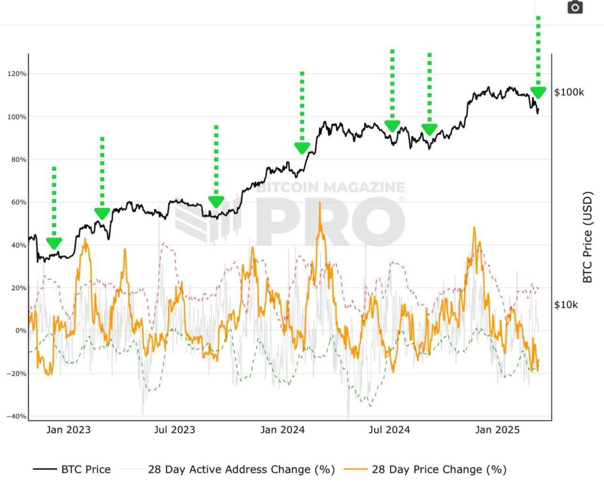
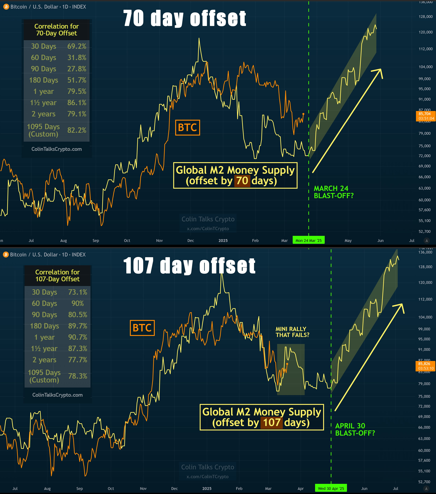

# 超卖时间

周六BTC小幅修复到84k附近。晚上补发完周日3.23一季度私董会的会议通知邮件，随便看了看，市场情绪冷淡的很，死水微澜。

据说现在BTC已经处于超卖状态。目前是市场的超卖时间。

超卖字面意思就是卖得太多了。这是一种对现象的感觉。现象就是价格快速下降，或者大幅下降。

虽然有一些诸如RSI之类的技术指标来判断超卖状态。但是，教链说过，一切技术指标都是价格的滞后指标。

所以，都是然并卵。

当你努力钻研、刻苦学习了N本技术分析书籍之后，也许会领悟到，返璞归真，一切技术指标里其实主要就是需要吃透和把握两个指标，一个是价格，另一个是成交量。

除此之外，这些与具体标的无关的通用知识学得再多，可能对投资成败也没有太大作用。

换句话说，持有BTC，需要掌握的知识里面，20%是一般性的金融投资知识，80%是BTC本身特殊的知识。

千万别搞颠倒了。

啃了再多金融投资书籍，却还是把BTC当作一支股票来炒，那恐怕是无法拿到大结果的。

可就是几乎99%的人的认知就是卡在这一层始终无法突破。

甚至其中不乏一些股圈大V之类的。

在他们的眼里，BTC就是一个仓位配置，跑得过美股就配置一点儿，跑不过美股就弃之如敝履。这甚至被认为是“专业”（professional）。也就是无情地看待所有的持仓标的，纯粹以收益率来评估价值。

投资固然要重视收益率，但投资不能只关注收益率。正如做生意当然要重视收入和利润，但是也不能忽视了国家关切、社会呼声。

在超卖时间里，有不少人就又开始嚷嚷什么周期不存在了之类的话。

周期怎么会不存在呢？周期只是不以人们预想的方式出现罢了。

只要一年还有春夏秋冬，一日还有白天黑夜，一个人的情绪还有高涨和低落，周期就一定还会存在。

当然他们说的是BTC的四年减半周期。

四年减半居然会驱动价格周期，这本身就是一件挺让人着迷的事情。

幂律揭示的价格时间双对数相关性，也是一件令人着迷的事情。

宏观经济流动性波动和BTC的延时相关性，同样令人着迷。

关于BTC，有太多令人着迷、值得探究的学问了。

只不过，不要因为陷入「人生有涯、学问无涯」的流沙之中，而忘记了更重要的事：

持有BTC。
