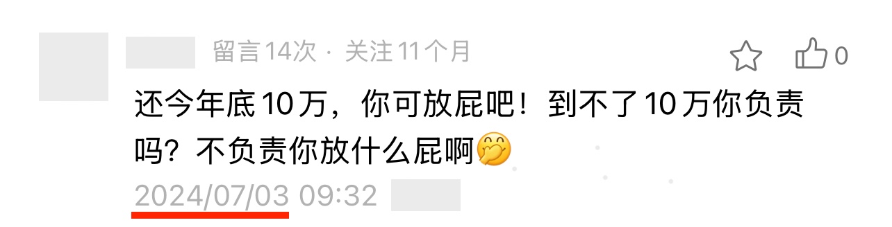

# 不信者恒不信

周末BTC在84k上方小幅上扬。今日3.23教链内参《第11周 市场横盘低位震荡 看牛看熊观点分歧》中提到，下午召开了一季度私董会，本来在内参里要提前写一点儿发言的引子和纲要的，但是时间仓促，一时竟忘记了。故会后在此稍作小结，弥补一下。

在本次会议上，教链的主题发言主要是分享了对过去一段时间市场发展的回顾和态势解读。其中重点回顾的是从去年2024年底四季度年终私董会至今的事态，兼谈自2022年底以来本轮牛市复苏进程，以及本轮周期与以往几轮周期的模式异同。

教链从全球地缘政治局势变化这一层切入，然后延伸到宏观经济周期，而后将上面两层作为加密市场的宏观背景，进入加密市场周期的剖析。先深入探究驱动牛熊周期的BTC，谈论市场分歧并展望后市，结合2024年底年终研究报告，分析了三种牛市发展模型，并指出自本轮周期起的奇点转折和相变，以及从牛市节奏上与之可能押韵的周期。由此继续，自然延伸到对山寨币包括如ETH、UNI、SOL等的驱动因素剖析，市场节奏背后的逻辑，以及本轮周期接下来的展望，等等。

在洋洋洒洒2个小时的即兴分享中，教链还记得谈到普通散户在这个如黑暗森林一般残酷博弈的加密市场中，投资致胜的法门或许只能是靠领先于市场的认知。

什么叫领先市场的认知？正好会后偶然看到一个真实案例。

下面截图中这位读者的留言因为语言比较粗鄙，所以教链并未精选出来。留言是去年也就是2024年7月3号评论的。评论的是哪篇文章呢？是更早前的一篇文章——2024年3月16号教链文章《BTC现阶段或不具备长期下跌基础》。

现在时间来到2025年3月底，我们可以回头捋一下时间线了：

2024年3月16号教链在文章中指出，「今年底我们有望看到10w+的BTC。」

2024年7月3号某读者评论说，「还今年底10万，你可放屁吧！」

2024年12月5号，BTC收盘10.1万刀。

2024年12月17号，BTC触及年内新高10.8万刀，收盘10.6万刀。

举这个例子不是说教链永远正确，而是说明一下什么是市场落后的认知，什么是领先于市场的认知，以及什么是愿意和敢于相信这一认知。

当然，正如教链在分享中谈的，仅仅有认知是不足以致胜的。

在有正确、领先的认知的基础上，能不能去相信，相信了有没有落实为行动。还有，有没有足够的耐心，以及保持耐心的实力，去等待，等到时间最终证实最初的认知和愿景。
