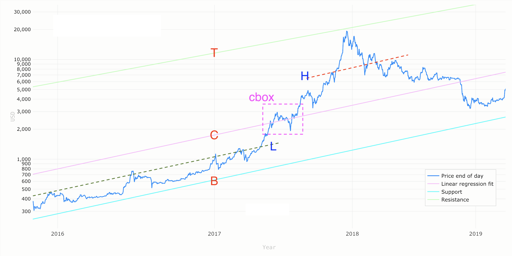
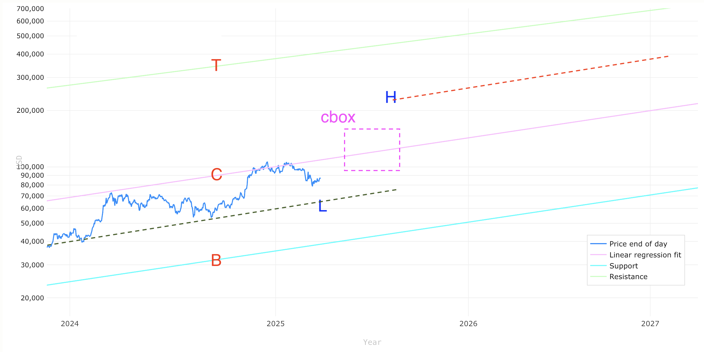
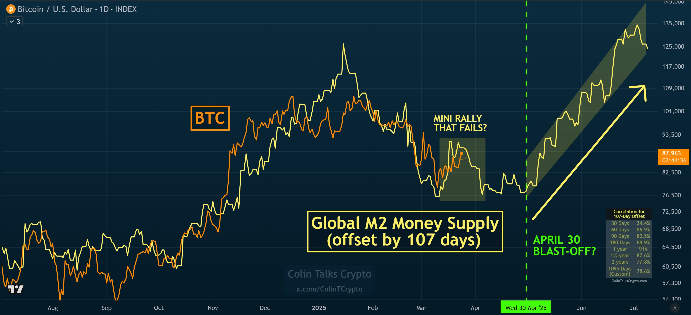

# 中轨彷徨

周二BTC多头未能守住88k，暂时回撤至87k一线防守。今日份3.25教链内参写的是，《大饼正沿30周均线向上爬行》。

提笔时收到券商推送的消息，是大A持仓年度分红公告。10派2，还不错。粗算了下，按持仓成本的话，年派息率约为5.44%（按市价约为4.4%）。仓位目前浮盈约22.75%（4年CAGR大概5.2-3%）。大A不搞投机安心投资的话，其实还是挺好的。

BTC这轮周期走到现在，已经没几个人看得懂了。说它像2021吧那肯定是不像。说它像2017吧，其实现在有些偏高。

这话怎么讲呢？

教链拉出2019版幂律图。我们先来看下2017年前后的。如下图。

上图中，红字标识的B、C、T分别是幂律的下轨（Bottom）、中轨（Central）和上轨（Top）。然后，教链在下轨和中轨之间添加了一条绿色虚线表示的低轨L（Low），在中轨和上轨之间添加了一条红色虚线表示的高轨H（High）。

可以很直观地看到，2017年牛市在5月份发动之前，BTC的价格长期在低轨下方运行。这对于低位建仓是极好的。

可是来到2025年这轮周期呢？就成了下面这幅图的样子。

教链在图中做了相似的B、C、T、L、H的标识。

一目了然的是，从2023年底开始，直到2025年3月的现在，BTC就始终没有落下过低轨，而是一直紧紧贴着中轨向上走。

虽然在2024年春和2024年底、2025年初曾两度靠近甚至缠绕中轨，但是两次都未能实质性突破。

现在我们再回过头去看一下上面两幅图中间的红紫色虚线框cbox。这个框也大致是所谓牛市年（2017、2025年）的中轨附近位置。因此，这个cbox其实是标识出了时空之“中”，即在时间上位于年中，也在价格水平上位于中轨。

为什么教链要特别画出这个cbox区域呢？

从2017年周期牛市后的深熊底部来看，当牛市进程中的BTC运行到cbox之中的时候，胜率就下降到一个临界点了。这个临界点可以称之为「FOMO stop」。

「FOMO stop」是教链发明的词儿。顾名思义就是停止FOMO的意思。意思就是说，当BTC运行到或者跨越这个「FOMO stop」临界点，就应该停止FOMO加仓了。因为此时的胜率越来越低了，而其实按住耐心，静等牛市情绪消退之后，再到熊市的时候，仍然有机会在相似的价格水平加仓，故而完全没有必要FOMO（Fear Of Missing Out，害怕错过）。

会看起来，才猛地惊觉，这轮周期，随着华尔街专业玩家和大机构的进入，给普通散户韭菜留下的跨周期套利空间是越来越小了。BTC的价格，在牛市前就被推高到低轨之上，贴着中轨向前走，让你根本没有2016年前后那样的在低轨下方从容低价抄底建仓的绝妙机会！

买不到足够便宜的筹码，就意味着，不仅胜率降低，而且就算是胜了，赔率也会降低，从大赚变成了小赚。

用高价透支市场的购买力，可能会使得，后市若冲破中轨，冲破之后还能有多少力气，还能冲多高，充满变数。

如此一来，现在8万刀的位置，不高不低，不三不四，不上不下，略显尴尬，有些彷徨。

彷徨之处在于，现在是直接起飞，直奔cbox的十万刀+呢；还是先蹲一波到低轨7万刀附近，然后再反弹升至cbox 10-15万刀呢？

要是按照「事不过三」的哲学智慧，把2024年1月视为「一测」（第一次测试低轨）、2024年9月视为「二测」的话，那么接下来，在冲进cbox之前，最好再来一个「三测」？

三振出局。

当然这第三振也是最危险、最致命的一振。如果破了低轨，那就让「看熊论」得了逞，不是空头被三振出局，而是多头被出局了。

假若果真有「三测」之时，恐怕韭菜届时不是逢跌加仓，而是丢盔弃甲、望风而逃了吧？

不过，不过，展望一下2026年底到2027年，7万刀至8万刀其实仍在下轨之上也。

勿谓言之不预。
