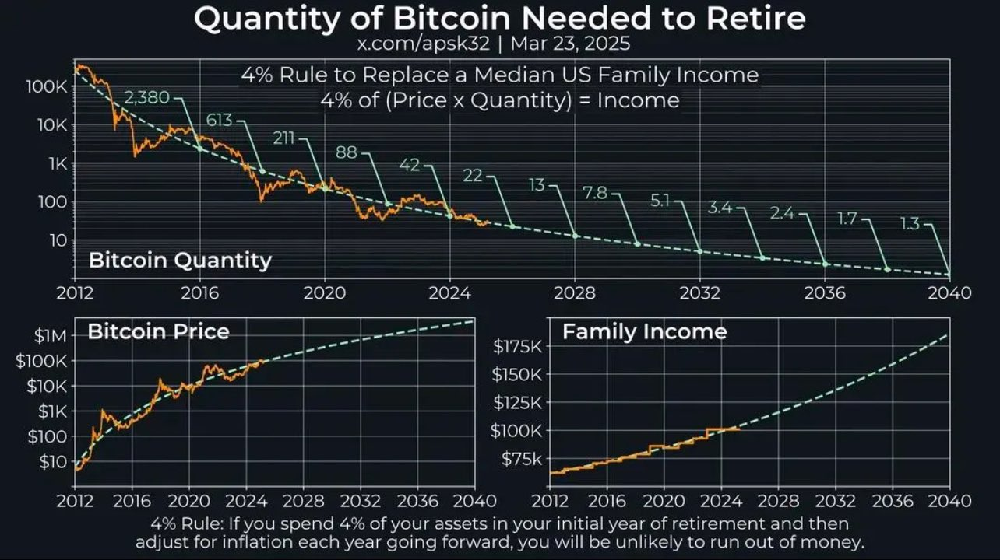

# 存够几个BTC就敢主动失业？

周三BTC在88k上下小幅震荡。关于应该囤多少BTC这个问题，此前教链也曾经写过一些文章。比如，2024.7.29《存够几个BTC可以提前退休？》。再比如，2023.6.28《你应该囤多少BTC？》。再早至2021.8.21《从投资小白到财务自由》。

这些篇目多多少少谈了一些和这个问题有关的解答思路。上面几篇要么是围绕储蓄率，要么是基于财富阶层结构，要么是谈论投入比例，各有各的角度，但是都没有从一个普通家庭收入的角度，来比较一下主动失业、提前退休需要准备的BTC数量。

那么这篇文章就来聊一聊这个角度的看法。下图是网友绘制的一幅退休所需BTC数量的图线。

图中所用的财务自由模型依然是教链此前介绍过的FIRE（财务自由、提前退休）。即，年抛4%仓位等于目标资金量。

这里的目标资金量，最低标准可以是覆盖生活开支，最高标准可以是替代家庭收入。

与2024.7.29教链文章《存够几个BTC可以提前退休？》中使用自己的开支或收入作为模型基准不同，上图中的模型使用美国家庭中位数收入水平作为基准。

2025年的当下，这个基准是每年10万美刀。

也就是说，仓位价值等于10万美刀除以4%即250万美刀，就可以实现年抛4%仓位替代年收入10万美刀的目标资金量。

250万美刀，按照目前BTC价格约9万美刀计算，大致相当于28枚BTC。

听起来有些遥不可及，是吗？

实际上，我们只需要了解模型的计算思路。因为对于生活在不同地方的人，模型的参数大有不同。

首先，我们的家庭收入水平可能不是10万美刀。北上深也许能够达到这个水平，但是我国绝大多数地区是远远不到这个水平的。

比如按照《中华人民共和国2023年国民经济和社会发展统计公报》的数据，「全年全国居民人均可支配收入39218元」，「全国居民人均可支配收入中位数33036元」，「城镇居民人均可支配收入51821元」，「城镇居民人均可支配收入中位数47122元」，「农村居民人均可支配收入21691元」，「农村居民人均可支配收入中位数18748元」。

把美国家庭中位数收入10万刀替换为我国城镇居民中位数收入47122元，所需仓位价值就变成了47122元除以4%等于117.8万元，按照目前BTC价格约63万元计算，大致相当于1.87枚BTC。

也就是说，如果你是生活在我国普通城镇，大概攒够2个BTC就可以主动退休了。

而如果你生活在我国农村，这个门槛还可以进一步降低。

按照农村居民中位数收入18748元计算的话，所需仓位价值就进一步下降为46.87万元，大致相当于0.74枚BTC。

已经可以说是实现了「1枚BTC退休」的目标了。

虽然收入水平低，但是我们普通人的生活水平，仅就衣食住行方面而言，其实并不比美国普通人差太多。在某些公共服务方面，比如社会安全、教育、医疗等问题上，性价比甚至高于美国普通人能够消费得起的水平。

归根结底还是社会体制不同造成的。

如果你是超级富豪（最好是昂撒族人），也许在美国生活会更爽。而如果你是普通人，还是生活在中国更惬意。

然后就是，模型中的4%这个参数，其实并不是为BTC量身定做的。这个数字来源于传统金融市场的一般回报率水平（扣除通胀后），比如美股。如果考虑通胀，比如2%通胀，那么就要求美股仓位年收益率达到6%；如果通胀飙升到8%，那么账面收益率要求就飙升到12%了。

对于BTC而言，我们希望它首先是能对冲通胀的，其次我们要对它通胀调整后的年均复合增长率（CAGR）有一个预期，比如10%、20%或者30%等等。

我们姑且按照比较保守的10%来算好了。那么上面的几个数字就会进一步得到降低：

替代美国家庭中位数收入所需BTC数量降低到11枚BTC。

替代中国城镇家庭中位数收入所需BTC数量降低到0.75枚BTC。

替代中国农村家庭中位数收入所需BTC数量降低到0.3枚BTC。

那么如果仍然按照最初计算的较多数量的BTC来积累呢？那就很显然地，每年提取4%会是一个很少的比例，剩下的仓位将能够在复利的魔力下，不断提高4%对应的资金量，从而持续提高生活水平，而不仅仅是保持生活水平了。

财务自由、主动失业的门槛其实可能并没有想象的那么高。更关键的在于是否敢于去想，敢于去为之而努力奋斗。
