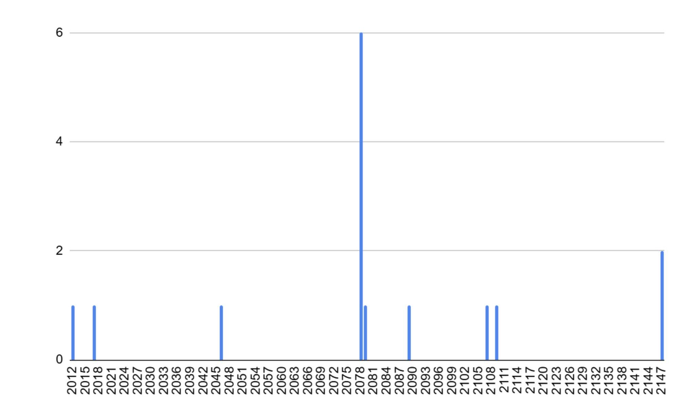

# 比特币的小bug：重复的币基交易

周四BTC在86-87k区间横盘小幅震荡。2025年3月份眼瞅着就要过去了。3月份过去，一季度也就要结束了。正如今日3.27教链内参说的，这个一季度《或许是2018年来最差的一季度》。

时光如水，岁月如歌。BTC就是时光奏响的乐章。但是在早年，具体说来是2013年之前，乐章中出现了一些不和谐的音符。这些不和谐的音符，就是重复的币基交易（铸币交易）。

所谓币基交易（铸币交易），又称 coinbase交易，是BTC每个新生成的区块中的第一条交易。挖到该区块的矿工通常会使用这笔交易把区块奖励发送到自己的地址里去。

众所周知，BTC的普通交易是不能重复的。因为普通交易都必须花费已经存在的一笔交易的未花费的输出，即所谓UTXO，教链将其比作“硬币”，这些硬币各不相同，因此各笔花费这些硬币的交易肯定也各不相同。如果一个硬币被两笔交易给花费了，那就成了所谓“双重花费”（double-spending），这是BTC严格禁止的。

但是，一个例外出现了。那就是币基交易。币基交易是铸币交易，所以不需要花费UTXO硬币，而是可以直接从空气中创造出新的BTC来，以此作为发给矿工的奖励。

如果一个矿工接连挖到了多个区块，并且在构造币基交易数据的时候，使用了完全相同的信息，比如接收地址和其他附加信息等，那么就可能构造出完全相同的两笔交易出来。体现在区块链就是这两笔位于不同区块内的币基交易，却拥有着相同的交易数据和哈希值。

这就是重复的币基交易。

这个比特币的bug真实存在。以下就是两个真实例子，大家可以打开BTC的任意区块链浏览器验证：

区块高度91812和区块高度91842，拥有哈希值完全相同的两笔币基交易。

区块高度91722和区块高度91880，拥有哈希值完全相同的两笔币基交易。

好消息是，从未有人利用这种重复的币基交易，花费它们，构造出同样是相同的后续普通交易，从而污染整个UTXO空间。在2012年3月15号通过一次软分叉实施了BIP-30之后，这种重复的交易就不能被使用了。

更进一步的，2013年3月又激活了BIP-34软分叉，给币基交易的构造中添加了区块高度信息作为“版本号”，从而使得币基交易的哈希值不可能再重复了。

具体的，从技术细节上，是在币基交易的scriptSig开头添加区块高度，第一字节是区块高度数值的字节数——目前是0x03，意思是后续3个字节表示本币基交易所在区块高度。币基交易里的这个scriptSig又被称为coinbase script，是矿工可自由自定义的字段，早期允许写入任意数据，比如中本聪就是在这个字段写入《泰晤士报》标题的。

对比一下更直观些。我们先来看下出现重复币基交易问题的区块#91812的币基交易的scriptSig是：0456720e1b00（OP_PUSHBYTES_4 56720e1b OP_0）。

而教链现在写这篇文章时刚刚产出的一个区块#889678的币基交易scriptSig则是：034e930d044260e5672f466f756e6472792055534120506f6f6c202364726f70676f6c642f23648154608b150000000000（OP_PUSHBYTES_3 4e930d OP_PUSHBYTES_4 4260e567 OP_PUSHBYTES_47）。

开头是0x03，后续三个字节是43930d，表示其所在区块高度是十六进制的0x0d934e，即十进制的889678。

坏消息是，在2013年修复之前，已经生成的币基交易中，也有一些它们的scriptSig开头碰巧是0x03！这就让未来这些当年的矿工有可能利用这一点来故意构造重复的币基交易。

举个具体的例子吧。区块#164384的coinbase script就是0x03开头的：03d6441e014b0136（OP_PUSHBYTES_3 d6441e OP_PUSHBYTES_1 4b OP_PUSHBYTES_1 36）。

我们不知道当时这位矿工写的这个脚本是何用意。但是我们可以知道的是，他有机会利用这个漏洞，在未来尝试构造出与之完全相同的币基交易出来。

具体是什么时间呢？我们需要简单推算一下。

根据BIP-34的定义，0x03后面3个字节表示区块高度。对上面这个例子而言就是d6441e，也就是十六进制的0x1e44d6，即十进制的1983702。

而区块#1983702大概会在什么时间产出呢？根据BTC大约每10分钟产出一个区块，很容易推算出，从现在的区块#889678到未来的#1983702，还需 (1983072 - 889678)/6/24/365 = 20.8年，也就是大约2046年的时候。

坏消息是，这样的区块还有不少。下面是全表：

block_height,coinbase_height,equal
164384,1983702,TRUE
169895,3708179,TRUE
170307,3709183,TRUE
171896,3712990,TRUE
172069,3713413,TRUE
172357,3714082,TRUE
172428,3714265,TRUE
174151,5208854,TRUE
176684,490897,TRUE
183669,3761471,TRUE
196988,4275806,TRUE
201577,5327833,TRUE
206039,7299941,TRUE
206354,7299941,TRUE
209920,209921,TRUE

从上面柱状图可以看出，2078年左右是风险最多的时间。

好消息是，在目前很大、未来更大的全网算力下，就算当年的矿工有这想法，它也很难刚好抢到那个高度的那个区块的打包权（生成权、挖矿权）。

而且，矿工得有多吃饱了撑的，才会去用费劲抢到挖矿权，构造一笔再也不能花掉的、模仿早年数据的交易，从而让自己白白遭受损失呢？

因此，结论就是，重复的币基交易这个bug，不能说已经被100%完美解决，但也不太可能掀起什么大的浪花。
