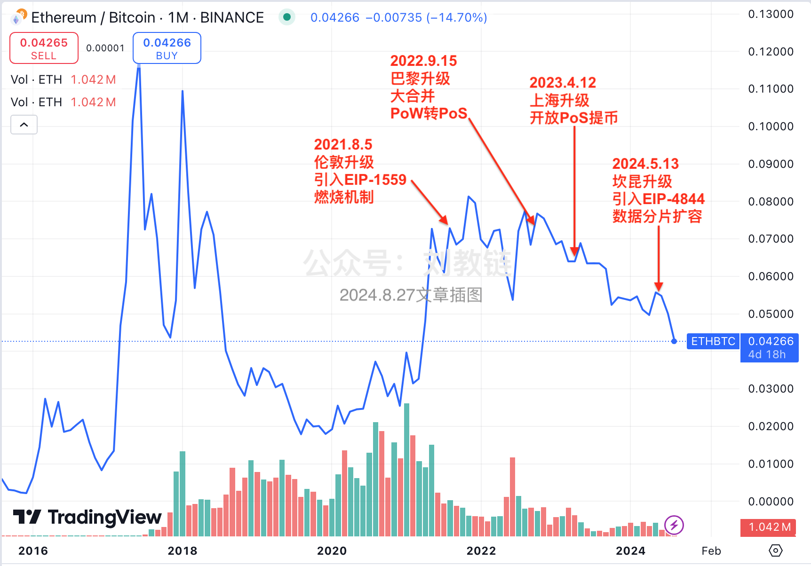

# 以太坊活成了稳定币

周末BTC突然下跌，来到82k附近。加密市场一片凄凄惨惨戚戚。这个三月BTC已经踩过10个月均线78.5k，现在似乎是拉开架势要再次测试。通常而言，牛市期间是不会踩破10个月均线的。如果踩破了，那就往往是转熊了。

当然，比BTC惨烈百倍的是ETH（以太坊）。真是不看不知道，一看吓一跳。上个月二月份ETH收盘2222刀，别说跌破10个月均线3k了，就连30个月均线2.3k都跌破了。三月以来继续下跌，至今已经回到1850刀，更是在30个月均线下方深不见底。

要知道，ETH上次跌破30个月均线还是2022年6月份，加密市场正式从技术上确认进入熊市的时候。之后ETH一直在30个月均线之下运行，直到2023年12月份才向上冲破均线阻力，重返牛市。

从2022年6月到2023年12月，整整一年半的时光逝去。

现在，ETH再次回到1850刀。这个高度，最早在2021年2月份就已经达到。从那时起，春去秋来，一晃已是四载光阴。期间，ETH最高超过4500刀。远远望去，它好像一直在1000多刀到4000多刀之间横盘震荡，仿佛活成了一个稳定币。

教链依稀记得，在2021年年底加仓4000刀的ETH时，耳边响起的是某行业大咖唱多ETH一万刀起步、三万刀不是顶的声音。教链其实挺“保守”的，准备说等1万刀就减仓。

下场就是等了3年，确实等到了“1字头”的ETH，只不过不是1万多刀，而是1千多刀。

想来市场也不是没给过机会。2021年底ETH突破4500的时候，教链当时拿ETH去做LP的，全都自动卖成USDT了。结果不开眼的是，等ETH跌回4000刀，就急不可耐地又把这些USDT全都换成了ETH——4000刀的ETH。

即便如此，市场也不是没给教链“解套”的机会。

2024年3月份和2024年12月份，ETH都曾经短暂地达到过4000刀附近。不过教链拒绝“韭菜三宝”之“回本止盈”，决定继续拿住、拿稳。只可惜，ETH并不能让拿稳变成稳拿（winner）。

有趣的是，从2020年至今，教链陆陆续续写过很多文章，有兴趣的读者可以去“刘教链”公众号搜索查证，从以太坊的“自限性”问题，到对EIP-1559燃烧模型的质疑，以及以太坊PoW转PoS后对PoS的种种疑虑，基本上都是持怀疑和担忧的态度，以至于当年的评论区都是被ETH拥趸的激烈批评所充斥。

但是教链却在行动上对ETH做了多，长期持有ETH仓位。

这显然不是知行合一。这是故意反着做。苦笑之余，教链找了个自我宽慰的说法，叫做“认知对冲”。

所谓认知对冲，就是行动和认知反着来。这样，如果ETH大涨，那么认知错了，但是仓位赚了。如果ETH没有大涨甚至跌了，那么仓位亏了，但是认知得到了验证。反正怎么都不亏。这就是对冲。

不过从金钱主义的角度讲，仓位亏了就是亏了。安慰自己的方法其实是“交了学费”。

感谢“好老师”、以太坊创始人、以太坊基金会实际掌控者Vitalik Buterin。

有人还在心存残念，声称以太坊即将迎来重大转折。

其实以太坊的重大转折已经发生过了。就是它抛弃PoW，转向PoS的那一刻。

这时候就要再再一次拿出来2024.8.27文章《以太坊的人生困局》中的经典插图了：

去年的这幅图唯一需要更新的，就是ETH/BTC从当时图中的0.04已经近乎再次腰斩，跌到了0.022。

0.022是什么水平？近乎2018年以来的历史最低位。期间只有2019年9月份左右跌到过局部低位0.016。而最高2018年初曾经创下过0.122的历史高点。今天的0.022，比这一高点跌去了82%。

这意味着，当年没有趁高把ETH换成BTC，今天相当于损失了80%的BTC。

当年价值10枚BTC的ETH仓位，坚持拿住，穿越牛熊，拿到今天，只值1.8枚BTC了。

心痛吗？

为什么一个PoW转PoS就能对价值造成如此毁灭性的打击？教链不知道对此Vitalik Buterin同学有没有预料到。

对这个问题的解释可能有无花八门的。但教链感觉一个可能的关键原因就是PoS节点对币价根本就没有托底支撑作用。

当初PoW转PoS，有无数人为PoS辩解，说什么PoS要质押代币，因此有资金成本，这和PoW支付算力成本是一样的。

但是设身处地的想想，感受一下，就很不一样。

PoW挖矿生产出来的代币，比如BTC，是有实打实的物理生产成本的。当矿机回本之后，其实就是运营性开支，包括电费、水费、场地等费用，主要是电费。

关键是有了这个成本，加上BTC不腐坏的特性，当价格击穿挖矿成本线时，矿工就倾向于持币等待更好的价格，而不是急于抛售挖矿所得，从而紧缩了供应，支撑了价格。

而PoS就是存币生息。质押者会觉得质押所得是白得的，从而倾向于抛售。就像你把钱拿去理财，赚到了利润，拿利润去消费的时候，就会更加敢于消费。

也许这才是ETH跌起来深不见底的原因之一吧？
