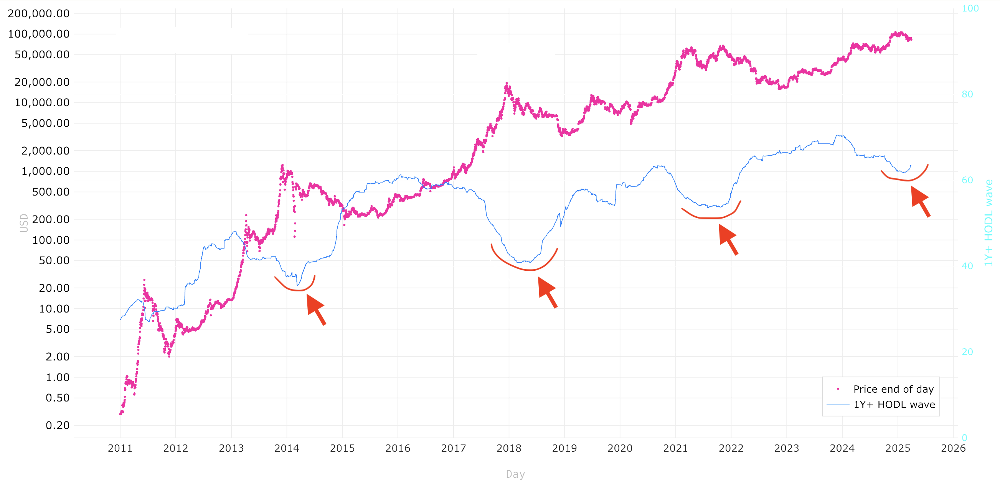

# 钻石手占比波动和BTC牛市

过去一周乃是希望燃起又被浇灭的一周。今日3.30内参总结道，《第12周 大饼假突破雪上加霜 以太陷绝境失尽人心》。至周日，BTC复回82k区间。

多空分歧真的是相当之大。看多的大致都是坚信牛市还有下一波。看空的则已经开始看熊了。

一跌就看熊，尿性不改。记得2021年“519”崩盘之后，市场也是弥漫着熊已到的悲观情绪。不过到了8、9月份还是拉起来一个年末的牛市第二高峰。

教链看到有人拉出来一个叫做「1-yr+ hodl wave」的指标来说明，BTC很可能正在走熊的路上。还说什么在过去三轮牛市都得到了验证。

于是就仔细瞧了瞧这个被说的神乎其神的指标。

顾名思义，这个「1-yr+ hodl wave」是指在链上持有BTC一动不动超过1年的地址数量占比的波动。这种一拿就拿一年多的，我们姑且可以称之为「钻石手」。于是这个指标也可以被称为「钻石手占比波动」。

首先从图上可以很直观地看到，相比于下跌，钻石手们更“害怕”上涨。因为下跌不能让他们投降割肉，但是上涨却可以让他们交出筹码。

其次可以观察到一个大的趋势，就是虽然每一轮牛市钻石手们都会逢涨抛售，但是钻石手占比的每一个局部底，其实是每轮周期都在升高的。

这就反映了一个颠扑不破的道理：越来越多的投资者，正在认识到拿住BTC的重要性。越来越多人的认知提高了，自然就有更多钻石手，并且选择拿住的人也越来越多，相对占比也越来越大。

换句话说，BTC的投资者群体正在变得越来越聪明。

那么这个指标果真可以用来预测牛市顶部吗？

正如前文介绍的，有些人观察到了，此前几次牛市，钻石手占比波动这个指标都是先跌后涨，画了个圆弧底。而这一次，似乎该指标正在画一个圆弧底的过程中。这也是为什么一些人会猜测、判断甚至一口咬定，BTC这轮牛市到此已形同末路，结束了。

这个指标相比于传统金融证券市场上的颇多技术分析指标，有一个特别大的优势，就是它不是从市场价格衍生出来的。从价格计算衍生出来的指标，不管是什么MA呀、布林带呀、RSI呀、MACD呀等等之类，其实都是价格的滞后指标。

而这个钻石手占比波动指标，不是价格衍生出来的，而是链上统计的地址数，是“基本面”。

但是，虽然这个指标不是价格直接计算出来的，但是，它其实也是受价格驱动的。

对，教链的意思是，价格驱动了钻石手占比波动，而不是相反。

这是教链的个人观点。任何人都可以不接受。

为什么呢？因为从逻辑上，价格暴拉，吸引了媒体传播，钻石手被消息吸引回到市场，一看，猛涨了，拉盘了，于是就开始做逢涨减仓的操作，占比就会下降。

而下跌却不会让他们割肉离场，而是拿住1年多前买入的仓位，所以占比就会上升。

看一下指标定义：

钻石手占比波动，即所谓“1年HODL波浪线”（1YR HODL Wave），指的是根据BTC持有时间划分的持币者分布情况，特别关注那些持有BTC一年或更长时间的群体。

换言之：这项统计数据反映的是至少一年内未进行任何转出交易的BTC地址（或钱包）所占的比例。

它揭示了长期持有者（而非短期交易者）的行为模式，体现他们对BTC投资的持久信心。

分析者和投资者常用这一指标衡量市场对BTC的长期信念强度：若1年HODL波浪线比例上升，可能表明投资者对BTC作为资产的长期潜力抱有坚定信心；若比例下降，则可能暗示抛售活动增加，反映短期市场情绪波动。

可见，这些「钻石手」们的基本行为特征可以概括为八个字：

不涨不卖，越涨越卖。

很显然，从逻辑上讲，是价格波动驱动了他们的行为。

这就是教链并不认为这一个指标就可以预测牛熊的原因。
