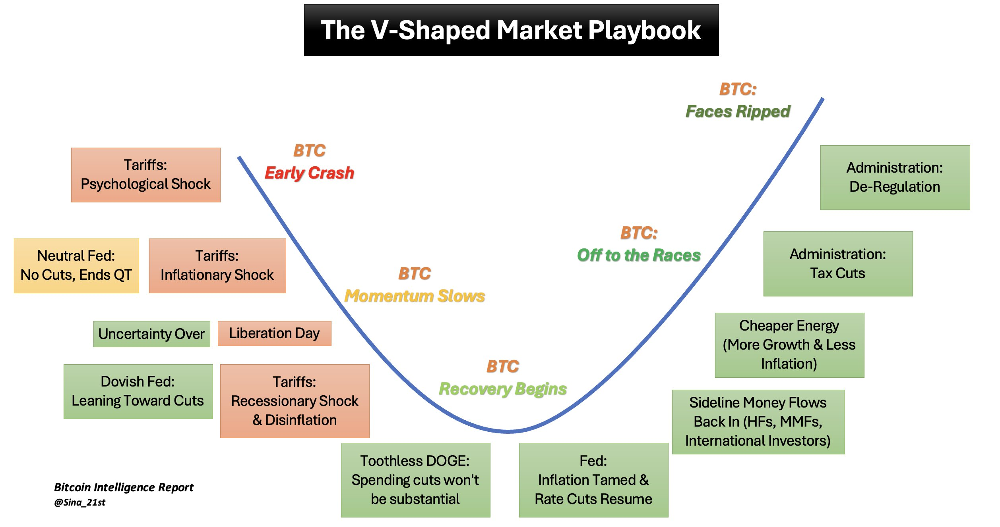

# 贪心和耐心

隔夜的BTC又拉回到了85k附近。昨天最低探到了82.2k，并未继续向下，反而拉上来了。拉远点儿看，就是4.2教链内参说的《BTC向30周线回归》。

昨天4.1教链内参提到有人说《四大利空》。但也有人说2025要走V字形。

问题在于什么时候会出现反转信号。

当然，左侧交易者总是提前行动。因为等到信号出现，市场都在抢跑，那时候再行动就晚了，也肯定难以抢到最好的价格。

提前行动的风险在于，也许价格还没有调整到位，进入的速度太快了，导致成本太高。但是，也有可能价格已经触底，但是进入的太犹豫，或者还想贪心，挂在更低的地方接，却迟迟接不到。

前一种情况是对于底部最优价格不够贪心，后一种情况则是太贪心。

当然，完全一点儿都不贪心更好的价格，那就是八字诀所讲的坚持定投了。不过这坚持定投实在是挺难的。总会遇到各种状况，打乱我们的计划，消磨我们的耐心，或者给我们制造犹豫和恐惧，从而阻止我们继续坚持下去。

天下难事有很多，“坚持”应该算得上一件。

贪心能不能胜过不贪心，这还真的不好说。也许稍微贪心一点点儿，但是又不要过度，会是更好的一个状态？

教链又想到了“耐心”这个词。与“贪心”不同，“耐心”通常被用来作为一个褒义词使用。可是如果我们剥离主观感情色彩，似乎二者实在是同一件事。比如贪心更低、更好的买入价格，其实就是耐心地等待更低、更好的价格。

但是几乎没有例外的，所有人都在谆谆教导我们，要充满耐心，不要贪心。为什么这些投资心法很容易让人学得走火入魔，一实操起来屁用没有？归根结底就是因为大都是“要耐心、不要贪心”这类的自相矛盾的功夫。

左右互搏？你永远不知道此时此刻，面对从10万刀回撤到8万刀的BTC，是应该继续充满耐心地等7万刀的BTC呢，还是应该不要贪心苦等7万刀的BTC。

所谓要耐心不要贪心，其实就是要耐心不要耐心，要贪心不要贪心，根本就是不可能做到的事。

也许有人说这两者本就不是黑白分明，只是个度的差别。那么请问，耐心到了多大就变成了贪心，或者贪心到了多小就变成了耐心呢？根本就没有办法定义和把握这个度嘛！这就不是科学。

想来想去，教链就悟到了，这东西说白了其实最后就是成败论英雄。

比如我本来就是贪心想等7万刀的BTC，结果市场果真暴跌让我成功抄底抄到了，那么转眼我就可以美滋滋地夸自己好有耐心呀！

而与之相反的，如果我本来就是备受煎熬地强迫自己保持极大耐心等待7万刀的BTC，结果市场压根儿不给我机会，测试了几次8万刀支撑位就扬长而去，那么我就成了那个贪心太过错失良机的傻瓜。

从这一辩证转化我们可以得到什么样的启发呢？

启发就是，再看到各种KOL得意洋洋地吹嘘自己咋滴咋滴，如何如何成功地做了什么神乎其技的操作，大赚特赚的时候，请冷静，那不过是随机的运气通过幸存者偏差的滤镜所折射出来的光晕罢了。

教链在市场摸爬滚打这些年，有个体会就是，有心栽花花不开，无心插柳柳成行。

重要的不是去猜花红还是柳绿，而是用心地栽花插柳，然后静静等待，把命运交给时间。
