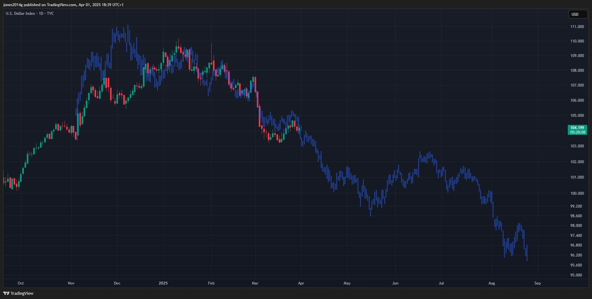

# 关税核弹来袭，BTC迫近8万刀

隔夜凌晨，川皇宣布一次性对185个国家加征关税，创下美国史上最大规模关税行动之一。消息公布后，标普500指数期货在15分钟内暴跌，市值蒸发2万亿美元。BTC则从86k上方日内急挫超5%跌至81k区间，迫近8万刀整数关口。

川皇详细解释了“对等关税”的计算方式。他表示，由于美国“非常仁慈”，关税将仅按各国目前对美国征税税率的一半征收。例如：若某国对美国商品征收20%关税，美国将对该国商品征收10%关税。

在本次关税政策出台前，美国平均关税水平如下图所示。随着新关税政策的实施，美国平均关税税率将突破10%大关。值得注意的是，这一关税水平甚至将超越二战时期的峰值。

4.3教链内参《超预期关税来袭》提到，「计算显示，如果这些关税完全落地，美国的有效关税率或从 2024 年的 2.4% 大幅上升 22.7 个百分点，至 25.1%，这将超过 1930 年《斯穆特-霍利关税法案》实施后的关税水平。」

自2018年开打贸易战以来，川皇就对关税战情有独钟。现在看来，他不是针对谁，他针对的是整个世界。

他质疑主流西方经济学家的理论，用朴素的逻辑直指人心：个人所得税是向美国人征税，而关税是向外国人征税，为什么要向美国人征税，而不是向外国人征税？

他同时提出，要对美国国内大幅度减税，对美国人大幅度减税。

任凭经济学家怎么搬出李嘉图比较优势学说之类的理论来支持零关税能最大化贸易双方福利的观点，美国的红脖子选民们大概是无法理解这么高深的经济学理论，而更容易被川皇简洁朴素的逻辑所打动。

只不过，一个吊诡的问题出现了。如果美国政府不再由美国纳税人供养，因为美国纳税人不需要纳税了，而是由外国人缴纳关税供养，那么按照西方政治学理论，美国政府是不是应该主要服务于纳税的外国人，而非不再纳税的美国人呢？如果是这样，那么美国政府会不会变成外国人的买办政府，而不再是美国人的民主政府了呢？

还有一个问题就是，商品输入美国，美国是对等输出美元的，而不是没有输出什么，如果美国对输美商品加征关税，会不会导致美国国内美元向外减少输出呢？这回不回进一步造成美国市场美元泛滥，而世界遭遇美元荒呢？这就势必造成美元走强。

但是奇怪的是，关税核弹来袭，美元指数竟也被击落，从104上方直线下坠跌破102，来到101区间。

有人说，美元指数会不会是在复刻2017年的走势呀？（看下图）

而BTC，则即将迎来一次“死亡交叉”——即50日均线向下穿越200日均线。

评论员说：「比特币即将出现的死亡交叉会是又一个虚假信号吗？完全有可能

比特币即将出现的死亡交叉会是一个有效熊市启动信号吗？同样有可能

在两次虚假信号之后，再次出现假信号的概率正在降低

预计这一死亡交叉将在未来一周左右出现——请做好准备」

不过，众所周知，均线不过是价格的滞后指标。

死亡交叉这种信号，大概相当于在狼已经过去之后才开始喊“狼来了”。

实在是有够后知后觉的了。
