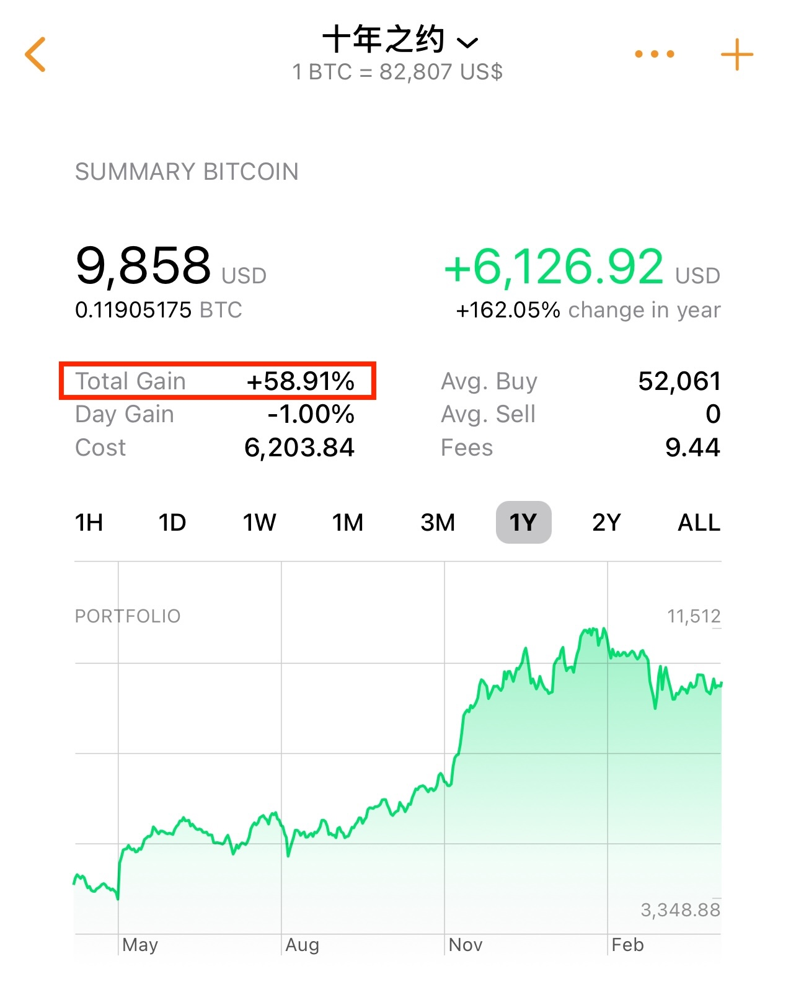

# 十年之约系列(45)：故意

BTC 82k+。“十年之约”实盘见证计划第45篇笔记，例行定投加仓。这是第32次加仓。加仓价格82781刀。投后持仓1190万聪。持仓成本52031刀。收益率回撤至60%。进度14%。对模型参数不了解的新读者可以回看一下2024.10.6文章《月薪5000工薪族的财务自由计划》，以免反复提出重复性而无意义的问题。

日前，一段由网友制作的视频开头直言：“特朗普正在引发股市崩盘……但他是故意的。” 这段视频被川皇本人转发。人们纷纷猜测，这是川皇暗示最近的这些动荡就是他故意为之。面对美股的剧烈回调，川皇再次喊话美国民众“挺住”，称这是一场“经济革命”，最终将带来“历史性结果”。

视频的观点认为，关税政策可以促进美国企业在国内进行生产，促使农民将更多农产品在国内销售，从而降低食品价格，通过调整关税和股市将进一步降低物价，使得美国中产阶级受益。

教链在2025.3.5文章《人造衰退》中就已经指出这一假设的可能性，并如此写道：

「经济学家惊呼，加征关税损人不利己，势必将损害美国经济，恐将使美经济陷入衰退。

道理谁不懂？问题是，如果制造一场衰退或者衰退预期本就是战术目标呢？

经济学家以为自己站在最高层。殊不知川皇直接站在了大气层。」

如今看起来，川皇恐怕自己心里面是真的知道自己就是要故意这么做的。

从今日4.6教链内参《第13周 关税来袭万物皆跌 加密独挺瑟瑟发抖》中可以看到，这一波战术核弹发射，逼得全球资本都在从风险资产中仓皇出逃，涌入避险资产，典型如美债、中债，从而推高了后者的价格，压低了债券收益率。

美股市场上，仅周四一个单日，对冲基金们就抛售了 400 亿美元股票，创下自 2010 年以来最大单日抛售纪录。

更牛逼的是，以摩根大通CEO吉米·戴蒙和股神巴菲特老爷子为代表的老钱们，早在2月份美股高位时就先走为敬，精准逃顶了。

究竟是老姜够辣，还是老姜们提前听到了定向走漏的风声呢？

这等动荡的宏观背景，让教链也不得不倒吸一口凉气。于是在4.6教链内参《第13周 关税来袭万物皆跌 加密独挺瑟瑟发抖》中也再三推演了几种剧本走向，并对自己的持仓进行再三的压力测试。

教链指出，2025年底幂律低轨是50k，2026年底幂律低轨是70k，也许最好不要让持仓成本高于这个水平。

回头一看“十年之约”，持仓成本已经拉到52k了，超过了50k，小有风险。

至于“恐怖故事”，那就实在是过于恐怖，不忍提及了。

但是每当这种至暗时刻，教链就不由得想起Nike创始人在自传里写的那句话：

懦夫从不启程，弱者死于途中，只剩我们前行。
