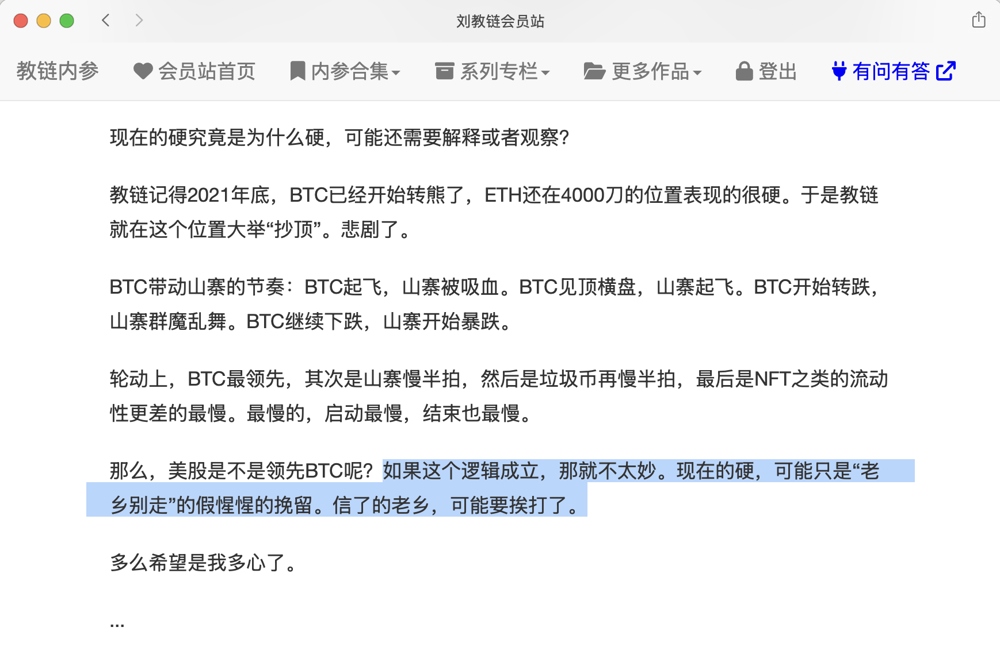

# 意料之中的暴跌：多重逻辑叠加的必然性危机

2025年4月7日的全球金融市场，用一场系统性暴跌印证了“所有危机都有迹可循”的古老定律。比特币跌破8万美元、美股单日蒸发超4.9万亿美元、日韩股市触发熔断，这些数字背后是宏观政策与市场结构的双重坍塌。

在昨天周日4.6教链内参《第13周 关税来袭万物皆跌 加密独挺瑟瑟发抖》中，进行了压力测试的预警。当机构和KOL们纷纷赞叹于加密市场在关税阴云中坚挺，当乐观者把BTC的韧性视为其逐渐演变为宏观对冲工具的迹象时，危机却正在海面之下酝酿。教链在内参中写道，「往最好处想，做最坏的打算。」「如果这个逻辑成立，那就不太妙。现在的硬，可能只是“老乡别走”的假惺惺的挽留。信了的老乡，可能要挨打了。」

常读教链内参的读者朋友都能感受到宏观因素急转直下的征兆。美联储的货币政策转向成为第一张倒下的多米诺骨牌。3月会议纪要释放的“延迟降息”信号，与特朗普政府激进的关税政策形成共振。当美国对全球进口商品加征高额关税的消息落地，全球供应链中断预期推高通胀压力，迫使美联储在“保就业”与“稳物价”之间陷入两难。这种政策矛盾直接撕裂市场预期：美元指数高位横盘，而风险资产遭遇无差别抛售。

比特币跌破8万美元看似突然，实则早有伏笔。市场在3个月内累积60%涨幅后，CME期货78.5k-79.2k缺口的回补需求成为技术面导火索。而早在2025.3.2教链内参《第8周 风云突变回踩八万 有问有答新鲜上线》中的成本分布图，就清晰地指出了75k-85k乃至于扩大到70k-90k区间的脆弱性。

以太坊的溃败则揭示更深层危机。今天4.7教链内参《多国股市熔断，BTC跌破8万刀》提到，ETH/BTC 汇率持续下行，现已跌至 2020 年“312”大崩盘时期水平。而投资机构Mechanism Capital则更是毫不客气地评论道，「一个市值高达 2150 亿美元的资产，在增长和盈利都为负的情况下，还维持这样的市值，实在是荒谬」。

历史的伤痛记忆仿佛就在昨天。2020年3月的流动性危机曾让比特币单日暴跌40%，彼时美债基差交易者50倍杠杆引发的挤兑，与当前美债波动率指数（MOVE）迫近警戒线的场景惊人相似。债券市场的剧烈波动通过两条路径传导：一是迫使杠杆资金平仓补缴保证金，二是推高企业融资成本压缩盈利空间。当纳斯达克100指数较高点回撤20%，机构投资者不得不抛售比特币等流动性较好的资产换取现金。

现代金融体系的致命软肋是，当国债波动率突破阈值，所有基于稳定利率假设的资产定价模型都将失效。

市场此刻的恐慌，本质是对“安全资产”定义的重新校准。黄金与比特币同步下跌、美元独强的反常现象，暗示机构正在为更严峻的流动性收缩做准备。

在眼前的这场危机中，比特币展现出矛盾性。尽管较美股表现出更强韧性，但其78k支撑位下方，仍有程序化交易的止损卖单暗流涌动。市场参与者需要警惕的是，过往暴跌后短期收复失地的历史，可能因当前链上巨鲸吸筹速度放缓而存在变数。

意料之中的暴跌，往往始于被忽视的确定性。从美联储货币政策框架的内在冲突，到加密货币市场杠杆率的非线性增长，再到全球贸易体系的重构压力，每个因子都在预警系统的脆弱性。当恐慌指数VIX飙升至45.7，这或许不是终点，而是新一轮价值发现的起点——正如2020年危机催生了DeFi革命，当前的市场出清也可能孕育着下一代金融范式的雏形。（请参阅教链2025.4.5文章《比特币债券：美国债务危机突围的“数字黄金”战略》）

活下来的投资者需要记住：

带血的筹码总是出现在所有人充满侥幸心理地质疑“这次不一样”的时刻。
