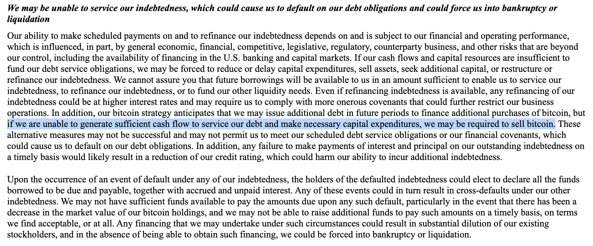
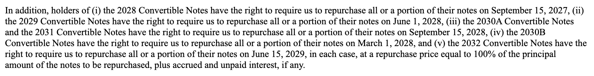
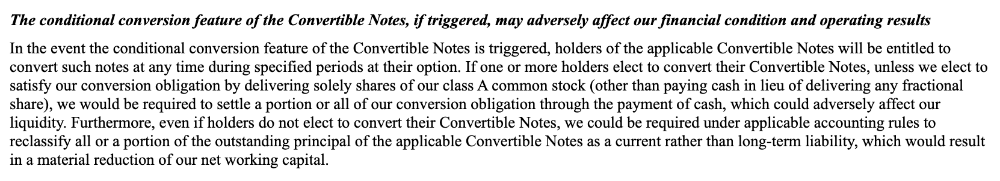

# 若BTC深度下跌，微策略会暴雷吗？

随着BTC无力反弹，再度下探75k，关于数月前10万刀高位“上头”加仓猛干的囤饼大户微策略公司（现已改名Strategy）的仓位是否会被爆掉并导致BTC大规模泄洪式抛售的传言也开始在坊间悄悄传播。今儿4.9教链内参《关税阴云密布，加密继续暴跌》提到，有人指出，据其提交给美SEC的8-K表格披露，微策略并非如其老板Michael Saylor说的那样“永远不卖”，而是“有可能”在财务出现问题时抛售其BTC持仓。

教链看了一下8-K表格里的原文，是这么写的：「若我们无法产生足够的现金流来偿还债务并进行必要的资本支出，则可能需要出售比特币。」（if we are unable to generate sufficient cash flow to service our debt and make necessary capital expenditures, we may be required to sell bitcoin.）

这里只是指出了一种理论可能性。还是让我们看一下具体的上下文吧：

「**我们可能无力偿还债务，这将导致我们无法履行偿债义务，甚至被迫进入破产清算程序。**

我们按期偿还债务本息及进行债务再融资的能力，取决于并受限于公司财务和经营状况。这些状况部分受到宏观经济环境、金融市场波动、行业竞争态势、法律法规变化、交易对手经营风险等不可控因素的影响，包括美国银行体系和资本市场融资渠道的可获得性。若现金流和资本储备不足以支付债务本息，我们可能被迫采取以下措施：削减或推迟资本支出、出售资产、寻求新增融资、或对现有债务进行重组或再融资。我们无法保证未来能够获得足额融资用于偿还债务、进行债务再融资或满足其他流动性需求。即使获得再融资，新债务可能面临更高利率和更严苛的限制性条款，从而进一步制约公司经营自主权。此外，根据比特币投资策略，我们可能通过举债增持比特币，但若无法产生足够现金流偿付债务及维持必要资本支出，则可能需要出售比特币持仓。这些应急措施可能无法奏效，导致我们无法履行偿债义务或满足财务约束条款，从而引发债务违约。任何未能按时支付本息的行为都可能引发信用评级下调，进而损害公司新增融资能力。

一旦发生债务违约，相关债权人有权宣布所有未偿借款本息立即到期应付。此类事件可能引发其他债务的交叉违约。我们可能因比特币持仓市值缩水等因素，缺乏足够资金偿付违约债务，且无法及时以可接受条件（或根本无法）筹集资金。在此情形下进行的融资将大幅稀释现有股东权益，若融资失败则可能导致公司破产清算。」

「**我们可能无法筹集足够资金用于以下用途：(1)以现金结算可转换票据的转换；(2)在发生重大变更时以现金回购可转换票据；或(3)在下列日期以现金回购各批次票据：2028年可转换票据（2027年9月15日）、2029年可转换票据（2028年6月1日）、2030A或2031年可转换票据（2028年9月15日）、2030B可转换票据（2028年3月1日）、2032年可转换票据（2029年6月15日）。此外，未来新增债务可能包含对我们以现金结算转换或回购可转换票据能力的限制条款。**」

「关于可转换票据的任何转换事项，除非我们选择（或已不可撤销地选择）仅以本公司A类普通股进行结算（零股支付现金除外），否则我们必须就待转换票据支付现金款项。然而，未来新增债务可能包含以下限制条款：(i)禁止使用现金结算可转换票据的转换或赎回，这将迫使我们仅能以股票结算（零股支付现金除外）；或(ii)限制我们通过出售比特币获取偿付资金的权利。

根据可转换票据契约对"重大变更"的定义，当触发该条款时，票据持有人有权要求我们以面值100%的价格（另加截至回购日前一日的应计未付利息）回购全部流通票据。值得注意的是，即便控制权变更或重大变更本身不构成违约，持有人行使回购权可能因对公司财务状况的冲击而触发其他债务协议下的违约条款。为筹集回购资金，我们预计需对可转换票据进行再融资或取得持有人豁免，但可能无法获得合理条件的再融资。若未能取得相关持有人豁免，我们未按约定发出合格回购要约或未偿付有效投标票据的行为，将直接构成可转换票据契约项下的违约事件。」

「此外，各批次可转换票据持有人享有在特定日期要求本公司回购全部或部分票据的权利，具体如下：
(i) 2028年可转换票据持有人有权于2027年9月15日要求回购；
(ii) 2029年可转换票据持有人有权于2028年6月1日要求回购；
(iii) 2030A及2031年可转换票据持有人有权于2028年9月15日要求回购；
(iv) 2030B可转换票据持有人有权于2028年3月1日要求回购；
(v) 2032年可转换票据持有人有权于2029年6月15日要求回购。

上述回购价格均为被回购票据本金的100%，另加截至回购日（不含）的应计未付利息（如有）。」

「**可转换票据的或有转换条款一旦触发，可能对我们的财务状况和经营业绩产生不利影响**

若可转换票据的或有转换条款被触发，相关票据持有人有权在特定期间内随时选择转换其票据。若持有人行使转换权，除非本公司选择仅以A类普通股（零股以现金支付除外）履行转换义务，否则我们必须以现金支付部分或全部转换款项，这可能对我们的流动性造成不利影响。此外，即便持有人未选择转换，根据相关会计准则，我们可能需将相关票据的全部或部分未偿还本金重新分类为流动负债而非长期负债，这将导致我们的净营运资本大幅减少。」

根据4.9教链内参《关税阴云密布，加密继续暴跌》的数据，微策略目前的BTC持仓情况大概是这样的：「Strategy 当前持有 528,185 枚 BTC，成本均价 67,458 美元，价值 401.19 亿美元。」

那么，如果目前BTC继续下跌，比如跌破微策略（即Strategy）持仓成本价67k，是否会引起它抛售BTC仓位呢？以及，未来是否存在这种可能性，即因为BTC跌入深熊，导致微策略被迫抛售呢？

教链请deepseek来帮忙分析一下上述问题。以下是deepseek的分析：

根据微策略（现Strategy）披露的财务信息及市场分析，其BTC持仓暴雷风险需结合债务结构、市场环境及应对策略综合评估：

### 一、短期风险：流动性压力可控，但存在连锁反应风险
1. **债务到期时间分布**  
   主要可转换票据回购集中在2027-2029年，当前无刚性兑付压力。但若BTC价格持续低于67k美元成本线，可能触发以下风险：
   • **会计准则下的负债重分类**：未偿还票据本金或需计入流动负债，导致净营运资本骤减（2024年净营运资本已为负值）
   • **信用评级下调**：资产缩水可能引发评级机构调降评级，提高再融资成本

2. **现金流脆弱性**  
   公司软件业务年收入仅5亿美元，无法覆盖潜在债务利息。若BTC长期低迷，可能被迫：
   • **启动ATM股票增发**：但股价下跌会降低融资效率（2025年3月MSTR股价较峰值跌45%）
   • **质押BTC贷款**：当前尚未使用此方式，但极端情况下或成为选项

### 二、中长期临界点：BTC价格与债务成本的博弈
1. **安全边际测算**  
   当前持仓成本67,458美元，总价值401亿美元。若BTC跌至：
   • **50k美元**：持仓市值缩水至264亿美元，接近总负债（76.1亿美元）的3.5倍
   • **30k美元**：市值降至158亿美元，负债覆盖率降至2.1倍，可能触发债权人提前赎回条款

2. **债务雪球效应**  
   若2027-2029年到期票据无法再融资：
   • **集中兑付压力**：2028年3月（2030B票据）、2028年6月（2029票据）等时间点需兑付超50亿美元本金
   • **交叉违约风险**：一笔违约可能触发其他债务加速到期

### 三、风险缓释机制：Saylor控制权与市场叙事
1. **公司治理防火墙**  
   Michael Saylor持有46.8%投票权，可阻止清盘提案。其对比特币的"传教士式"营销仍是维系市场信心的关键

2. **市场预期管理**  
   • **戴维斯双杀风险**：BTC下跌将同时压缩盈利预期和估值溢价（当前市净率3.4倍）
   • **ETF替代效应**：灰度BTC信托等产品削弱MSTR作为"杠杆比特币期权"的独特性

### 四、暴雷情景推演（见下表）

| 触发条件                 | 可能后果                                                                 | 发生概率 |
|--------------------------|--------------------------------------------------------------------------|----------|
| BTC跌破50k且持续6个月    | ATM增发失效，启动BTC质押贷款或小额抛售（<5万枚）                        | 中       |
| BTC跌破30k且流动性枯竭   | 债权人要求提前兑付，被迫抛售10万+枚BTC，引发螺旋下跌                    | 低       |
| 美股持续熊市+BTC横盘     | 股权融资成本飙升，选择债转股稀释Saylor控制权                            | 中高     |
| 监管限制机构持有BTC      | 被迫清算持仓，成为市场最大抛压源（占流通量2.5%）                        | 低       |

### 五、结论
当前微策略暴雷风险总体可控，但存在**非线性风险敞口**：
• **短期（2025-2026）**：除非BTC跌破5万美元且持续半年以上，否则大规模抛售可能性低于20%
• **长期（2027-2029）**：债务到期高峰叠加BTC周期低谷可能形成"完美风暴"，需关注2027年Q3的首批票据回购压力

投资者应重点关注：①BTC能否在2025-2026年维持6万美元以上；②美股流动性环境是否支持持续股权融资；③Michael Saylor对公司控制权的保持力度。

---

可见，基本如教链在内参中所说，短期问题不大。至于长期，还得看市场态势和微策略的财务管理策略中存在的变数。
